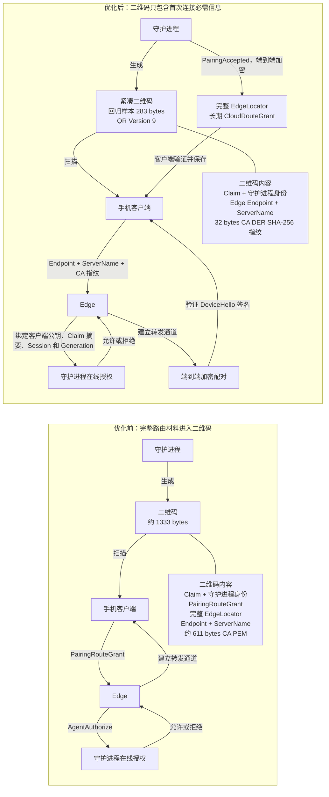
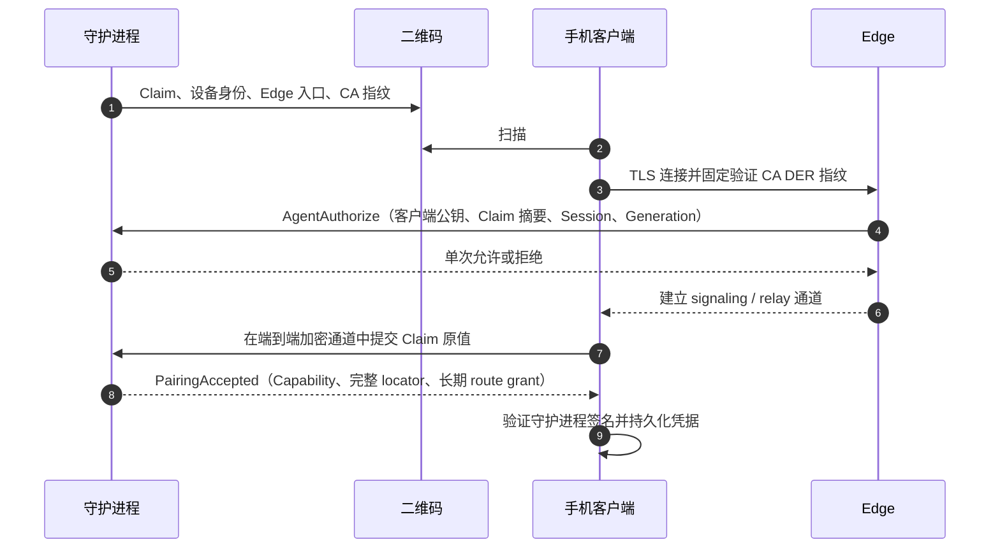

# Pairing 二维码优化

> 状态：已实现。协议直接升级为 `MXP2`，不兼容旧二维码、旧字段或旧持久化记录。

## 前后对比

## 材料迁移

| 材料 | 优化前二维码 | 优化后二维码 | 获取方式 |
| --- | --- | --- | --- |
| Pairing claim | 保留 | 保留 | 二维码；只在端到端通道中提交原值 |
| 守护进程 ID 和公钥 | 保留 | 保留 | 二维码；用于验证守护进程签名 |
| Edge endpoint 和 server name | 完整 locator 内 | 保留 | 二维码；用于首次直连 Edge |
| Edge 私有 CA PEM | 约 611 bytes | 删除 | 首次 TLS 返回证书链，二维码只固定根 CA DER 指纹 |
| PairingRouteGrant | 保留 | 删除 | 改为 Edge 向在线守护进程实时请求 pairing admission |
| 完整 EdgeLocator | 保留 | 删除 | 守护进程在端到端加密的 `PairingAccepted` 中返回 |
| 长期 CloudRouteGrant | 配对成功后返回 | 配对成功后返回 | 守护进程签发并通过端到端通道返回 |

## 当前连接时序

首次 pairing 不回源 Web Controller。此时客户端尚无长期 `CloudRouteGrant`，不能安全调用 Directory；Edge 或 daemon 不可达时本次 pairing 明确失败。完成授权后的普通连接才允许在可信 locator 缺失、Edge 建连前网络失败或 Edge 明确返回位置不存在时回源 Controller。

## 必须保持的安全约束

1. 客户端必须验证 Edge 返回的完整证书链、有效期、server name/IP 和 server-auth EKU，并要求信任锚的 DER SHA-256 与二维码指纹完全一致。
2. CA 指纹不匹配、证书验证失败、守护进程拒绝、签名失败或协议错误时必须立即失败，禁止回源 Controller 掩盖认证错误。
3. 首次 pairing 不允许 Controller fallback；已授权连接只有在 Edge 建连前的网络失败或明确位置不存在时才允许 fallback。
4. Edge 只接收 Claim 摘要；Claim 原值只能在客户端与守护进程之间的端到端加密通道中传输。
5. pairing admission 必须绑定客户端公钥、Claim 摘要、产品、Session、Generation、目标守护进程和短有效期，不能作为通用授权复用。
6. Claim 必须短期有效并原子单次消费；只允许同一客户端身份进行受限的幂等恢复。
7. `PairingAccepted` 必须由已验证的守护进程端到端会话发送，客户端验证后才能保存完整 locator 和长期 grant。
8. 开发期直接升级新协议，并删除旧字段、旧逻辑、旧生成代码和旧测试，不提供降级路径。

## 安全边界

优化后减少的是二维码里的公开路由材料，不减少守护进程对配对的最终控制权。恶意或被入侵的 Edge 可以拒绝服务并观察连接元数据，但不能伪造守护进程的 `DeviceHello` 或 `PairingAccepted`、获得 Claim 原值、签发 CapabilityGrant，或签发长期 CloudRouteGrant。

二维码被他人拍摄后的抢先配对风险与当前方案相同。短有效期、原子单次消费，以及需要时增加守护进程侧确认，可以进一步缩小该风险。

## 尺寸回归

固定 Cloud pairing 回归样本当前结果：protobuf 载荷 283 bytes，`MXP2` 压缩文本 211 字符，纠错级别 Medium 下为 QR Version 9。测试硬限制为载荷不超过 300 bytes、文本不超过 400 字符、QR Version 不超过 10；真实 endpoint 和 ID 长度不同会改变具体文本长度，但不能突破协议预算。
