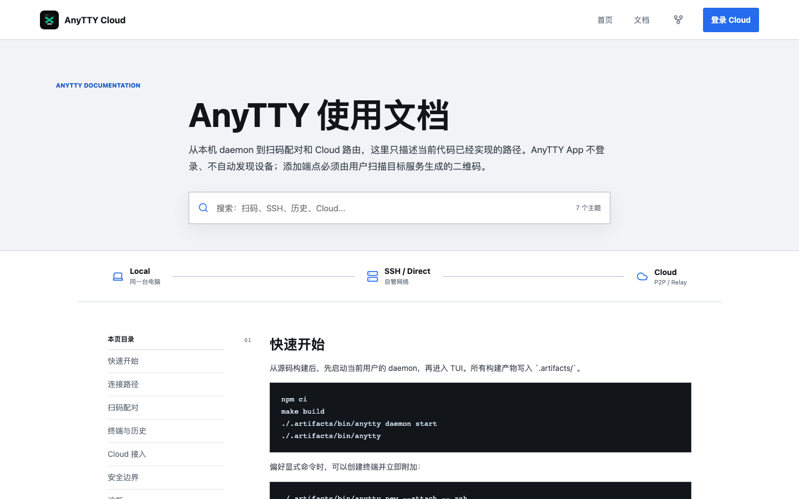

# AnyTTY

AnyTTY 是一个正在开发、尚未公开发布的远程终端系统。它把终端进程放在用户自己的 daemon 中，由 CLI/TUI、Android App 或后续客户端通过 Local、SSH、Direct WebRTC 或 AnyTTY Cloud 连接。

> 当前仓库是私有开发 monorepo。代码、文档和构建产物受根目录 [LICENSE](LICENSE) 约束，不等同于未来可能发布的开源快照。

<p align="center">
  
</p>

## 产品边界

- `anytty` 同时提供 CLI、TUI 和当前用户 daemon 管理命令。
- daemon 是终端、历史、文件、设备身份和客户端授权的最终所有者。
- Android App 不登录、不关联 Cloud 账号、不自动发现设备，只能由用户扫描目标服务生成的二维码添加端点。
- Cloud 账号只管理 daemon 注册、Edge 路由、P2P/Relay、订阅与运营配置，不会把设备同步到 App。
- Controller 和 Edge 不拥有终端权限。terminal、file 和 CapabilityGrant 在客户端与 daemon 的端到端连接内处理。
- 项目尚未发布，不维护开发期协议或数据格式兼容层；变更时直接更新实现、生成代码、测试和文档。

## 组件

| 组件 | 目录 | 职责 |
| --- | --- | --- |
| CLI / TUI | `cmd/anytty/`, `tui/` | daemon 管理、endpoint、终端、文件、配对与交互界面 |
| Core daemon | `core/`, `api_layer/` | PTY、终端生命周期、历史、文件 API 和有界输出缓冲 |
| 客户端运行时 | `client/`, `remote/` | endpoint registry、凭据、SSH、Direct 与 WebRTC 会话 |
| 共享 Web UI | `clients/ui/` | 终端、历史、文件和移动端共用 React 界面 |
| Android App | `clients/mobile/` | Capacitor 宿主、原生连接桥、扫码和移动交互 |
| Cloud Controller | `cloud/controller/`, `cmd/anytty-cloud-controller/` | 账号、注册、策略、Directory、证书、用量和 EdgeControl |
| Cloud Edge | `cloud/edge/`, `cmd/anytty-cloud-edge/` | 公网准入、内存 Presence、信令、P2P 与 TURN Relay |
| Cloud Web | `cloud/web/` | 公开首页、使用文档、用户控制台和运营控制台 |
| 协议 | `proto/` | Core、远程连接和 Cloud protobuf 契约及生成物 |

## 连接模型

```text
                       enrollment / policy / directory
daemon <-----------------------> Controller <-------> PostgreSQL
  ^                                   |
  | AgentGateway v4                   | EdgeControl v8
  |                                   v
Client ----------------------------> Edge
   ClientGateway / signaling           |
       \_______________________________/
             WebRTC P2P or Relay

Client <========== DTLS DataChannel ==========> daemon
          terminal / file / authorization
```

一个 endpoint 可以保存多条 route：

| Route | 用途 | 是否依赖 Cloud |
| --- | --- | --- |
| Local | 当前电脑通过用户级 Unix socket 连接 daemon | 否 |
| SSH | 经 OpenSSH 隧道访问远端 daemon 的 loopback signaling 与 ICE-TCP | 否 |
| Direct | 直连 daemon 发布的 signaling 与 ICE-TCP 地址 | 否 |
| Cloud | 通过 binding 指定的 Edge 信令，优先 P2P，必要时 Relay | 是 |

完整信任链、故障行为和持久化边界见 [ARCHITECTURE.md](ARCHITECTURE.md)。

## 快速开始

### 1. 准备环境

基础 CLI/TUI 开发需要：

- Go `1.26.5`
- Node.js `24`（CI 基线）
- npm 锁文件对应的依赖

完整仓库门禁还需要 Java `21`、Android SDK、`apkanalyzer`、protoc `35.1`、`protoc-gen-go` `1.36.11` 和 `protoc-gen-go-grpc` `1.6.2`。

```sh
npm ci
make build
```

二进制生成在 `.artifacts/bin/anytty`。下文命令都直接使用这个构建产物，不假设已经全局安装。

### 2. 启动 daemon 和 TUI

```sh
./.artifacts/bin/anytty daemon start
./.artifacts/bin/anytty daemon status
./.artifacts/bin/anytty
```

显式创建并附加一个终端：

```sh
./.artifacts/bin/anytty new --attach -- zsh
```

常用 daemon 命令：

```sh
./.artifacts/bin/anytty daemon doctor
./.artifacts/bin/anytty daemon logs
./.artifacts/bin/anytty daemon restart
./.artifacts/bin/anytty daemon stop
```

### 3. 管理 endpoint

本机通常使用自动解析的 local socket。需要显式 registry 时：

```sh
./.artifacts/bin/anytty endpoint add local workstation --label "本机"
./.artifacts/bin/anytty endpoint set-default workstation
./.artifacts/bin/anytty endpoint list
./.artifacts/bin/anytty endpoint test workstation
```

SSH route 示例：

```sh
./.artifacts/bin/anytty endpoint add ssh server-a \
  --host server-a.example.com \
  --user alice \
  --host-key SHA256:REPLACE_WITH_PINNED_HOST_KEY
```

Direct 和 Cloud route 的必填身份、地址与凭据由配对流程写入；不要手工伪造 fingerprint 或 credential reference。完整参数以 `./.artifacts/bin/anytty endpoint add <route> --help` 为准。

## 扫码配对

在目标 daemon 所在电脑生成十分钟有效、一次性使用的二维码：

```sh
./.artifacts/bin/anytty pair create --qr-file ./anytty-pair.png
```

在 Android App 点击扫码按钮并扫描该图片。配对成功后，端点和客户端凭据只保存在当前设备。二维码过期、取消或被其他客户端消费时需要重新生成；原客户端若只丢失了交付响应，可在 24 小时 delivery grace 内用同一 bundle 和 client key 幂等恢复。

可选 route 可以写入同一个配对 offer：

```sh
./.artifacts/bin/anytty pair create \
  --qr-file ./anytty-pair.png \
  --route ssh \
  --ssh-host server-a.example.com \
  --ssh-user alice \
  --ssh-host-key SHA256:REPLACE_WITH_PINNED_HOST_KEY
```

配对协议和凭据落盘边界见 [docs/PAIRING_PROTOCOL.md](docs/PAIRING_PROTOCOL.md)。

## 终端、实时画面与历史

```sh
./.artifacts/bin/anytty ls
./.artifacts/bin/anytty new --name work --attach -- zsh
./.artifacts/bin/anytty attach work
./.artifacts/bin/anytty terminal show work
./.artifacts/bin/anytty kill work
./.artifacts/bin/anytty rm work
```

- daemon 按 protocol session 和 terminal 保存最近确认的短期画面基线。基线可用时返回增量，不可用、过期或出现 gap 时返回全量。
- 客户端把当前帧提交给唯一 renderer 后立即重挂 long-poll；渲染期间只合并最新 damage，不排队过时帧。
- 每个 terminal generation 的主 PTY payload 只有一份并受字节预算限制；Live 和 History 使用独立 cursor。raw-stream 订阅者另有各自固定深度的有界队列，因此总内存还随活跃订阅者数量增长，但不会随累计输出行数增长。
- 输出缓冲超过限制时按配置选择 `block` 减慢 PTY 或 `drop` 丢弃旧数据并产生显式 gap。
- 进入历史模式时冻结当时的视觉锚点；新输出继续落历史但不推动视口。滚动到底会回到 Live。
- 搜索和大范围复制保存逻辑行范围，复制确认时才物化文本。

实现契约见 [docs/TERMINAL_DELIVERY.md](docs/TERMINAL_DELIVERY.md)。

## 文件操作

```sh
./.artifacts/bin/anytty file list workstation /tmp
./.artifacts/bin/anytty file stat workstation /tmp/example.txt
./.artifacts/bin/anytty file download workstation /tmp/example.txt ./example.txt
./.artifacts/bin/anytty file upload workstation ./example.txt /tmp/example.txt
```

文件操作发生在目标 daemon 上，下载会校验 daemon 返回的 checksum。更多命令见 `./.artifacts/bin/anytty file --help`。

## Cloud 接入

<p align="center">
  
</p>

1. 登录 Cloud 控制台创建 daemon enrollment code。
2. 在目标电脑消费一次性 code。
3. 已运行的 daemon 会自动发现 enrollment 并接入 Edge，不需要重启。
4. 使用显式 Cloud route 生成二维码，让每台 App 分别扫描。

```sh
ENROLLMENT_CODE=REPLACE_WITH_ONE_TIME_CODE
./.artifacts/bin/anytty cloud enroll \
  --controller https://cloud.anytty.com \
  "$ENROLLMENT_CODE"

./.artifacts/bin/anytty pair create --route cloud --qr-file ./anytty-cloud-pair.png
```

查看候选 Edge、设置软偏好或立即重选时，也不需要重启 daemon：

```sh
./.artifacts/bin/anytty cloud edge list
./.artifacts/bin/anytty cloud edge prefer EDGE_ID_OR_NAME
./.artifacts/bin/anytty cloud edge prefer auto
./.artifacts/bin/anytty cloud edge reselect
```

`prefer` 不是强制绑定。daemon 会综合自身测得的 TLS/gRPC 连接耗时、连接失败率和 Controller 看到的节点负载；偏好节点离线、不可达或容量已满时会自动回退。这里的连接失败率不是 UDP 丢包率。重选只重建 Cloud 控制连接，不重启 daemon、terminal 或本地服务；正在进行的 Cloud 会话会断开并重新建立。

Cloud daemon 生命周期：

- `ACTIVE`：接受新的 Cloud 客户端连接。
- `BLOCKED`：可恢复；拒绝新 Cloud 会话并关闭现有 Cloud 会话，保留 Agent 控制连接以便立即恢复。
- `DELETED`：终态；清除 Cloud enrollment 并断开 Agent。Local、SSH 和 Direct 数据不受影响；再次使用 Cloud 必须重新注册。

稳定状态机见 [docs/CLOUD_DAEMON_LIFECYCLE.md](docs/CLOUD_DAEMON_LIFECYCLE.md)，生产部署见 [cloud/deploy/README.md](cloud/deploy/README.md)。

Cloud 控制台使用 15 分钟 Access JWT 和数据库持久化、单次轮换的 30 天 Refresh Token。普通 API 请求只做本地 JWT 验签，不查询登录记录；完整边界见 [docs/CLOUD_ACCOUNT_AUTH.md](docs/CLOUD_ACCOUNT_AUTH.md)。

## 配置与数据路径

运行时会解析平台目录；不要在文档中硬编码用户主目录：

```sh
./.artifacts/bin/anytty config paths
./.artifacts/bin/anytty config show
./.artifacts/bin/anytty config validate
```

Unix 默认位置：

| 数据 | 默认位置 |
| --- | --- |
| TUI / daemon 配置 | `$XDG_CONFIG_HOME/anytty/tui-v3.yaml`，未设置时为 `~/.config/anytty/tui-v3.yaml` |
| Endpoint registry | `$XDG_CONFIG_HOME/anytty/endpoints.yaml` |
| 日志 | `$XDG_STATE_HOME/anytty/anytty.log` |
| 历史 | `$XDG_STATE_HOME/anytty/history-v2/` |
| 远程凭据 | `$XDG_STATE_HOME/anytty/remote-v2/credentials/` |

唯一完整配置模板是 [tui/docs/tui-v3.example.yaml](tui/docs/tui-v3.example.yaml)。单项可原子修改：

```sh
./.artifacts/bin/anytty config set daemon.output_buffer.overflow block
./.artifacts/bin/anytty config set daemon.output_buffer.capacity_bytes 33554432
./.artifacts/bin/anytty config get daemon.output_buffer.overflow
```

## 开发

安装依赖后，可分别启动三个 Web workspace：

```sh
npm run dev --workspace @anytty/ui
npm run dev --workspace @anytty/mobile
npm run dev --workspace @anytty/cloud-web
```

常用门禁：

```sh
# Go
make test

# 三个 JavaScript workspace
make test-clients
npm run lint

# 完整工具链与生成物；需要 Android SDK
make doctor

# Android release APK
make test-android

# 已连接设备/模拟器上的 instrumentation 与历史 E2E
make test-android-device

# 顺序运行 Go、clients 和 Android 门禁
make test-all
```

Cloud Web 浏览器和无障碍测试：

```sh
npm run test:e2e --workspace @anytty/cloud-web
npm run test:axe --workspace @anytty/cloud-web
```

协议变更必须先改 `proto/`，再运行仓库生成器并提交生成物：

```sh
npm run proto
scripts/check-generated-code.sh
```

更完整的环境、提交和测试要求见 [CONTRIBUTING.md](CONTRIBUTING.md)。

## 文档

- [架构与信任边界](ARCHITECTURE.md)
- [文档索引](docs/README.md)
- [终端实时画面与历史](docs/TERMINAL_DELIVERY.md)
- [扫码配对协议](docs/PAIRING_PROTOCOL.md)
- [Cloud daemon 生命周期](docs/CLOUD_DAEMON_LIFECYCLE.md)
- [Cloud 商业化与权益策略](docs/CLOUD_COMMERCIAL_POLICY.md)
- [Cloud 部署与升级](cloud/deploy/README.md)
- [安全报告](SECURITY.md)
- [未发布变更](CHANGELOG.md)

## 项目状态

AnyTTY 仍在开发，当前没有受支持的公开版本、稳定升级承诺或公开下载渠道。发布前仍需要由实际发布主体完成签名、发行账号、隐私政策和发布渠道配置。不要把开发环境二进制、unsigned APK 或 Development Cloud 支付适配器当作生产发行物。
