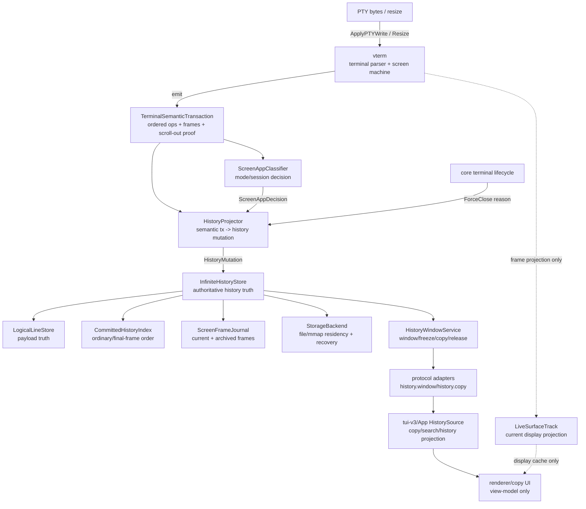

# screen app 无限历史定案

状态：历史背景。R318 后，history 语义设计基准曾切换到 `docs/history/core/history-logical-renderer-design.md`；R430 后曾切到 screen-backed 设计；R431 后用户确认不再修补 screen-backed 路径，当前 production 基准已切到 `history/linehist` 的 file-backed logical-line + vterm hot-screen projection。

本文保留 R300-R317 的问题背景、vterm transaction 边界和旧切片记录；其中 `commit/committed` 术语、`CommittedHistoryIndex` / `MutableFrontier` 分层、classifier 或 projector/store 边界若与 linehist 基准冲突，以 `workflow.md` R431+ 和 `history/linehist` 为准。

本文把之前的未确认预案升级为后续删代码、重建边界和补接口的技术定案。它不替代
`workflow.md` 的任务队列和提交准入；真正动代码前，仍必须先把对应切片写入
`workflow.md`，并按当前仓库规则执行。

本文面向两类读者：

- 前半部分是给 Agent / 工程实现看的专业 contract。
- 末尾有白话翻译，用来对齐产品语义和颗粒度。

## 1. 我们想要的是什么

目标是 **无限历史**，但这里的“无限”不是把当前屏幕 grid 无限保存，也不是永久保存
PTY raw bytes 后反复 replay。目标是：core-v2 维护一个可落盘、可分页、可冻结、可复制
的 authoritative history model，客户端只按需取窗口。

已确定语义如下。

### 1.1 普通输出是普通历史

普通 shell、普通 CLI、append-only stdout/stderr 的输出，一旦根据终端语义稳定，就进入
ordinary committed history。

规则：

- 文本先进入 mutable frontier。
- CR/BS/EL/CUP 等行内编辑只修改 frontier，不把中间态追加成历史。
- LF/IND/scroll-out/seal 等语义让 logical line 成为提交候选。
- line 离开 primary screen ownership，或者 terminal/process lifecycle 触发 force
  commit 时，才进入 ordinary committed history。
- ordinary history 以 logical line 为单位，可落盘、可分页、可复制、可搜索。

### 1.2 primary pseudo-TUI 是 screen app session

Codex、Claude Code、opencode 这类程序可能不进 alt-screen，却在 primary screen 上反复
home、clear、absolute cursor、scroll region、synchronized output 重绘。它们不能被当作
普通 append-only 日志。

规则：

- 进入 primary screen app session 后，运行中的 repaint 修改 session current frame。
- current frame 能在 `history.window latest` 和 frozen copy 中看到，`Committed=false`。
- 普通 repaint 默认只替换 current frame，不把 `/re` -> `/res` 这类输入补全过程写入
  archived journal。
- 只有 alt enter、session boundary 或后续明确 retention policy 标记的有意义边界，才可以把旧
  primary current frame 放入 bounded archived frame journal。
- archived frames 不进入 `CommittedHistoryIndex`，不增加 ordinary history depth。
- session 关闭时，最终 primary current frame ordinary commit 一次。
- 中间 repaint 不 ordinary commit。

### 1.3 alt-screen 默认是 current-only

vim、htop、Codex `/resume` picker 这类 alt-screen 内容需要在当前进入 copy/history 时可选，
但默认不污染 primary ordinary history。

规则：

- alt-screen current frame 能出现在 latest/frozen snapshot 中。
- alt-screen 内部 repaint 默认不归档成 session journal。
- alt-screen exit 不把 alt frame ordinary commit 到 primary history。
- Codex `/resume` picker 是独立 transient alt frame。
- 进入 alt 是明确边界：alt enter 前已发布的 primary current frame 如果需要保留，只能
  archive/hide；不能继续保留一个跨 alt 生命周期可恢复或可 final commit 的 primary current
  frame。
- alt exit 后，如果程序恢复 primary frame，这个 restored primary frame 是一次新的 publish，
  可以归入同一 session journal 或显式新 session；它不能复活 alt enter 前的 primary current
  frame，也不能和 alt frame 拼接。

### 1.4 history mode 看到的是“历史 + 当前 session”

进入 history/copy 时，不只是看 ordinary committed history，还要看到当前 terminal 的
可选择状态：

```text
latest window
  active alt frame, if terminal is in alt-screen
  else active primary screen frame, if screen app session is active
  plus ordinary committed history / archived frames by cursor
```

older 顺序：

1. active frame 当前可见内容。
2. 同一 primary screen app session 在明确边界保留下来的 archived frames，newest -> oldest。
3. ordinary committed history。

alt-screen current frame 不自动用旧 shell history 填满首屏。用户 older 时才进入前面的
历史段。

### 1.5 file storage 只是 backend，不是新模型

后续可以用文件、mmap 或其它 backend 承载 `LogicalLineStore`、index 和 journal payload。
但 backend 不能改变 domain model：

- 文件里已经写入不等于 immutable。
- persisted line 仍可能被 reclaim、replace、truncate、retention 或 compaction。
- 文件 backend 不能变成第二份 history truth。
- resize 不允许全量读回历史再重写。
- 可恢复 backend 必须能恢复 `LogicalLineStore`、`CommittedHistoryIndex`、
  `MutableFrontier`、screen session / frame journal metadata 和 generation；只把 line
  payload append 到文件不算完成无限历史。
- 当前 compact/file line backend 只能视为 payload 落点雏形，不是完整 recovery contract。

## 2. 权威边界

history 不直接消费 TUI/App rows，也不重新解释一份 raw PTY。唯一允许的输入边界是 shared
vterm 同一次 write transaction 产生的终端语义事件。

```text
PTY bytes
  -> shared vterm write transaction
  -> ordered semantic ops + scroll-out proof + final primary/alt frame cells
  -> screen/session classifier
  -> history projector
  -> LogicalLineStore + CommittedHistoryIndex + ScreenFrameJournal
  -> history.window / history.copy
```

关键约束：

- `HistoryTrack` 是 semantic projector + logical-line owner，不是“从屏幕截图持久化”的
  renderer。
- vterm screen cells 可以作为 current/final frame 的 frame payload 来源，但不能让
  `HistoryTrack` 在 live 更新完成后读取 live snapshot 反推 history。
- vterm `ScrollbackAppend` 只证明真实 primary scroll-out 发生；ordinary history payload
  仍必须由 ordered semantic ops / screen ownership 合成 logical line。
- `RequiresFullReplace` 只表示 live/stale/projector 边界，不等价于“把当前屏幕全追加进
  history”。
- TUI/App/xterm/renderer/local scrollback 都只能是投影或缓存，不能作为 copy/search/history
  truth。

禁止路径：

```text
process name -> special history behavior
TUI local rows -> copy/history truth
renderer output -> history truth
live snapshot -> committed history
vterm internal scrollback rows -> ordinary history payload
alt-screen current frame -> primary ordinary history by default
raw PTY replay parser -> second terminal semantics owner
```

### 2.1 架构图与接口绑定

后续代码按这张图切边界。图上的每条实线都必须落到一个明确 interface 或 domain event；
虚线是 projection/cache，不允许反向写 history truth。



禁止反向边：

```text
renderer/copy UI -> history truth
LiveSurfaceTrack -> committed history
TUI/App local rows -> history.window/copy payload
StorageBackend file record -> domain mutability policy
raw PTY replay parser -> HistoryProjector fallback
process name -> ScreenAppDecision
```

接口绑定表：

| 架构边 | 必须落地的 contract | Owner | 首个切片 |
| --- | --- | --- | --- |
| PTY / resize -> vterm | `TerminalSemanticSource.ApplyPTYWrite`、`TerminalSemanticSource.Resize` | `vterm` adapter | R302 |
| vterm -> core history | `TerminalSemanticTransaction`，包含 ordered `Ops`、`PrimaryScrollOut`、`PrimaryFrame`、`AltFrame`、alt enter/exit、sync begin/end、full replace 标记 | `vterm` 产出，`core` 消费 | R302 |
| semantic tx -> session decision | `ScreenAppClassifier.Classify(tx, state) ScreenAppDecision` | `core` | R303 |
| semantic tx + decision -> history mutation | `HistoryProjector.Apply(tx, decision)` | `core` | R303 |
| terminal lifecycle -> force close | `HistoryProjector.ForceClose(reason)`；process exit、terminal kill、detach cleanup 不能伪造成 vterm transaction | `core` | R303-R304 |
| projector -> authoritative store | `HistoryMutation`，只能表达 ordinary commit、frontier mutate、publish primary frame、archive primary frame、publish alt frame、close session、final frame commit | `core` | R303 |
| store 内部 payload/index/journal | `LogicalLineStore`、`CommittedHistoryIndex`、`ScreenFrameJournal`，三者不能互相复制成第二份 truth | `core` | R303-R307 |
| store -> file backend | `StorageBackend`，只负责 append/update/recover/compact residency，不决定 mutability | `core` | R309 |
| store -> history consumer | `HistoryWindowRequest`、`HistoryWindow`、`FreezeHistoryRequest`、`HistoryCopyRequest`、`HistoryToken` | `core` | R309-R310 |
| protocol -> TUI/App | `history.window`、`history.copy`、`history.release`，必须保留 row kind、segment cursor/token、generation | `internal/protocol` / `proto` / `tui` | R310 |
| live display projection | `LiveSurfaceTrack` 或等价 view model，只能服务当前显示和短缓存 | `core` / `tui` | 按需 |

落地规则：

- R302 之前不要把旧 raw parser 包一层新名字当成 `TerminalSemanticSource`。
- R303 之前不要让 `InfiniteHistoryStore` 暴露 visual row 或 grid row API。
- R309 之前文件 backend 只能是 storage contract 讨论，不得用文件格式反向决定 history model。
- R310 之前 TUI/App 不允许新增本地 fallback；缺字段就补 protocol/domain contract。

## 3. 接口先行

后续要删掉大量现有实现时，第一步不是直接重写细节，而是先把以下接口和 domain boundary
锁住。接口可以先落在 core-v2 内部，等 domain harness 稳定后再接 protocol/TUI/App。

### 3.1 terminal semantic source

vterm 只负责解释终端协议，不拥有 history policy。

建议 domain 形状：

```go
type TerminalSemanticSource interface {
    ApplyPTYWrite(raw []byte) (TerminalSemanticTransaction, error)
    Resize(size TerminalSize) (TerminalSemanticTransaction, error)
}

type TerminalSemanticTransaction struct {
    Seq uint64
    Size TerminalSize

    Ops []TerminalSemanticOp

    PrimaryScrollOut []ScrollOutProof
    PrimaryFrame *ScreenFrame
    AltFrame *ScreenFrame

    AltEntered bool
    AltExited bool
    SynchronizedBegin bool
    SynchronizedEnd bool
    RequiresFullReplace bool
}
```

注意：

- `PrimaryScrollOut` 是 ownership proof，不是独立 payload store。
- `PrimaryFrame` / `AltFrame` 是 fixed-grid frame payload，只服务 screen session/current
  frame。
- `Ops` 必须保持 PTY raw order；history projector 不再通过 screen diff 猜顺序。

### 3.2 screen app classifier

classifier 只根据终端语义和当前 session state 判断，不根据程序名。

```go
type ScreenAppClassifier interface {
    Classify(tx TerminalSemanticTransaction, state ScreenSessionState) ScreenAppDecision
}

type ScreenAppDecision struct {
    Mode ScreenOutputMode
    PublishFrame bool
    ClosePrimarySession bool
    ArchivePrimaryBeforeAlt bool
    ClearPrimaryCurrentForAlt bool
    EnterAltTransientFrame bool
    ExitAltTransientFrame bool
    ForceCommitPrimaryFinalFrame bool
}
```

已确定规则：

- alt enter 先 archive/hide 已发布 primary current frame，并清掉可被 final commit 的
  active primary current ownership；它不是跨 alt 生命周期复活同一个 current frame。
- alt exit 只结束 transient alt frame；如果随后出现 primary frame，它是新 publish，
  可以接到同一 session journal，但不能复活 alt enter 前的 primary current frame。
- terminal exit 时，只有当前 owner 仍是 primary 的 active primary current frame 才走
  primary final commit；active alt frame 不 ordinary commit。primary ordinary mutable
  frontier 仍按 primary rules force commit，但 pre-alt archived frame 不会因为 terminal
  死在 alt-screen 而被复活成 final frame。
- 普通 append batch 能明确回到 shell/prompt 模式时，先 close primary session，再按
  ordinary output 投影该 batch。

### 3.3 history projector

projector 是 terminal semantic transaction 到 history domain event 的唯一转换层。

```go
type HistoryProjector interface {
    Apply(tx TerminalSemanticTransaction, decision ScreenAppDecision) (HistoryMutation, error)
    ForceClose(reason CloseReason) (HistoryMutation, error)
}
```

它负责：

- ordinary logical line frontier。
- primary scroll-out ownership commit。
- primary current frame publish。
- primary archived frame journal。
- alt transient current frame。
- final primary frame commit once。

它不负责：

- 启动/管理进程。
- 持有 TUI/App view state。
- 从 renderer rows 拼 copy 文本。
- 用 storage scrub 或 fallback 修补状态错乱。

### 3.4 infinite history store

history store 是唯一 truth。接口要表达 segment，而不是假装所有东西都是 ordinary rows。

```go
type InfiniteHistoryStore interface {
    ApplyOrdinaryEvent(event HistoryEvent) error

    OpenScreenSession(params ScreenSessionParams) (ScreenSessionID, error)
    PublishPrimaryFrame(session ScreenSessionID, frame ScreenFrame) error
    PublishAltFrame(frame ScreenFrame) error
    CloseScreenSession(session ScreenSessionID, policy ClosePolicy) error

    LatestWindow(req HistoryWindowRequest) (HistoryWindow, error)
    OlderWindow(req HistoryWindowRequest) (HistoryWindow, error)
    Freeze(req FreezeHistoryRequest) (FrozenHistorySnapshot, error)
    Copy(req HistoryCopyRequest) (string, error)
    Release(token HistoryToken) error
}
```

`HistoryWindow` 必须能表达：

- committed ordinary row。
- committed primary final screen-frame row。
- current primary screen frame row。
- archived primary screen frame row。
- current alt-screen frame row。

### 3.5 cursor / protocol contract

domain-only harness 可以先不改 wire，但只要暴露给 protocol/TUI/App，就必须满足下面二选一：

1. wire contract 显式表达 segment cursor：

```text
segment = committed | current_primary_frame | archived_primary_frame | current_alt_frame
session_id
frame_id
line_id
row_in_line
generation
token
```

2. 或 core 生成 opaque cursor token，client 只能原样传回，不能从 row kind、本地 row index、
   xterm scrollback index 推断下一页。

不能把 segment cursor 偷塞进旧 `before_line_id` 语义里，让客户端误以为所有 older 都是
ordinary committed line。

## 4. 数据模型定案

### 4.1 ordinary committed history

```text
LogicalLineStore payload
CommittedHistoryIndex ordered ids
MutableFrontier mutable ids
StorageBackend persistence
```

约束：

- 在 R300-R317 旧 logical-line-first 模型内，payload 由 `LogicalLineStore` 统一持有；R430 曾迁到 screen-backed physical rows，R436 后默认 production payload truth 已迁到 linehist cold logical lines + vterm hot-screen projection。
- `CommittedHistoryIndex` 是索引，不是第二份 store。
- `MutableFrontier` 可以 reclaim committed suffix，但不复制 payload。
- `StorageBackend` 只是 residency/persistence，不定义 mutability。

### 4.2 current frame

current frame 是 fixed-grid logical line group：

```text
LineKind: screen-frame | alt-screen-frame
Committed: false
FixedGrid: true
ScreenCols: original PTY cols
ScreenRow: row inside frame
SessionID / FrameID
```

约束：

- current frame 进入 latest/frozen。
- current frame 不进入 ordinary committed depth。
- fixed-grid frame 不按普通 logical text reflow；按原始 screen cols clip/pad。
- 空物理行、默认空白裁剪范围、styled blank、wide char、OSC8 link footprint 必须保留。

### 4.2.1 committed final screen-frame

primary screen app session close 后的 final commit 不是把 frame 转成普通 logical text。
final primary frame 进入 committed index 后，仍必须保留 fixed-grid frame kind：

```text
LineKind: screen-frame
Committed: true
FixedGrid: true
ScreenCols: original PTY cols
```

约束：

- final committed frame 参与 `CommittedHistoryIndex` cursor/depth，但 row projection 仍按 fixed-grid
  frame 处理，不走普通 text reflow。
- final committed frame 必须保留空物理行、styled blank、wide char、OSC8 link 和 tail
  footprint。
- 从 final committed frame older 时，如果同 session 存在明确边界保留下来的 archived frames，
  仍要能先进入这些 archived frames，再回到更早的 ordinary committed history；cursor/token
  必须表达这个 segment 边界。
- final committed frame 不会把 archived frames 改写成 ordinary history。

### 4.3 archived frame journal

archived frame journal 是索引，不是 payload store：

```text
FrameRecord
  SessionID
  FrameID
  Sequence
  LineIDs
  ContentHash
  ScreenSize
  PublishedAt
  ArchiveReason
```

约束：

- 普通 replacing current primary frame 是 current-only replace；旧 current frame 被丢弃。
- alt enter、session boundary 或明确 retention policy 标记的 archive boundary 才能把旧
  current frame 转成 `archived-screen-frame`。
- archived frame 不进入 `CommittedHistoryIndex`。
- older 先遍历 current session 已存在的 archived frames，再回 ordinary committed history。
- 相同 frame hash 不重复归档。
- retention 必须有最大帧数、最大字节数和 snapshot pin/stale 规则。

### 4.3.1 style / color token

历史 payload 只保存 terminal 内容语义，不保存查看端主题解析结果：

- default fg/bg 用空 `CellStyle.FG` / `CellStyle.BG` 表达；查看历史时才按当前
  `HistoryTheme.DefaultFG` / `HistoryTheme.DefaultBG` 解析。
- `ansi:N` 表达 16 色 SGR token，`idx:N` 表达 256 色 SGR token；如果查看端提供 palette，
  可以在 view-time 解析成 RGB，否则必须原样保留 terminal token。
- 明确 truecolor SGR 写入的 `#rrggbb` 是内容属性，后续主题或默认色变化不能替换。
- OSC 10/11/12 只改变 terminal 默认颜色状态或响应查询，不得把当时默认色 RGB 烘焙进
  ordinary history、screen-frame 或 archived frame payload。

### 4.4 alt transient frame

alt transient frame 是 current-only 默认策略。

约束：

- running alt frame 可在 latest/frozen 选择复制。
- alt exit 默认释放或短暂保留 transient latest-only frame，直到 primary 输出替换。
- alt frame 不 ordinary commit。
- alt frame 默认不进入 primary archived frame journal。
- alt frame 可以有未来 opt-in journal，但不作为第一版默认。

## 5. 必须覆盖的 case

### 5.1 普通 shell / CLI

```text
$ echo hello
hello
$ ls
file
```

预期：

- `hello`、`file` 是 ordinary committed history。
- copy/history 只从 core `HistoryWindow` 和 frozen snapshot 取文本。
- 不创建 screen app session。

### 5.2 progress bar / CR 单行覆盖

```text
download 1%\rdownload 2%\rdownload done\n
```

预期：

- 中间百分比只 mutate current logical line。
- 最终稳定行 ordinary commit。
- 不把每个百分比追加成历史。

### 5.3 long-running append-only 程序

```text
tail -f log
line 1
line 2
...
```

预期：

- 真实 scroll-out / sealed logical line 持续进入 ordinary history。
- 慢客户端可以丢 live display cache；history/copy 仍从 core 拉。
- 不进入 frame journal。

### 5.4 Codex primary synchronized output

特征：

- DECSET/DECRST 2026。
- home/top positioning、ED/EL、scroll region、RI、absolute cursor。
- 事务结束后发布完整 primary frame。

预期：

- synchronized begin 到 end 之间的 pending frame 不进 latest/frozen。
- end 后 current frame 原子替换。
- current frame 可选择，`Committed=false`。
- ordinary depth 不因 repaint 增长。

### 5.5 Codex 长 session / 几千行上下文

预期：

- 如果程序通过真实 primary scroll-out 产生 transcript，这部分按 ordinary logical line 提交。
- 如果程序只是重绘 current screen，没有产生 terminal scroll-out，那么历史不能凭空得到
  未在终端语义中出现过的隐藏内容。
- 普通 primary repaint 只替换 current frame，不记录 `/re`、`/res` 这类中间输入态。
- 如果程序通过 terminal 语义产生 scroll-out transcript，则 transcript 进入 ordinary history；
  如果遇到 alt enter 等明确 archive boundary，pre-alt primary current 才进入 bounded
  archived frame journal。
- older 先看明确保留下来的 archived frames，再看 ordinary transcript。
- 这不是 Codex 特判，是 primary screen app session 规则。

### 5.6 Codex `/resume` alt-screen picker

流程：

```text
primary Codex frame
/resume
alt-screen picker
alt-screen exit
primary restored frame
```

预期：

- 进入 alt 是 primary frame 边界：pre-alt primary current 只能 archive/hide，不能保留成
  可复活或可 final commit 的 current frame。
- picker 是 current alt transient frame，可选择复制。
- picker 不写 primary ordinary history。
- picker 不进入 primary archived frame journal。
- alt exit 后 restored primary frame 是一次新 publish，可以接回同一 session journal 或开启
  明确的新 primary session。
- restored primary frame 不和 picker 拼接，也不复活 pre-alt primary current frame。

### 5.7 vim / htop alt-screen

预期：

- running alt current frame 可选。
- 默认不归档每个 repaint。
- 默认不 ordinary commit。
- 退出后恢复 primary，后续 shell 输出继续 ordinary commit。
- 不因为进程退出就把 alt screen 当 primary transcript。

### 5.8 terminal exit

primary exit：

- 如果存在 active primary current frame，final commit once。
- final committed frame 仍保留 `screen-frame` fixed-grid kind，只是 `Committed=true` 并进入
  committed index。
- archived frames 仍是 archived session history，不变 ordinary committed history。
- 后续 terminal lifecycle marker 可以作为普通事件，但不能提交中间 repaint。

alt exit / terminal 死在 alt：

- alt current frame 不 ordinary commit。
- primary ordinary mutable frontier 仍按 primary rules 处理。
- alt enter 前已 archived/hidden 的 primary frame 不会被复活成 active current frame，也不会
  因 terminal 死在 alt-screen 而 final commit。
- 不从 alt frame 反推 primary transcript。

### 5.9 ED2 / ED3 / full replace

预期：

- ED2 可作为 page/frame boundary，但不能从清屏后的 live snapshot 造历史。
- ED3 是 clear-scrollback soft boundary，不物理删除 authoritative history。
- `RequiresFullReplace` 只是 live/stale signal；同批有 ordered semantic ops 时仍消费 ops。
- full-replace-only 不能回退 raw parser 把整屏写成 history。

### 5.10 resize / attach / slow client

预期：

- resize 不重写 ordinary logical history。
- resize 只让 projection/window token/generation 失效。
- fixed-grid frame 保留自己的 `ScreenCols`，按 clip/pad 投影。
- attach/reattach 不创建 committed history。
- TUI/App 本地 cache 可以失效；copy/history truth 仍由 core window/copy 提供。

### 5.11 frozen copy during repaint

预期：

- 进入 copy/history 时冻结 active frame、archived frames、ordinary history boundary。
- 后续 repaint 不改变已冻结 selection/copy 文本。
- retention 遇到 frozen token 时，要么 pin payload，要么返回明确 stale；不能 silent fallback 到
  TUI/App cache。
- latest/frozen boundary 只能由 core `history.window` / `history.copy` token、generation 和
  cursor 建立。TUI/App 的 live surface revision、EnteringLive 或本地 frame cache 只能用于等待态
  UI，不能作为 core history generation 上界，也不能参与 copy 文本组装。

## 6. 当前代码库哪些点支撑定案

这些点是后续删代码时必须保留或抽成接口的能力，不等于必须保留当前实现形状。

### 6.1 vterm 已经有 semantic transaction 的雏形

`vterm/vterm/vterm.go` 的 `WriteDamage` 已包含关键字段：

- `SemanticOps`
- `ScrollbackAppend`
- `AlternateAppend`
- `RequiresFullReplace`

这说明 shared vterm 已经能在一次 write transaction 中同时给出 ordered semantic ops、
scroll-out proof、alternate output 和 full-replace boundary。后续应把这些整理成更干净的
`TerminalSemanticTransaction`，而不是让 history 继续读 raw parser fallback。

### 6.2 live surface 已能分段带出 primary / alt frame

`core/live/types.go` 的 `SurfaceTrack.WriteWithResult` 和
`SurfaceWriteSegment` 已能带出：

- `PrimaryScreenRows`
- `AltScreenRows`
- `AltScreenExitFrame`

这证明“同一次 vterm 输出后拿到当前 primary/alt frame”这件事已经成立。后续要做的是把
它从 live 包装中抽成 EventRouter/semantic source contract，避免 history 读 live snapshot。

### 6.3 semantic ingest 已经走 shared vterm 边界

`core/terminal_semantic_ingest.go` 已有：

- `FromSharedVTerm`
- raw shared batch semantic ops 消费边界。
- alt frame 到 `EventAppendAltScreenFrame`。
- primary frame 到 `EventReplacePrimaryFrame`。

这支撑“消费 vterm 解释过程事件，而不是消费 vterm 屏幕输出”的方向。

### 6.4 history 已有 frame row kind 和 journal 雏形

`core/history/types.go` 已有：

- `RowKindScreenFrame`
- `RowKindArchivedScreenFrame`
- `RowKindAltScreenFrame`

`core/history/track.go`、`window.go`、`snapshot.go` 当前已经有
`archivedFrameLineIDs` 相关路径。这些证明 current/archived/alt frame 作为 logical-line
payload 进入 authoritative window 是可行的。

后续即使删除当前实现，也应保留这些 domain 概念：

- frame row kind。
- archived frame segment。
- fixed-grid projection。
- frozen snapshot pin/stale。
- older 先 frame journal 再 committed history。

### 6.5 protocol / TUI 已能保留 row kind

`core/protocol_service.go` 已投影 `RowKinds` / line span kind。
`tui/services/protocol_adapter.go` 和 `tui/state/history.go` 已认识
`screen-frame`、`archived-screen-frame`、`alt-screen-frame`，并对 fixed-grid frame 不做普通
reflow。

这说明客户端 contract 可以承接 frame segment；下一步重点是 cursor/token 必须显式或
opaque，不能让 TUI 自己猜 segment。

## 7. git 历史里处理过的问题如何进入新方案

下面这些问题即使现有代码被删，语义也必须留下。新方案不是丢掉问题，而是把问题升成
interface/harness contract。

| 问题族 | 代表提交 | 当时解决的问题 | 新方案里的处理 |
| --- | --- | --- | --- |
| shared vterm 是唯一语义源 | `R201I`、`R201J`、`R201M`、`R201P`、`8a3d45a8`、`8a3d45a8..R201CX` | history parser 和 live vterm 双重解释导致顺序、mode、cursor、C1/OSC 语义不一致 | 保留 `TerminalSemanticTransaction` 接口；删除 history terminal-semantic raw parser fallback |
| ordered semantic ops | `R201L` 到 `R201CW` 大量 raw vterm 收口提交 | CUU/CUD/CUP/ED/EL/OSC8/C1/mode/tab/charset/margin 等不能靠 screen diff 猜 | vterm 只产出 ordered ops；projector 只消费 ops；unsupported 不能回退写 history |
| 普通 primary scroll-out | `R201U`、`R201V`、`R201Y`、`R201Z`、`R201AC`、`R201AI`、`R201DI`、`R201DL` | rows=1/2、大高度、多 scroll、styled/link scroll-out 不丢不重复 | `ScrollbackAppend` 作为 ownership proof；logical line payload 仍由 semantic ops 合成并提交一次 |
| synchronized primary frame | `e5ae9127`、`cbcf1506`、`c0d5e95b`、`R201DD`、`R201DE` | Codex 2026 pending frame 不能进 latest，ESU 后原子发布 current frame | `PublishPrimaryFrame` 是明确 interface；pending/current/final commit 分开 |
| primary fullscreen repaint | `R201B`、`R201C`、`R201F`、`R201H`、`R201BH`、`R201BU` | Codex home/ED repaint 不能当普通历史，也不能丢 current frame 上半部 | screen app classifier + current frame；不按进程名特判 |
| fixed-grid frame footprint | `948c5a74`、`17af2583`、`R201DF`、`R201DG` | frame 空行、默认空白裁剪、styled blank、宽字符不能被普通 reflow 吃掉 | frame line kind 固定 `FixedGrid=true`，保留 `ScreenCols` 和 row metadata；primary final commit 后仍是 committed `screen-frame` |
| alt-screen current-only | `ec016115`、`4a9fa945`、`9fec5358`、`R201DH`、`R201AE`、`R201BW` | `/resume` picker、vim/htop 不能污染 primary history，也不能拼入 primary frame | alt transient frame contract；alt enter archive/hide pre-alt primary current；alt exit 不 final commit primary，也不复活 pre-alt current frame |
| history entry live anchor | `d26153b7`、`df334f94`、`49f8f0e3`、`95c78720`、`R201CY`、`R201DA`、`R201DB` | 进入 history 时 Codex 当前帧被尾部锚点遮掉或从 TUI live rows 回填 | latest/frozen 由 core 返回 active frame；TUI 只消费 authoritative row kind/cursor |
| frame journal | `44e0a91f`、`1fea590c` | latest-only 只能看到最后一屏，older 看不到同 session 旧 published frame | 保留 `ScreenFrameJournal` 概念，但先抽接口、cursor、retention，再决定实现形状 |
| full replace / stale | `R201X`、`R201AD`、`R201AH`、`R201DL` | full replace 不能触发 raw replay 或整屏 append，但同批有完整 ops 时不能丢 scroll-out | `RequiresFullReplace` 不进 history；同批 ops 继续进入 projector |
| ED3 / clear scrollback | `948c5a74`、`R201BK`、`R201CR`、`R201CS` | ED3 不能物理删除 authoritative history，ED0/1/2 要按语义修改 frontier/frame | ED3 soft boundary；ED/EL 是 ordered semantic op，不是 storage scrub |
| App/TUI history truth | `R190` 到 `R196`、`R201CY` | App/TUI 本地 xterm/snapshot/cache 不能成为 copy/history truth | `history.window` / `history.copy` 是唯一接口；client cache 只做 projection |

由新方案消除的旧问题：

- 不再需要按 Codex/htop/vim 进程名写特殊分支。
- 不再需要让 `historyANSIParser` 继续补终端控制语义。
- 不再需要让 TUI/App 用 local rows 补 current frame。
- 不再需要把 alt-screen final frame 当 primary transcript 兜底。
- 不再需要靠 storage scrub、重复 attach、定时刷新来修状态错乱。

仍然必须保留的语义问题：

- ordinary append-only output 不能丢、不重复。
- Codex current frame 可见，但 repaint 不污染 ordinary history。
- Codex 长 session older 能看 archived frames / real scroll-out transcript。
- primary final commit 只提交一次，且 final committed row 仍保持 fixed-grid `screen-frame` kind。
- alt-screen 可选但不污染 primary history。
- fixed-grid frame 不能被 ordinary reflow 破坏。
- frozen copy 不能被后续 repaint 改写。
- cursor/token 必须能跨 segment 稳定分页。

## 8. 后续删代码 / 重建的执行顺序

建议后续切片按这个顺序做，避免一边删一边把旧问题重新引入。

`workflow.md` 里的 R301 可以先做审计和最小隔离，删除会误导后续实现的入口；这不等同于
下面第 11 步的大规模删除。大规模删除必须等接口和 harness 已经能承接新边界后再做。

1. 新增 core-v2 内部接口：`TerminalSemanticTransaction`、`HistoryProjector`、
   `InfiniteHistoryStore`、`ScreenAppClassifier`、segment cursor。
2. 写 domain harness：普通输出、progress bar、primary synchronized、primary fullscreen、
   `/resume` alt picker、vim/htop alt、terminal exit、resize、frozen copy。
3. 把当前 vterm `WriteDamage` 适配为 `TerminalSemanticTransaction`，不改 policy。
4. ordinary projector 先跑通，证明普通 history 不回退 raw parser。
5. primary screen session current frame 跑通，证明 repaint 不进 ordinary history。
6. segment cursor/token contract 先明确：domain 和 protocol 必须选择显式 segment cursor 或
   core opaque cursor；archived frames 不得通过旧 `before_line_id` 语义对外暴露。
7. archived frame journal 跑通，证明 older 通过新 cursor 先 session frame，再 committed
   history。
8. alt transient frame 跑通，证明 current selectable、exit no commit、no splice、no pre-alt
   primary current revive。
9. frozen/copy 跑通，证明 repaint 后 copy 内容稳定，且不使用 TUI/App live revision 建立
   core history boundary。
10. TUI/App 只按 core row kind/cursor 渲染，不保留 local fallback。
11. 删除旧 raw parser terminal semantics、ad hoc frame gates、live row fallback、storage scrub。

每一步都必须有 harness。只要某个 case 需要“再补一个局部 if”才能成立，就回到接口和
domain owner 重新建模。

## 9. 已定与未定

已定：

- 历史背景阶段曾定为 logical line；R430 后默认 production ingest truth 基本单位是
  screen-backed physical row/cell，logical line 是查询/复制投影。
- ordinary output 进入 ordinary committed history。
- primary screen app 运行中使用 current frame；只有明确 archive boundary 或已定 retention
  policy 才使用 bounded archived frame journal。
- primary session close 时 final primary frame ordinary commit once，且 committed row 仍保留
  fixed-grid `screen-frame` kind。
- alt-screen 默认 current-only，不 ordinary commit，不进入 primary journal。
- alt enter archive/hide pre-alt primary current，不保留可复活或可 final-commit 的 pre-alt
  primary current frame。
- shared vterm semantic transaction 是唯一终端语义来源。
- TUI/App local rows 不是 copy/history truth。
- protocol 暴露前必须解决 segment cursor，不能让 client 猜。

未定，后续切片再定：

- archived frame journal 的默认容量、字节数和最小归档间隔。
- archived frame 是否长期落盘，或只在 daemon/session 生命周期内保留。
- full-history search 是否覆盖 archived frames。
- segment cursor 使用显式 wire 字段还是 opaque token。
- retention 遇到 frozen token 时默认 pin payload 还是标记 stale。
- 可恢复 file/mmap backend 的记录格式、index/journal recovery 和 compaction 策略。
- screen app classifier 的具体阈值和弱信号组合。

这些未定项不能推翻已定边界；只能在边界内调策略。

## 10. 白话翻译

我们要的不是“把屏幕上的 100 行无限保存”，而是让 core 自己维护一个真正的历史账本。

普通命令像 `ls`、`echo`、`tail -f` 这种，输出了就基本不会再改。它们就像日志，稳定后
直接进普通历史，以后可以从文件里一页一页翻出来。

Codex / Claude Code 这种不一样。它看起来在输出很多东西，但它会反复回到屏幕前面改旧
内容、清掉一块、重新画一块。所以它运行时不能把每次重画都当日志写进去。我们要给它
一个“会话”：当前看到的是 current frame；普通重绘只替换这个 current frame；只有 alt
enter 这类明确边界或后续定下的 retention 策略，才把旧的有意义画面归档成 archived
frame。程序结束时只把最后一屏提交到普通历史一次。这个最后一屏即使进了普通历史，也
还是按“屏幕形状”保存，不会被当成普通文本重新折行。

vim / htop / Codex `/resume` picker 这种 alt-screen 更像“临时全屏界面”。你正在看的时候
要能复制它，但退出后默认不应该把它塞进 shell 历史。Codex `/resume` picker 也不能和
前后的 Codex primary frame 拼在一起；进入 picker 前的 primary current frame 也不能在
退出 picker 后被“复活”成当前屏。

所以 history 里以后有几种东西：

- 普通历史：真正的 shell / CLI transcript。
- 当前 primary frame：Codex 这类程序现在画出来的一屏。
- archived primary frame：同一个 Codex 会话里被替换掉的旧画面。
- 当前 alt frame：vim/htop/resume picker 这种临时全屏画面。

翻历史时，顺序应该是：先看当前屏，再看这个 screen app 会话里的旧 frame，再回到普通
shell 历史。

我们不会去消费 vterm 最后画出来的“屏幕截图”来猜历史。要消费的是 vterm 在解释 PTY
时产生的语义事件：写了什么字、移动了光标、清了哪一行、真的滚出了哪些行、发布了哪
个 frame。这样才不会丢 Codex 的语义，也不会把 htop 每次刷新都写成历史垃圾。

后面删代码前，先写接口，是为了防止又长出很多临时补丁。接口先说清楚：

- vterm 只负责解释终端语义。
- projector 只负责把语义变成历史事件。
- history store 只负责 authoritative history。
- TUI/App 只负责显示 core 返回的窗口。

这样删掉现在复杂代码后，问题不会消失，但会被固定在明确的边界里，不会散到各个 if 和
fallback 里。
