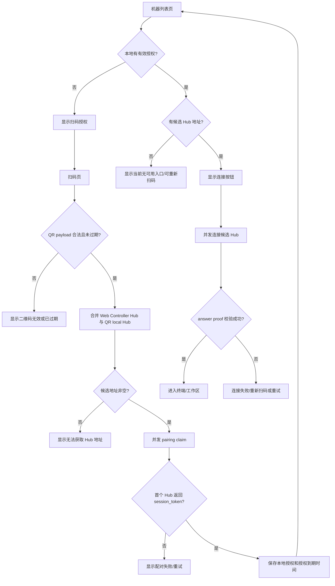
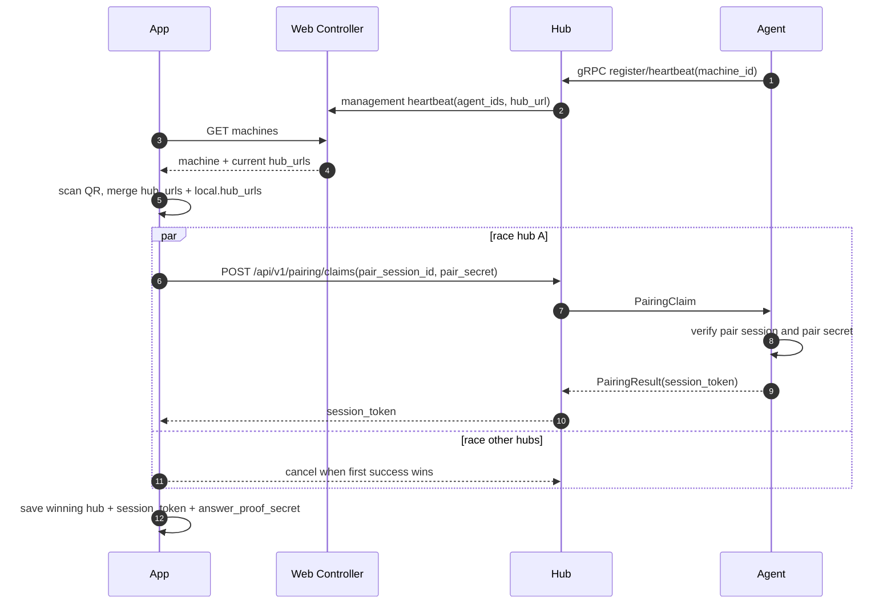

# Remote Pairing V2 Business Flow

本文档定义 App 扫码配对与后续连接的目标业务流程。后续实现以本文档为准。

## 目标边界

Web Controller 不参与连接鉴权，不转发 pairing claim，不记录机器是否已被 App 配对。它只提供账号下机器目录，以及每台机器当前注册在哪些 Hub。

Hub 负责 agent 注册、在线状态、内存态 pairing/signaling 中继和 ICE 配置。Hub 不做用户级鉴权，不调用 Web Controller 做单次连接判断，不保存 durable pairing state。

Agent 是 pairing/session token 的唯一签发与校验方。App 通过二维码拿到一次性 pairing material 后，直接向 Hub 发起配对请求；之后所有 runtime 数据仍必须走 WebRTC DataChannel。

## 角色职责

| 角色 | 做什么 | 不做什么 |
| --- | --- | --- |
| Web Controller | 用户登录、机器列表、Hub 地址目录、订阅/管理面状态 | 不代理 pairing claim；不签发/验证 session token；不记录 paired 状态；不参与 WebRTC offer/answer |
| Hub | agent 注册/心跳、pairing claim 中继、offer/answer 中继、ICE 配置 | 不做用户鉴权；不保存长期状态；不接收 runtime 数据 HTTP/WebSocket 代理 |
| Agent | 生成 pairing session、校验 pair secret、签发 session token、验证 session token、响应 WebRTC offer | 不依赖 Web Controller 才能完成单次配对或连接 |
| App | 扫码、向 Web Controller 拉机器/Hub 目录、并发向候选 Hub 配对/连接、保存 session token | 不把 Web Controller 作为连接链路依赖 |

## 二维码 Payload

`termx remote pair` 生成的二维码只描述目标机器与一次性配对材料，不携带云端 Hub 绑定关系。

```json
{
  "type": "termx_pair",
  "schema_version": 4,
  "machine": {
    "id": "machine_id",
    "name": "machine_name"
  },
  "pairing": {
    "session_id": "pair_xxx",
    "secret": "pair_secret",
    "answer_proof_secret": "proof_secret",
    "expires_at": "2026-05-18T12:00:00Z"
  },
  "local": {
    "hub_urls": [
      "http://192.168.1.10:18888",
      "https://user-frp.example.com"
    ]
  }
}
```

`local.hub_urls` 是可选数组。它表示该 agent 可能开启了 local hub，且这些地址可以被 App 尝试访问。这里允许用户通过 FRP、反向代理、公网映射等方式提供多个地址。

## App 机器列表发现

App 登录 Web Controller 后，通过机器列表接口拿到账号下 agent 目录。在线 Hub 模式 agent 必须能在列表页刷到。

目标返回信息：

```json
{
  "machines": [
    {
      "id": "machine_id",
      "name": "machine_name",
      "online": true,
      "hub_urls": ["https://hub-a.example.com"],
      "current_hub_url": "https://hub-a.example.com"
    }
  ]
}
```

业务要求：

1. 如果 Agent 使用 Hub 模式并在线，App 列表必须能看到这个 Agent。
2. 列表必须告诉 App 当前 Agent 连接在哪个 Hub。
3. Web Controller 只返回它从 Hub heartbeat 得到的目录信息；不保证 pairing 已完成，也不判断 App 是否有连接票据。
4. App 可以把列表中的 `hub_urls/current_hub_url` 与二维码中的 `local.hub_urls` 合并为候选 Hub 地址。
5. `hub_urls/current_hub_url` 使用 HTTP base URL。gRPC 是 Agent 与 Hub 之间的注册/长连接协议，App 不需要 gRPC 地址。

## App 页面业务流程

App 侧分为三个核心界面：机器列表页、扫码/配对页、连接页。页面状态以 App 本地授权数据和 Web Controller 机器目录合并后的结果为准。

### A 页：机器列表页

机器列表页展示“这个账号能看到哪些机器、哪些机器本 App 已授权、现在能不能连接”。

数据来源：

1. Web Controller `GET /api/v1/machines`：账号下在线/离线机器、当前 Hub HTTP 地址、最后在线时间。
2. App 本地授权存储：`machine_id` 对应的 `session_token`、`answer_proof_secret`、授权到期时间、上次成功 Hub、二维码里的 local hub 地址。
3. App 当前运行时连接状态：连接中、已连接、失败原因、上次路径。

列表合并规则：

1. 以 `machine_id` 为唯一 key。
2. Web Controller 有、App 本地没有授权：展示为“未授权”，可扫码授权。
3. App 本地有授权、Web Controller 暂时没有返回：展示为“已授权，在线状态未知”，允许用本地保存的 Hub/local 地址尝试连接。
4. Web Controller 和本地都有：合并名称、在线状态、Hub 地址和授权信息。
5. 授权过期后不删除机器卡片，状态显示“授权已过期”，主操作变为重新扫码授权。

每个机器卡片展示：

| 字段 | 来源 | 展示规则 |
| --- | --- | --- |
| 机器名称 | Web Controller 或 QR payload | 优先 Web Controller，其次本地授权记录 |
| 在线状态 | Web Controller | 在线、离线、未知 |
| Hub 状态 | Web Controller + 本地记录 | 当前 Hub、候选地址数量 |
| 授权状态 | App 本地授权 | 未授权、已授权、授权已过期 |
| 授权到期时间 | session token expires_at | 展示为“授权到期时间” |
| 上次连接路径 | App 本地运行记录 | Hub/local/未知 |

主操作：

1. `连接`：有未过期授权且至少一个候选 Hub 地址时可用。
2. `扫码授权`：未授权或授权过期时展示。
3. `刷新`：重新拉取 Web Controller 机器目录。
4. `移除本机授权`：只删除 App 本地保存的授权，不调用 Web Controller 删除机器。

空状态：

1. 没有 Web Controller 机器，也没有本地授权：提示登录后刷新，或扫描 `termx remote pair` 二维码。
2. Web Controller 不可用但本地有授权：列表仍展示本地机器，并允许尝试使用已保存 Hub/local 地址连接。

### 扫码/配对页

扫码页输入是 `termx://pair?payload=...`。扫码后先解析 payload，再进入配对确认/执行流程。

扫码后立即校验：

1. `type == "termx_pair"`。
2. `schema_version` 是当前支持版本。
3. `machine.id` 非空。
4. `pairing.session_id`、`pairing.secret`、`pairing.answer_proof_secret` 非空。
5. `pairing.expires_at` 未过期。
6. `local.hub_urls` 如果存在，必须是可解析的 HTTP/HTTPS URL。

扫码成功后的确认信息：

| 字段 | 展示 |
| --- | --- |
| 机器名称 | QR payload machine.name |
| 机器 ID | machine.id，可只展示短 ID |
| 配对二维码到期时间 | pairing.expires_at |
| 候选地址 | Web Controller 当前 Hub + QR local hub 地址数量 |

配对页动作：

1. App 尝试刷新 Web Controller 机器列表，查找同 `machine_id` 的在线 Hub。
2. 合并 Web Controller Hub 地址与 QR `local.hub_urls`。
3. 用户点击确认后，App 对全部候选 Hub 并发发起 pairing claim。
4. 第一个成功返回 `session_token` 的 Hub 获胜。
5. App 保存授权并跳回机器详情或列表页，机器状态变为“已授权”。

如果 Web Controller 不可用：

1. 只要二维码带有 `local.hub_urls`，仍允许继续配对。
2. 如果二维码没有 local 地址，则无法知道云端 Hub，提示“无法获取 Hub 地址，请稍后刷新机器列表或确认机器在线”。

### 连接页

连接页从某个机器卡片进入，输入是本地授权记录和候选 Hub 地址。

连接前校验：

1. 本地授权存在。
2. `session_token` 未过期。
3. `answer_proof_secret` 存在。
4. 至少有一个候选 Hub 地址。

连接执行：

1. 对候选 Hub 并发执行连接 race。
2. 每个候选 Hub 都走 HTTP Hub API：`/api/v1/sessions/ice` 与 `/api/v1/sessions`。
3. 第一个 WebRTC answer 成功且 answer proof 校验通过的连接获胜。
4. 关闭其他候选 Hub 的请求、PeerConnection 和临时 DataChannel。
5. 进入终端/工作区页面。

连接失败后：

1. 授权过期：回到扫码授权。
2. Hub 全部不可达：展示候选地址失败摘要，允许重试。
3. answer proof 失败：拒绝连接，提示安全校验失败，建议重新扫码。
4. session token 被 agent 拒绝：提示授权失效，建议重新扫码。

### App 本地授权存储

App 本地至少保存以下字段：

```json
{
  "machine_id": "machine_id",
  "machine_name": "machine_name",
  "session_token": "token",
  "answer_proof_secret": "proof_secret",
  "authorization_expires_at": "2026-05-19T12:00:00Z",
  "hub_urls": ["https://hub-a.example.com"],
  "local_hub_urls": ["http://192.168.1.10:18888"],
  "known_mode": "hub",
  "last_successful_hub_url": "https://hub-a.example.com",
  "updated_at": "2026-05-18T12:00:00Z"
}
```

存储规则：

1. `authorization_expires_at` 使用 Hub pairing result 的 `expires_at`，与 `session_token` 生命周期一致。
2. `answer_proof_secret` 保存到授权到期为止，授权过期后必须视为不可用。
3. 授权是 machine-scoped，不区分 local/hub 路径。只要 `machine_id` 与 machine secret 不变，这台机器的授权仍然有效。
4. `known_mode` 是 App 基于当前可用入口推导出的本地展示状态，可为 `local`、`hub`、`both`、`unknown`。它不是授权边界。
5. 新扫码成功后覆盖同 `machine_id` 的旧授权。
6. 移除授权只影响 App 本地，不影响 Web Controller 的机器目录，也不影响 Agent 在线。

### 模式切换与本地数据更新

机器身份由 `machine_id` 和 agent 本地 machine secret 决定，不由 remote 模式决定。纯 local、纯 hub、both 之间切换时，只要 `machine_id` 没变，App 都视为同一台机器。

授权不按模式区分。模式变化只影响 App 本地保存的入口地址、展示状态和下一次连接候选地址。只要 App 能通过任意入口连接上同一个 `machine_id`，就可以静默更新该机器的本地数据。

模式切换处理规则：

| 原模式 | 新模式 | App 行为 |
| --- | --- | --- |
| local | hub | Web Controller 列表出现同 `machine_id` 时，合并 Hub 地址并静默更新为 hub；旧 local 地址可保留但降级为候选历史地址 |
| hub | local | 如果 App 没有任何 local 地址，Web Controller 列表也不再返回该机器，则无法发现入口，需要重新扫码 |
| local | both | 保留 local 地址；Web Controller 列表出现 Hub 地址后静默追加，展示为 both |
| hub | both | 保留 Hub 地址；如果扫码或连接发现 local 地址，静默追加，展示为 both |
| both | local | 如果 Hub 列表不再返回，但 local 地址可连，静默更新为 local |
| both | hub | 如果 local 地址不可连但 Hub 可连，静默更新为 hub |

如果 agent 重新初始化了数据目录或 machine secret，导致 `machine_id` 改变，App 视为一台新机器。旧授权不能迁移。

App 选择候选地址时，需要满足：

1. 候选地址当前可用。
2. 本地授权未过期。
3. 连接成功后返回/证明的机器身份与本地 `machine_id` 一致。

如果没有任何候选地址能连接，但本地授权未过期，机器卡片展示“当前无可用入口”。如果已知机器从 hub-only 切到 local-only 且 App 没有 local 地址，展示“需要重新扫码获取本地入口”。

### App 页面状态图



## 候选 Hub 地址

扫码后，App 形成候选地址集合：

1. Web Controller 机器列表返回的在线 Hub 地址。
2. 二维码 `local.hub_urls` 内的本地或用户映射地址。

合并规则：

1. 去空、去重、标准化尾部 `/`。
2. 保留来源标记：`control_hub`、`qr_local`。
3. 不因为来源不同而走不同协议；对 App 来说它们都是 Hub HTTP API 信令目标。
4. 如果没有任何候选地址，配对失败，提示机器不在线或二维码缺少可达地址。

## 配对 Race

App 对所有候选 Hub 并发发起 pairing claim。当前选择策略先保持简单：第一个成功返回 `session_token` 的 Hub 获胜。

成功条件：

1. HTTP 状态为 200。
2. 返回包含 `session_token`、`machine_id`。
3. `machine_id` 与二维码 machine id 一致。
4. 返回未声明错误。

获胜后：

1. 立即取消其他候选 Hub 的请求。
2. 保存获胜 Hub 地址、`session_token`、`answer_proof_secret`、token 过期时间。
3. App 进入已配对/可连接状态。

失败处理：

1. 如果某个 Hub 返回 `pending`，这次设计暂不把它当成功；继续等其他 Hub。
2. 如果所有 Hub 都失败，汇总最有意义的错误：过期、secret 错误、机器不在线、网络不可达、Hub 拒绝。
3. `pair_session_id + pair_secret` 是一次性材料；如果 agent 已消费，重复扫码应提示用户重新运行 `termx remote pair`。

## 配对请求

App 直接请求 Hub，不经过 Web Controller。

```http
POST {hub_url}/api/v1/pairing/claims
Content-Type: application/json

{
  "machine_id": "machine_id",
  "pair_session_id": "pair_xxx",
  "pair_secret": "pair_secret",
  "app_device_id": "app_device_id",
  "app_name": "TermX Android",
  "requested_capabilities": ["terminal", "file_manager"]
}
```

Hub 收到后只做格式校验和在线 agent 路由，把 claim 投递给对应 machine 的在线 agent。Agent 校验 pair secret 并签发 session token。

公开 pairing claim 接口需要低成本防滥用机制。建议按 Hub 本地内存做 per-machine 和 per-IP 限流；限流只保护 Hub 资源，不代表用户鉴权。

Hub 返回：

```json
{
  "claim_id": "pair_claim_xxx",
  "machine_id": "machine_id",
  "machine_name": "machine_name",
  "session_token": "token",
  "expires_at": "2026-05-19T12:00:00Z"
}
```

## 后续连接 Race

配对成功后，App 用保存的 Hub 候选地址继续连接。候选地址可以包括：

1. 配对获胜的 Hub。
2. 机器列表刷新后的 `hub_urls/current_hub_url`。
3. 二维码中的 `local.hub_urls`。

连接 race 也是并发执行，第一个完成 WebRTC answer 且通过 answer proof 校验的地址获胜。获胜后释放其他连接尝试。

连接步骤：

1. `POST {hub}/api/v1/sessions/ice` 获取 ICE。
2. App 创建 WebRTC offer。
3. `POST {hub}/api/v1/sessions` 提交 offer、`session_token`、`answer_proof_challenge`。
4. Hub 转发 offer 给 agent。
5. Agent 校验 session token HMAC、过期时间和 machine id。
6. Agent 返回 WebRTC answer 和 `answer_proof`。
7. App 用二维码里的 `answer_proof_secret` 校验 answer。
8. WebRTC DataChannel 建立后，terminal/file/api/events 走 DataChannel。

## 在线配对流程图



## 连接流程图

```mermaid
sequenceDiagram
  autonumber
  participant App
  participant Hub
  participant Agent

  par race candidate hubs
    App->>Hub: POST /api/v1/sessions/ice(session_token)
    Hub-->>App: ICE servers
    App->>App: create WebRTC offer
    App->>Hub: POST /api/v1/sessions(offer, session_token, challenge)
    Hub->>Agent: SignalingOffer
    Agent->>Agent: verify session_token and machine_id
    Agent-->>Hub: SignalingAnswer(answer_proof)
    Hub-->>App: answer
    App->>App: verify answer_proof
  end
  App->>App: first verified connection wins, cancel others
  App<->>Agent: WebRTC DataChannel runtime traffic
```

## 废弃逻辑

以下逻辑在 V2 中废弃，后续实现时应移动到 deprecated/legacy 区域或删除，并更新调用方：

1. Web Controller `POST /api/v1/machines/{id}/pairing/claims` 代理 Hub pairing claim。
2. Web Controller 写入或依赖 `agents.paired` 表示 App 已配对。
3. 旧 `POST /api/agents/{id}/pair` 只改 DB 标记的流程。
4. App 把 Web Controller 当作 pairing 或连接链路中的强依赖。

## 需要改造的服务端点

Hub：

1. 云端 Hub 的公开 `POST /api/v1/pairing/claims` 应允许 App 直接提交 claim。
2. 这个公开接口只做机器在线/claim 格式/中继，不做 Web Controller 鉴权。
3. 公开接口增加轻量限流：per-machine 和 per-IP 维度即可，状态保存在 Hub 内存中。
4. Hub 仍然不得持久化 pairing/session state。

Web Controller：

1. 保留 `GET /api/v1/machines`，确保在线 machine 返回 `hub_urls/current_hub_url`。
2. 移除或废弃 pairing claim 代理接口。
3. 删除 `agents.paired` 字段及相关展示/判断/写入逻辑。

Agent：

1. 保持 PairStart 生成一次性 pairing session。
2. 保持 ClaimSession 由 agent 本地签发 session token。
3. Session token 授权对象是 machine，不区分 local/hub 连接路径。连接路径变化由 App 本地 endpoint 数据静默更新处理。

App：

1. 扫码后拉取机器列表，合并候选 Hub。
2. 对候选 Hub 并发 pairing claim，第一个成功获胜。
3. 对候选 Hub 并发连接，第一个 answer proof 校验成功获胜。
4. 取消其他并发请求和 PeerConnection。
5. 本地保存 `answer_proof_secret` 的生命周期与 `session_token` 一致；UI 展示为授权到期时间。

## 安全与可用性原则

1. Web Controller 宕机后，已获得 Hub 地址和 session token 的 App 仍应能连接。
2. 新设备首次扫码如果还没有 Hub 地址，仍可能需要 Web Controller 的机器列表；二维码里的 local hub 地址可作为无 Web Controller 兜底。
3. Hub 是分布式入口，承载 pairing/signaling 流量。
4. Pair secret 只用于一次性换 token；session token 由 agent 本机密钥签发，Hub 无法伪造。
5. answer proof 用于确认 WebRTC answer 来自持有 machine secret 的 agent。
6. 公开 Hub pairing claim 接口必须限流，避免单机 Hub 被无成本刷 pending claim。

## 已确认决策

1. 云端公开 `POST /api/v1/pairing/claims` 需要低成本防滥用机制，采用 per-machine/IP 限流。
2. App 只使用 HTTP Hub base URL；gRPC 地址不返回给 App。
3. `agents.paired` 字段直接删除。
4. App 本地保存 `answer_proof_secret` 到 `session_token` 过期为止，并展示为授权到期时间。
