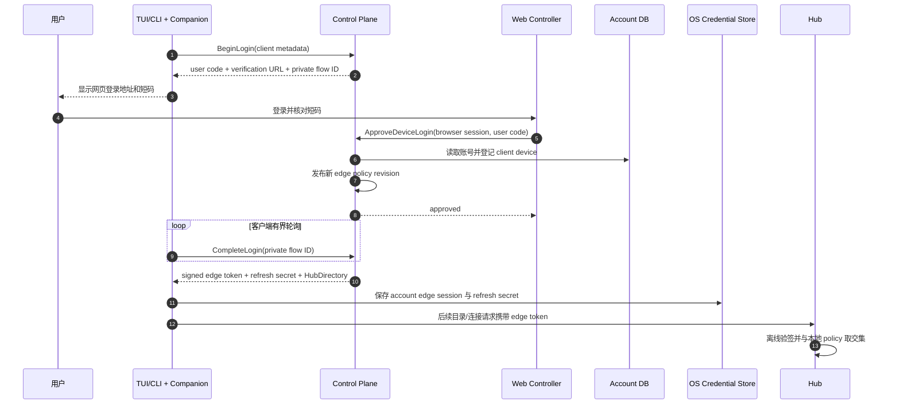
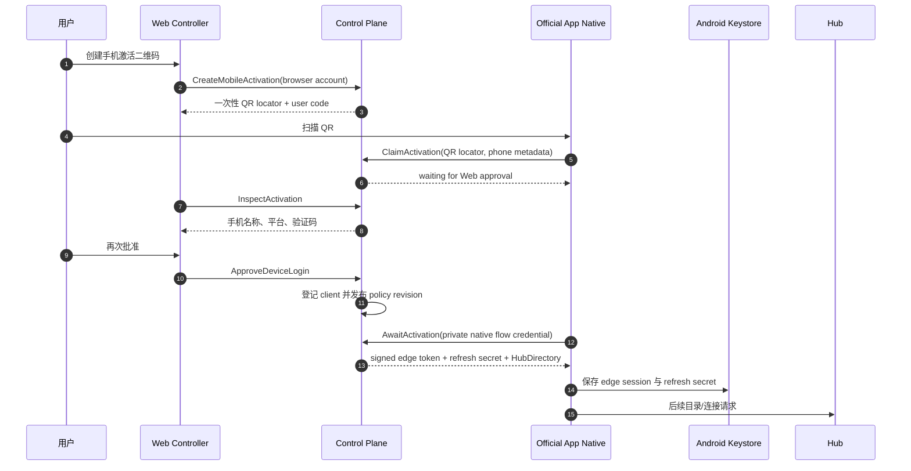
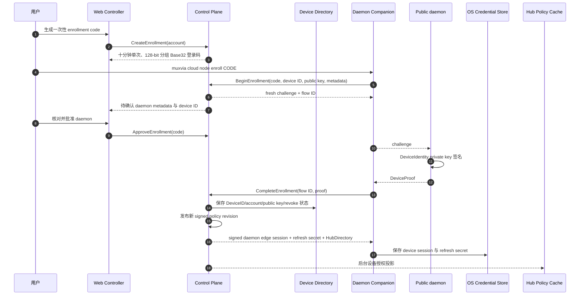
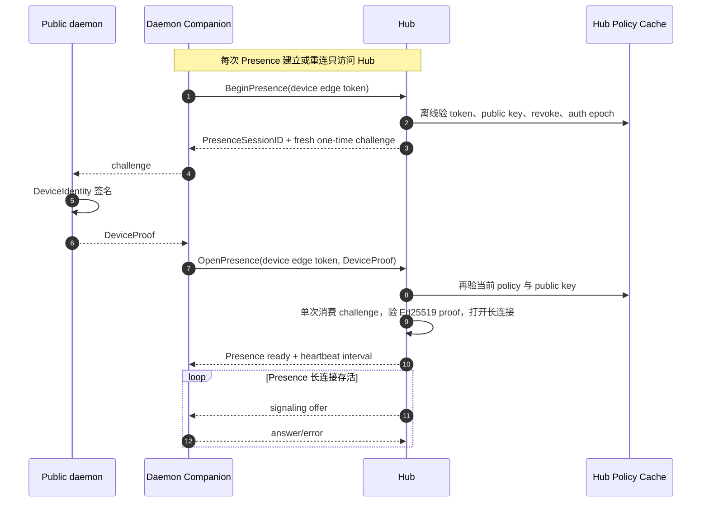
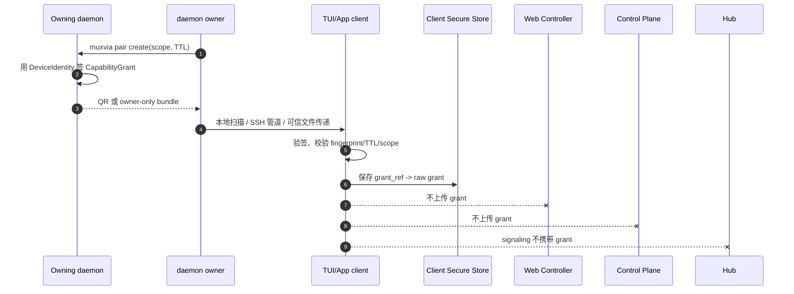
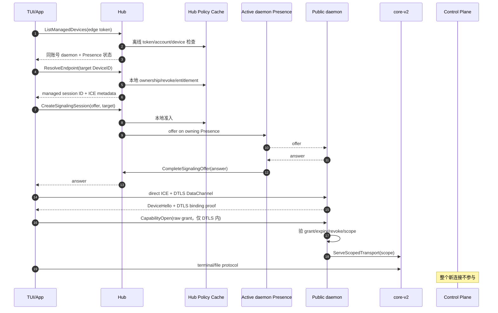
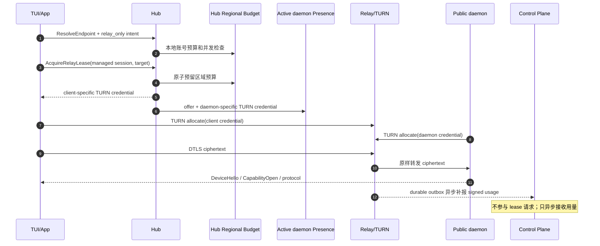
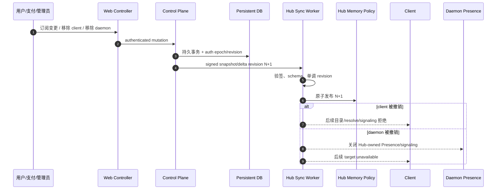
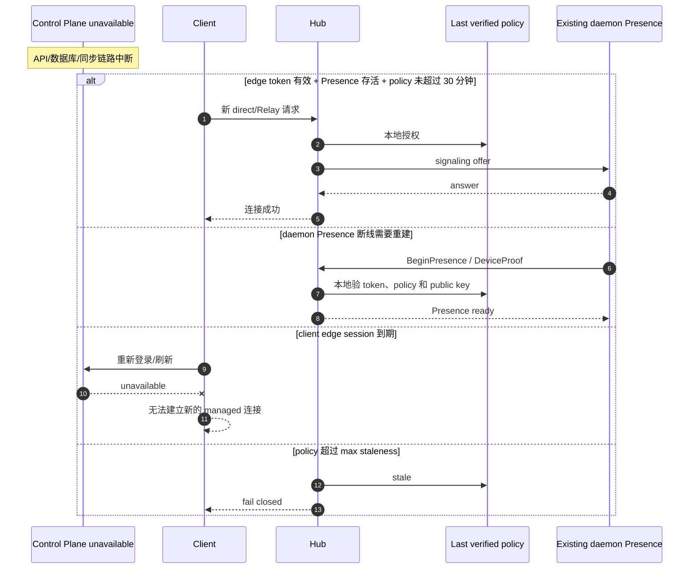
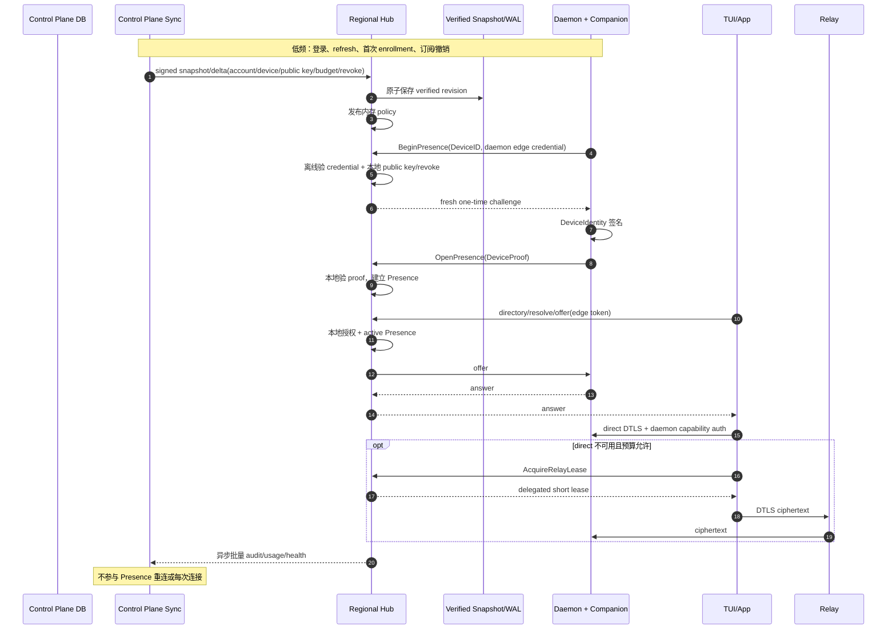

# Muxvia Cloud 全链路泳道与 Control Plane 降载审计

状态：CLOUD018 已实现基线

日期：2026-07-15

## 1. 结论

Muxvia Cloud 的连接热路径已经基本从 Web Controller 和 Control Plane 移到 Hub：客户端登录后，设备目录、endpoint resolve、direct signaling 和 single Relay lease 都只访问 Hub；WebRTC 建立后，direct 数据完全绕过云，Relay 也只转发 DTLS 密文。

三个 P0 缺口已经收口：

1. daemon Presence challenge/proof 完全由 Hub 基于本地签名 policy 验证，建立或重连不访问 Control Plane。
2. Control Plane 设备安全目录、Ed25519 authority 和 Hub 已验签 policy snapshot 均使用 `0600` 原子文件恢复；supervisor 重启后 daemon 不需要重新 enrollment。
3. account/device edge session 使用 30 天单次轮换 refresh secret；secret 只进入 OS credential store/Android Keystore，Control Plane 只持有 SHA-256，Hub 永远不接收 refresh。

Web Controller 不应、目前也不会参与每次连接。它只应出现在用户主动进行身份与管理操作时。Control Plane 应是低频持久真值和后台同步 owner，不应出现在 Presence 重连、direct 或 Relay 的请求热路径。

## 2. 参与者与部署关系

当前 staging 中，React Web Controller 由 Nginx 静态托管，浏览器 API 与 Control Plane HTTP API 运行在同一个 Cloud supervisor 进程内。图中仍拆成两个泳道，因为它们承担不同产品职责：

- Web Controller：用户可见的登录、批准、账号、订阅和设备管理入口。
- Control Plane：账号、设备 ownership、edge credential、策略 revision 和持久业务真值。
- Hub：本地授权投影、Presence、目录、resolve、signaling 和区域 Relay lease。
- Relay：验证短租约并转发端到端加密字节。
- daemon：DeviceIdentity、CapabilityGrant、terminal/file truth 的 owner。

## 3. 调用频率矩阵

| 场景 | Web Controller | Control Plane | Hub | Relay | daemon |
| --- | --- | --- | --- | --- | --- |
| 浏览器注册/登录 | 用户主动 | 读写账号数据库 | 不参与 | 不参与 | 不参与 |
| TUI/CLI 登录批准 | 用户主动批准一次 | 创建 Flow、签发 edge session | 登录后使用 | 不参与 | 不参与 |
| 手机 QR 激活 | 用户主动创建和批准 | 创建/认领 Flow、签发 edge session | 激活后使用 | 不参与 | 不参与 |
| daemon enrollment | 用户主动生成短码 | 验证 DeviceIdentity、登记 ownership、签发 device session | 接收后台投影 | 不参与 | 生成 proof |
| daemon Presence 首次建立/重连 | 不参与 | 不参与 | challenge + proof + 长连接 | 不参与 | fresh proof |
| 设备列表刷新 | 不参与 | 不参与 | 每次刷新 | 不参与 | 不参与 |
| direct 新连接 | 不参与 | 不参与 | resolve + signaling | 不参与 | answer + E2E auth |
| explicit Relay 新连接 | 不参与 | 不参与 | resolve + lease + signaling | allocate/转发 | answer + E2E auth |
| terminal/file 数据 | 不参与 | 不参与 | 不参与 | direct 时不参与；Relay 时只搬密文 | 每个 protocol 请求 |
| 订阅/撤销/踢线 | 用户或后台动作 | 更新持久真值 | 后台接收签名 revision | 可撤销新 lease | capability 撤销仍由 daemon |
| Relay 用量 | 不参与 | 异步接收幂等事件 | 预算预留 | durable usage event | 不参与 |
| policy 保鲜（当前 staging） | 不参与 | 每 5 分钟发布完整快照 | 原子应用 | 不参与 | 不参与 |

## 4. 当前真实实现泳道

### 4.1 TUI/CLI 账号登录

Web Controller 只参与用户批准。登录完成后，它不参与设备刷新或连接。edge token TTL 为 8 小时；Companion 在到期前 15 分钟低频访问 Control Plane，以 30 天单次 refresh secret 轮换新 token。提前刷新失败时，仍有效的 edge token 继续访问 Hub。

### 4.2 Official App Web QR 激活

二维码只定位活动 Flow。高熵 flow credential 留在原生层，WebView、Web Controller 和二维码都不能单独领取 edge session。

### 4.3 daemon enrollment

短期 enrollment flow 只存在于单个 Controller 进程内，以 TTL 和容量上限约束；重启后 pending flow 全部失效，用户必须重新生成。已 revoked 的 daemon 仍可用原 DeviceIdentity 私钥证明重新 enrollment；目录以 public key 连续性为真值，先撤销旧 session/Presence，再恢复或迁移账号 ownership，不要求删除本地身份文件。

enrollment 是低频 Control Plane 操作，保留在 Control Plane。注册完成后，Presence 重连只访问 Hub；device session 仅在低频 refresh 时访问 Control Plane。

### 4.4 daemon Presence 建立与重连

Hub 是 Presence 短期状态和 challenge 的 owner，Control Plane 是设备 ownership/public key 的持久 owner。cache miss、stale policy、错误 key、replay、撤销和角色不匹配全部 fail closed，且请求线程不回源。

### 4.5 CapabilityGrant 配对

账号相同只决定 Hub 是否允许发现和建立托管连接，不授予 terminal 权限。CapabilityGrant 始终由 daemon 签发，Web Controller 和 Control Plane 不能代替它。

### 4.6 managed direct 新连接

这是当前已经达到的主要降载目标。Control Plane、Web Controller 和数据库都不在 direct 请求热路径。

### 4.7 explicit single Relay 新连接

single Relay lease 已由 Hub 的区域委派 authority 签发。当前 SmartRoute、路径质量上报和 connection outcome API 仍明确 deferred/fail closed，不构成隐藏的逐连接 Control Plane 流量。

### 4.8 订阅、撤销与后台 policy 同步

当前 staging 不是独立分布式同步服务，而是同进程每 5 分钟重新签发完整 snapshot。生产实现需要真正的 snapshot/delta worker、持久 verified snapshot/WAL 和断档恢复。

## 5. Control Plane 故障窗口

| 故障条件 | 当前结果 | 是否符合目标 |
| --- | --- | --- |
| Web Controller 不可用，已有 edge session | 目录和连接继续 | 符合 |
| Control Plane 不可用，已有 Presence 和有效 policy | 新 direct/Relay 继续 | 符合 |
| Control Plane 不可用，daemon Presence 需要重建 | Hub 本地 challenge/proof，重新上线 | 符合 |
| Cloud supervisor/Hub 重启 | 恢复 authority、security directory 与 verified snapshot；无需重新 enrollment | 符合当前单机 staging 目标 |
| policy 同步中断超过 30 分钟 | 新连接 fail closed | 安全正确，窗口需产品决策 |
| 已建立 direct DataChannel | 通常继续，不依赖云 | 符合 |
| 已建立 Relay DataChannel | Relay lease/传输存活期内继续 | 符合 |

## 6. 已实现 Hub 自治泳道

目标架构仍保留 Control Plane，但把它限制为：

- 用户身份、账号、首次 enrollment、refresh、订阅、撤销和全局策略的持久 owner；
- 向 Hub 推送签名 snapshot/delta；
- 接收异步批量 audit/usage；
- 不参与 Presence challenge、Presence admission、resolve、signaling 或 Relay lease 请求。

## 7. 后续优先级

### 已完成 P0：移除 Presence 重连对 Control Plane 的同步依赖

- 把 fresh Presence challenge owner 从 Control Plane 移到 Hub。
- Hub 使用已同步的 daemon public key、DeviceID、AccountID、revoke 和 auth epoch 本地验证 DeviceProof。
- daemon edge credential 只证明云服务身份，不能替代 DeviceIdentity proof。
- cache miss、stale policy、proof replay 和 revoked device 继续 fail closed，禁止请求线程回源。

### 已完成 P0：持久化 Control Plane 设备安全真值

- 持久保存 DeviceID、account ownership、public key、kind、revoke、auth epoch 和 policy revision。
- Web 节点展示表不能作为设备安全真值；它缺少 public key 和完整 credential lifecycle。
- Cloud/Hub 重启后应能恢复 verified directory/policy，不要求用户重新 enrollment。

### 已完成 P0：补 account/device session refresh contract

- account 和 daemon device session 都需要明确 refresh/rotation，而不是固定 8 小时后重新登录或 enrollment。
- refresh 访问 Control Plane 是低频允许行为；Hub 不持有 refresh token，也不能自行延长账号权限。
- refresh secret 为 256-bit 随机单次凭据并绑定 kind/account/device；服务端只持有 SHA-256，重放失败，设备撤销会删除该设备全部 refresh 记录。

### P1：生产 Hub snapshot/delta worker

- Control Plane 预计算签名 snapshot/delta，数据库变更时推送；正常保鲜不应每 5 分钟全表重读。
- Hub 持久化 verified snapshot/WAL，重启先恢复再后台追 revision。
- `max_staleness` 是最大撤销传播窗口，需要按套餐/安全等级明确配置和监控，不能无限延长。

### P1：Web Controller 与 Control Plane 资源隔离

- React 静态资源可由 CDN/Nginx 提供，不消耗 Control Plane 进程。
- 浏览器 API 可以保持同一安全域，但应有独立限流、连接池和只读 projection，避免 Landing/账号查询挤占 Hub 同步和 credential 签发资源。
- Web Controller 故障不得影响已有 edge session、Presence 或连接。

### P2：异步 telemetry

- SmartRoute 恢复后，质量与 outcome 先写 Hub/客户端有界队列，再批量异步进入 Control Plane。
- 连接成功不能等待 telemetry ACK；telemetry 失败不能触发 transport fallback 或改变 terminal capability。

## 8. 不应做的“降载”方式

- 不把 Control Plane 数据库复制到每个连接请求的本地 fallback。
- 不让 Hub 在 cache miss 时同步查询 Control Plane。
- 不把 edge token 变成永久 token，也不无限延长 stale policy。
- 不让 Web Controller 代发或保存 CapabilityGrant。
- 不把 terminal inventory、文件 metadata 或 DataChannel payload同步到 Hub。
- 不用客户端自报“订阅有效”或“daemon 在线”替代签名 policy 和 Hub Presence。

## 9. 最终判断

Web Controller 只处理用户主动管理动作，不参与连接。Control Plane 已退出 Presence、direct、single Relay 请求热路径；数据库压力主要来自低频身份/订阅/撤销、session refresh 和后台 policy 发布。

当前剩余工作是把单机 JSON/snapshot authority 演进为生产数据库和独立 Hub snapshot/delta worker，并为 `max_staleness`、authority 轮换、备份恢复和多区域发布建立上线门禁。它们不应重新把 Control Plane 拉回逐连接路径。
