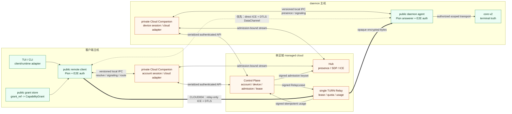
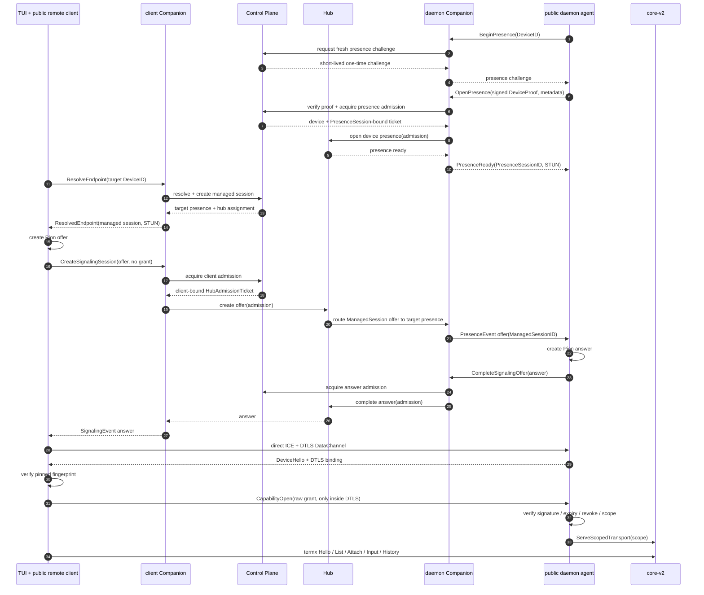

# TermX Cloud 单区域 Staging 纵向路线图

状态：唯一活动实现真值

生效日期：2026-07-11

对应切片：CLOUD001-CLOUD005

## 1. 文档权威性

本文件回答三个问题：当前 managed cloud 到底能不能用、下一切片要打通哪一条真实消息链路、什么用户行为才算完成。

- `product-prd.md`、`architecture-spec.md`、`security-protocol-spec.md`、`network-topology.md`、`distribution-and-cloud-companion-spec.md` 和 `global-acceleration-spec.md` 继续定义产品、安全和目标架构。
- 旧文档中的 RP/GA “完成”只表示 contract、领域组件或 harness 已落地，不再作为 runtime 完成度依据。
- 当前实现状态、执行顺序和用户可观察 DoD 只以本文件和根 `workflow.md` 为准。
- 如果实现为了通过单个测试而绕过本文消息链路，切片仍未完成。

## 2. 当前阶段目标

当前只建设一个单区域、可在开发机启动、可由真实 TUI 和 Official Android 使用的纵向闭环：

1. 一个命令启动显式 dev cloud。
2. daemon 通过本机 Companion 在 Hub 建立 presence。
3. TUI 通过本机 Companion resolve 目标并完成 direct WebRTC。
4. 同一链路可以显式强制经过一个 lease-bound TURN Relay。
5. Official Android 通过同一 cloud contract 连接同一个 daemon。
6. direct、Relay 和 Android 最终都在 DTLS DataChannel 内执行同一套 DeviceIdentity 和 CapabilityGrant 授权，再运行同一种 termx protocol。

当前明确不做：生产 OAuth、生产 TLS 和域名、持久化数据库、Kubernetes、多区域、Relay Mesh、transit、复杂 billing、团队治理、通用插件、public snapshot 和正式发布流水线。

## 3. 当前代码真值

| 组件 | 已存在的真实能力 | 当前阻塞 |
| --- | --- | --- |
| `core/` | terminal lifecycle、scoped transport、live/history 真值；desktop 与 Android 共用授权后的 termx protocol | 当前单区域纵向链路无 core 阻塞 |
| `tui/` | 多 endpoint manager、managed dial、局部失败、连接 phase、实际 direct/single_relay path 与远程 terminal 投影 | desktop 纵向链路已闭环；不承担 Android 装配 |
| `remote/client` | Pion offer、relay-only ICE、caller-specific RelayLease、DTLS fingerprint、capability handshake 和 protocol transport | 自动 SmartRoute 继续延后，不影响显式 single Relay |
| `remote/daemon` 与 `remote/webrtc` | fresh-proof presence 续约、principal-specific TURN material、relay-only answerer、DataChannel auth 和 core scoped transport | 自动 SmartRoute 继续延后 |
| `shared/cloudcompanion` | versioned local IPC、single Relay material 校验、错误语义、stream、fake 和 installer contract | contract 本身不提供云服务 |
| `private/cloud/companion` | sidecar、本地 IPC、账号/device session、显式 dev HTTP adapter、direct signaling 和 Relay lease orchestration | 默认路径继续 fail closed；Official Android 使用独立私有装配 |
| `private/cloud/control-plane` | PresenceSession/ManagedSession、admission、entitlement、session-bound Relay lease、principal credential 与 usage ledger | 生产 entitlement/billing 与持久化继续延后 |
| `private/cloud/hub` | admission-bound presence、offer/answer/candidate 路由和 ManagedSession-bound relay-only intent | 不接收 TURN credential、grant 或 terminal payload |
| `private/cloud/relay` | dev service 中的真实 Pion UDP TURN、lease authority、到期/并发/quota、meter 和 signed usage | 多区域与 Relay Mesh 继续延后 |
| `private/cloud/route-planner` | direct/single-relay 决策和短期 route plan contract | 自动 SmartRoute 未进入当前用户链路，继续延后 |
| Desktop endpoint registry | `hub-p2p`、device pin、`grant_ref`、relay mode、pairing create/import 和原子 registry writer | direct 与显式 relay-only 均可配置 |
| Official Android | 显式 dev gateway、Keystore pairing import、真实 DTLS certificate binding、capability authorizer、单一 protocol DataChannel、core-v2 live screen 与共享 terminal multiplexer | 单区域纵向 DoD 已完成；生产账号/TLS 继续延后 |

结论：Desktop managed direct、显式 single Relay 与 Official Android 真实用户链路均已闭环；CLOUD001-CLOUD005 单区域目标完成，生产和多区域事项继续延后。

## 4. 单区域纵向拓扑



图中的 Companion 有两个实例，分别服务 client 和 daemon 的本机公开进程。它们可以连接同一组 Control Plane/Hub，但账号 session、device session、本地 IPC socket 和状态目录必须按 profile 隔离。

## 5. 固定消息链路

### 5.1 四类 session 身份

以下身份不能共用 ID，也不能因为都叫 session 就互相替代：

| 身份 | Owner | 生命周期与用途 |
| --- | --- | --- |
| CloudCredentialSession | Companion/Official module + Control Plane | account 或 device 的云 API authorization；不表示在线或 terminal 权限 |
| PresenceSession | daemon Companion + Hub | 一个已证明 DeviceID 的短期在线注册；先于任何 client resolve 存在，可承接多个 ManagedSession |
| ManagedSession | Control Plane | 一次 client DeviceID 到 target DeviceID 的托管连接意图；绑定 signaling、route、Relay lease 和质量摘要 |
| ProtocolSession | public client/daemon + core-v2 | DTLS DataChannel 内 capability 通过后形成的 termx protocol session |

CLOUD002 已修正旧 session 混用：presence 使用独立 `PresenceSessionID` 和 fresh one-time challenge，offer 保留自己的 `ManagedSessionID`，enrollment challenge 不会复用为 presence proof。

### 5.2 控制面链路

```text
public client/daemon
  -> local versioned Companion IPC
  -> private Companion cloud adapter
  -> serialized Control Plane or Hub network API
```

公开进程不直接调用私有 Control Plane/Hub package，也不根据 endpoint 配置绕过 Companion 直连某个 Hub。Companion 不建立 PeerConnection，不接收 grant，不代理 termx protocol。

### 5.3 direct 数据面链路



### 5.4 single Relay 数据面链路

CLOUD004 不新增 terminal protocol，也不新增授权模式。它只把 ICE path 从 direct 改成一个 Relay：

```text
Companion -> Control Plane: request route/RelayLease
Control Plane -> Companion: caller-bound short TURN material
client + daemon -> one Pion TURN server: allocate with distinct credentials
client <-> Relay <-> daemon: opaque DTLS/DataChannel bytes
client <-> daemon inside DTLS: unchanged DeviceHello/CapabilityOpen/termx protocol
Relay -> Control Plane: signed idempotent usage
```

首个 Relay 验收必须使用显式 `relay_only`，不能靠等待 direct 偶然失败来触发。自动选择、SmartRoute 和会话中换路都不属于 CLOUD004 的完成条件。

### 5.5 Official Android 链路

Android 不运行桌面 Companion 进程，但 Official 私有 module 必须实现相同逻辑 contract：

```text
public Android UI/connector
  -> Official private cloud adapter
  -> same Control Plane/Hub network API

raw grant: QR/text import -> Android Keystore -> public Android authorizer -> DTLS DataChannel
terminal traffic: public WebRTCTransport -> DTLS DataChannel -> public daemon -> core-v2
```

Official module 不能接收原始 grant。Community APK 继续使用 disabled adapter，不能因 Official 接线而获得隐藏 cloud fallback。

## 6. Truth 与凭据可见性

| 数据或凭据 | Owner / truth source | 允许经过 | 禁止经过 |
| --- | --- | --- | --- |
| terminal lifecycle/history | owning `core-v2` daemon | authorized termx protocol | Control Plane、Companion、Hub、Relay |
| DeviceIdentity private key | public daemon process/local secure state | daemon-local signing | Companion、Control Plane、Hub、Relay |
| Device fingerprint/public proof | public daemon identity | client、Companion、Control Plane、Hub admission metadata | 不得替代 account token 或 grant |
| CapabilityGrant | daemon 签发；client secure store 持有 | out-of-band pairing、DTLS DataChannel | Companion、Control Plane、Hub、Relay、SDP、日志 |
| AccountAccessToken/session | Companion 或 Official module | Control Plane | public remote runtime、Hub、Relay |
| HubAdmissionTicket | Control Plane | Companion 与 Hub | public endpoint config、DataChannel、长期存储 |
| RelayLease/TURN material | Control Plane/Relay authority | Companion、Pion ICE config、Relay | terminal protocol、grant store |
| SDP/ICE | public Pion 生成；Hub 路由 | public process、Companion、Hub | terminal/history storage |

任何服务日志、错误详情或测试 fixture 中出现原始 CapabilityGrant、DeviceIdentity private key 或 terminal payload，均视为切片失败。

## 7. Dev Cloud 运行剖面

CLOUD002 建立名为 `dev-local` 的显式 staging 剖面：

- `make cloud-dev` 是唯一启动入口，前台运行并响应 SIGINT/SIGTERM。
- 默认只绑定 loopback；Control Plane 和 Hub 使用不同 HTTP listener，Relay 使用独立 UDP TURN listener、短期凭据和计量边界。
- 一个 dev supervisor 可以在同一进程托管多个 listener；当前不为了生产部署提前引入容器编排或多进程 supervisor。
- 每次启动生成短期 admission/lease signing key、固定 dev account、一次性 enrollment code 和运行 manifest。
- 运行 manifest 写入 `.artifacts/cloud-dev/`，包含地址、公开 key 和 dev profile，不包含 CapabilityGrant、DeviceIdentity private key 或长期生产 secret。
- Companion 只有收到显式 dev config 才连接该服务；默认 release/无配置路径继续装配 fail-closed adapter。
- dev account、内存 store、固定 entitlement 和 loopback 明文仅允许出现在显式 dev profile。任何 production channel 发现 dev flag、固定账号或测试 key 必须拒绝启动。
- Android 设备测试优先使用 `adb reverse` 访问开发机 loopback listener，不为 CLOUD005 提前建设公网 dev 环境。

“真实服务边界”在当前阶段表示：请求必须经过 socket、序列化、认证、超时和错误映射；不能由 Companion 直接 import Control Plane/Hub 的内存 Service 来冒充网络对接。

## 8. 分切片 DoD

### 8.1 CLOUD002：最小单区域开发云服务

实现范围：

- 为 Control Plane 和 Hub 增加最小可启动网络 surface 与 health/readiness。
- 先拆开 PresenceSession 与 ManagedSession，并增加独立 fresh presence challenge/proof；不得把 enrollment flow、account session 或 client managed session 当作 daemon 在线证明。
- 在 Companion 增加显式 dev cloud adapter，覆盖 login、device enrollment、presence challenge、resolve、presence admission、client admission、answer admission 和 signaling。
- 使用现有进程内领域组件作为 owner，不重写账号、目录、admission 或 Hub 路由模型。
- 增加跨真实 listener 的 harness；此切片不接 Pion、不接 TUI、不接 Android。

完成条件：

1. `make cloud-dev` 一条命令启动并打印脱敏的 Control Plane、Hub、profile 和 readiness。
2. 两个隔离 Companion profile 可以分别建立 client account session 和 daemon device session。
3. daemon profile 使用 fresh challenge 打开一个 device-scoped PresenceSession；challenge 重放、过期、错 key 和错 DeviceID 全部拒绝。
4. client profile 能 resolve 同一 DeviceID，并创建独立 ManagedSession；PresenceSession ID 与 ManagedSession ID 不相等。
5. client 发送一个不含 grant 的测试 offer，daemon presence 收到该 ManagedSession 的 offer，并把 answer 经 Hub 返回 client；同一 presence 可以承接后续另一个 ManagedSession，跨 session answer 被拒绝。
6. 错账号、错 DeviceID、错 admission、过期 admission、Hub 关闭和 stream backpressure 返回稳定局部错误。
7. 跨组件捕获证明 cloud 请求和日志不含 grant、设备私钥或 terminal payload。

不算完成：只增加更多 interface/fake、Companion 直接调用 Hub Service、只有 health endpoint、或依赖生产 OAuth/数据库才能运行。

### 8.2 CLOUD003：Desktop managed direct

状态：完成。

实现范围：

- 将 `remote/daemon.Agent`、Pion answerer、DataChannel `SessionAcceptor` 和 running core-v2 装配进显式启用 cloud 的 daemon 生命周期。
- 让 desktop Companion 使用 CLOUD002 的真实 dev adapter，支持 daemon presence 与 client signaling 并存。
- 补最小 public pairing UX：daemon 签发 grant；client 导入 bundle 后把 raw grant 写入 credential store，只把 `grant_ref` 写入 endpoint registry。
- 修正 managed endpoint 输入：Hub assignment 由 Companion/Control Plane 决定，当前被要求但被 dialer 忽略的 `hub_url` 不再作为有效 dial identity。target DeviceID、fingerprint、grant ref 和 relay policy 保持彼此独立。
- 复用现有 TUI endpoint manager 和 termx protocol，不增加 managed terminal inventory API。

用户可观察完成条件：

1. 用户启动 dev cloud、两个 Companion profile 和一个真实 `termx daemon`。
2. 用户完成 dev login/enroll，并通过 public pairing create/import 得到 managed endpoint。
3. TUI picker 显示远程 endpoint；连接状态经过 resolving/signaling/authorizing 后显示 direct。
4. TUI 从远程 daemon 的 termx protocol 列出 terminal，能够 attach、输入、resize、读取 live/history，并与本地 endpoint 同时存在。
5. 关闭 Companion、Hub 或远程 daemon 时只影响该 managed endpoint；local/SSH 和其他 endpoint 不被清空，也不发生 fallback。
6. managed direct E2E harness 使用真实 loopback network、真实 Pion DataChannel、真实 capability handshake 和真实 core-v2 protocol，不允许 fake Companion 或 memory transport 作为最终证据。

不算完成：只能跑 `remote/client` 单测、只能 ping Companion、手工把 offer/answer 粘贴到测试中、或 TUI 只展示一个假 online 状态。

### 8.3 CLOUD004：单区域 single Relay

状态：完成。

实现范围：

- `make cloud-dev` 在同一 `dev-local` region 启动一个真实 Pion UDP TURN Relay。
- Control Plane 通过现有 entitlement/relaylease 领域服务签发短期、session-bound、client/daemon 分离的 Relay material。
- Companion/route material 把选中的 TURN server 交给公开 Pion；Relay authority 验证 lease、并发、到期和 quota。
- Relay usage 通过 signed idempotent event 回到 Control Plane 内存 ledger。

用户可观察完成条件：

1. managed endpoint 设置显式 `relay_only` 后，TUI 仍能完成与 CLOUD003 相同的 List/Attach/Input/History 操作。
2. 客户端确认 selected ICE candidate 是 relay，TUI 显示 `single_relay`，不是根据配置猜测路径。
3. 无 lease、错 principal、错 session、过期 credential、并发超限和 quota 耗尽都被 Relay/Control Plane 拒绝。
4. Relay 停止只使当前 Relay endpoint 失败，不影响 local/SSH；不自动切回 direct 来掩盖 Relay 故障。
5. usage bytes 非零、重复事件不重复结算、Relay 进程无法读取 DataChannel payload。

不算完成：只有现有 TURN 单测、使用静态 TURN username/password、或由客户端自行选择未授权 TURN URL。

### 8.4 CLOUD005：Official Android

状态：完成。代码接线、client workspace、Community/Official 单测、三个 APK、class boundary、真实 daemon List/Attach/Input/Output、2 秒/10 秒恢复、Hub 局部失败和 Community fail closed 均已通过。Community 验收后设备物理断开，重连后只需恢复安装 Official dev APK，不影响切片完成度。

实现范围：

- 用真实 dev cloud gateway 替换 Official development gateway 的固定 `login_required`。
- Official gateway 实现与 desktop Companion 相同的 resolve、signaling 和 route error 语义，但继续不接收 grant。
- 增加 public Android DeviceIdentity/DTLS/capability authorizer；不能继续装配 `CommunityEndpointAuthorizer`。
- 使用现有 `AndroidGrantCredentialStore`，增加 QR/文本 pairing import，把 endpoint identity 与 raw grant 分开持久化。
- 对接现有 `ConnectionStore`、terminal protocol bridge 和前后台恢复，不复制第二套 terminal lifecycle。

用户可观察完成条件：

1. Official APK 通过 `adb reverse` 连接 `dev-local` cloud，Community APK 仍稳定显示 cloud module missing。
2. 用户扫码或导入 pairing bundle 后，App 能 resolve、signaling、direct WebRTC、验证 daemon、提交 grant。
3. App 能列出远程 terminal、attach、输入并看到真实输出；失败时没有 legacy WebSocket/旧 Hub fallback。
4. App 进入后台再恢复后，连接状态与 endpoint identity 正确；恢复失败只影响该 endpoint，并提供可重试状态。
5. Official 单测、APK 构建边界、Android managed E2E harness 和 ADB 手测清单全部通过。

不算完成：Official factory 只存在于 APK、只验证 `login_required`、使用 Community authorizer、或只在 JVM fake 中成功。

## 9. 失败边界

| 失败点 | 正确 owner | 必须发生 | 禁止发生 |
| --- | --- | --- | --- |
| dev cloud 未启动 | Companion adapter | managed operation 返回 route unavailable | 尝试 archive Hub、local 或 SSH |
| account session 缺失 | Companion/Official module | login required | public process 读取账号 token |
| daemon device session 或 fresh proof 缺失 | daemon Companion/Control Plane | PresenceSession 不建立 | 复用 enrollment challenge 或把 daemon 描述为 online |
| admission 过期或绑定错误 | Hub | 拒绝当前 presence/signaling | 接受长期 bearer token |
| target presence 不存在 | Control Plane/Hub | 当前 endpoint offline | 创建伪 terminal inventory |
| fingerprint 不匹配 | public client auth | DataChannel 关闭 | Companion 或 Hub 代替用户信任新设备 |
| grant 过期/撤销/scope 错误 | public daemon auth | protocol session 不创建 | 云端解释或扩大 scope |
| Relay lease/quota 失败 | Control Plane/Relay | relay-only endpoint 失败 | 偷用共享 TURN credential 或切 direct 掩盖 |
| Companion 崩溃 | owning managed endpoint | 当前连接或新连接失败 | local/SSH/core daemon 生命周期受影响 |

## 10. 总体验收与停止条件

CLOUD005 已完成，原单区域 Cloud 纵向目标随之完成。CLOUD009-CLOUD011 按 `hub-edge-control-plan.md` 继续把逐连接 Control Plane admission 下沉到 Hub；本文件以下原链路记录保留为迁移前基线，不再作为新授权 ownership 真值。最终审计已经证明：

- Desktop direct、Desktop single Relay、Official Android 三条链路都到达同一个真实 daemon/core-v2 terminal protocol。
- 三条链路只改变 transport/path，不改变 Endpoint/TerminalRef、history owner 或 capability 语义。
- Control Plane、Companion、Hub、Relay 的请求、日志和持久化均看不到原始 grant、DeviceIdentity private key 和 terminal payload。
- local、SSH 和多 endpoint 仍可独立工作。
- 所有 dev shortcut 都被显式 profile 隔离；默认无配置路径继续 fail closed。

完成本轮后再根据真实测量决定是否恢复 GA003。生产 OAuth/TLS、数据库、billing、多区域、Relay Mesh、正式开源和发布隔离仍是独立后续目标，不得在 CLOUD002-CLOUD005 中提前展开。
