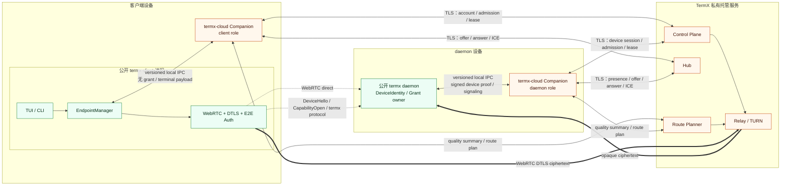

# TermX 发布、安装与 Cloud Companion 规范

状态：RP006A 安装、进程激活与 Android 官方私有模块构建基线完成；生产发布根与 OAuth/TLS adapter 仍由正式发布环境注入

日期：2026-07-11

## 1. 决策结论

TermX 桌面/headless 不发布一个同时包含公开 core 和闭源 cloud 代码的混合主程序，也不在当前分支恢复通用插件系统。移动端因平台分发模型采用官方私有模块构建，但继续受同一公开 contract 和安全边界约束。目标分发模型是：

1. `termx`：公开、可独立构建和使用的主程序。
2. `termx-cloud`：桌面/服务器用户可选安装的闭源官方 Cloud Companion sidecar。
3. Official App cloud module：移动端官方构建使用的闭源模块，实现与 companion 相同的公开 contract。
4. Control Plane、Web Controller、Hub、Relay、Route Planner：只部署在 TermX 托管环境的闭源服务端。
5. Enterprise cloud bundle：按商业协议交付的私有容器、配置和运维资产。

普通用户只需要安装 `termx`。只有使用官方 managed cloud、Relay、SmartRoute、云同步或团队能力时，桌面端才安装 `termx-cloud`。

## 2. 为什么使用 Companion 而不是进程内插件

### 2.1 安全边界清晰

公开 `termx` 进程继续拥有：

- DeviceIdentity private key。
- 原始 CapabilityGrant 和 `grant_ref` 解析。
- WebRTC PeerConnection、DTLS peer certificate 验证和 DataChannel。
- DeviceHello/CapabilityOpen 端到端授权状态机。
- termx protocol、terminal payload 和 core-v2 scoped session。

闭源 `termx-cloud` 只拥有：

- AccountAccessToken、登录 session 和设备 enrollment session。
- 官方 Control Plane/Hub TLS client。
- endpoint resolution、presence 和 SDP/ICE signaling。
- HubAdmissionTicket、RelayLease 和 principal-specific TURN credential。
- 网络质量 summary、route candidate 和 SmartRoute selection result。
- managed cloud 配置同步与 entitlement 错误。

Companion 不接收 CapabilityGrant、DeviceIdentity private key、DataChannel frame、termx protocol frame、terminal ID/list/content、history 或输入。

### 2.2 发布边界清晰

- public namespace 不 import、link、embed 或 vendor `private/` 模块。
- Companion 可以独立签名、升级和回滚，不要求重发整个 TUI/core。
- Companion 崩溃或版本不兼容只影响 managed cloud endpoint。
- 公开构建可以用 fake companion 完成 contract 测试。
- 私有实现被逆向也不能绕过服务端 entitlement；真正商业 moat 仍是托管服务、网络、运营和计费。

### 2.3 不使用通用插件系统

Cloud Companion 是一个固定用途、固定 publisher、固定 RPC surface 的官方 sidecar，不是插件市场。它不允许：

- 第三方注册任意 action、transport 或 UI。
- 动态加载 `.so`、`.dylib`、`.dll` 或 Go plugin。
- 由 Hub/Control Plane 返回任意 executable URL。
- companion 请求公开进程执行 shell command 或加载脚本。
- 用 cloud capability 绕过公开 endpoint/transport contract。

## 3. Artifact 矩阵

| Artifact | 源码 | 安装位置 | 用户 | 包含内容 | 不包含 |
| --- | --- | --- | --- | --- | --- |
| `termx` | 公开 | 用户设备 | 所有人 | core/TUI/CLI/daemon/local/SSH/WebRTC/E2E auth/public contract | 私有 cloud 实现和 server |
| `termx-cloud` | 私有 | 桌面或 headless daemon 设备 | managed cloud 用户 | account/cloud/signaling/lease/route adapter | grant/DataChannel/terminal payload |
| Official App | 公开 app + 私有 cloud module | Android/iOS 官方包 | 移动 cloud 用户 | UI、platform WebRTC、同一 cloud contract adapter | cloud server |
| Community App | 公开 | 可复现社区包 | 开源用户 | 公开 App 能力和 fake/disabled cloud adapter | 私有 cloud module |
| `termx-cloud-server` bundles | 私有 | TermX regions | 官方运维 | Control Plane/Hub/Relay/Route Planner | 用户 terminal truth |
| Enterprise bundle | 私有商业交付 | 客户基础设施 | 企业 | 许可范围内的 server containers/ops assets | 公开主程序私有 fork |

官方可以提供同时安装 `termx` 与 `termx-cloud` 的 convenience/meta package，但两个 artifact、进程、签名和许可证边界保持独立。

源码共同保存在当前私有 authoritative monorepo；artifact 拆分不要求源码拆成两个仓库。所有闭源实现统一位于 `private/`。开发阶段只在当前 Git 仓库正常提交；正式开源时把审核后的公开目录复制到全新的空 Git 仓库并从零建立公开历史。

## 4. 进程与网络拓扑



Companion 可以观察 SDP/ICE 和网络质量，但不能读取 WebRTC DataChannel。恶意或被攻破的 companion 最多可以拒绝服务、返回错误目标或干扰 signaling；公开进程仍必须通过 pinned DeviceFingerprint 和 DTLS binding 阻止 daemon 冒充。

## 5. Public Cloud Companion Contract

public namespace 定义 domain interface、versioned IPC message、error taxonomy、fake server 和 fixtures。私有 companion 实现该 contract。

### 5.1 Transport

桌面/headless v1：

- Unix：user-scoped Unix domain socket。
- Windows：user-scoped Named Pipe。
- socket/pipe 由 OS ACL 限制为 owning user 或明确的 daemon service account。
- client 验证 endpoint owner、文件类型和权限后连接。
- server 使用 OS peer credential/ACL 拒绝其他用户。
- 单个 OS user 默认只有一个 active companion instance。

移动端不启动外部 executable。官方私有模块通过进程内 platform interface 实现同一 domain contract，但不能改变 message 语义或安全边界。

### 5.2 Version handshake

连接建立后第一条消息必须是：

```text
CompanionHelloRequest {
    protocol_min
    protocol_max
    termx_version
    caller_role       # tui | cli | daemon
    requested_capabilities
    request_nonce
}

CompanionHelloResponse {
    selected_protocol
    companion_version
    supported_capabilities
    build_channel
    response_nonce
}
```

规则：

- 无共同 protocol version 时 fail closed，返回 `cloud_companion_incompatible`。
- capability negotiation 只能减少功能，不能扩大账号 entitlement 或 terminal scope。
- 未协商的 optional field 不得被解释为默认授权。
- 主程序不得因 companion 版本不兼容 fallback 到旧 remote/session-token path。

### 5.3 Lifecycle operations

```text
GetStatus() -> install/session/protocol/capability status
BeginLogin(login method) -> browser/device-code flow metadata
CompleteLogin(flow id) -> account session summary
Logout(purge account session) -> result
BeginDeviceEnrollment(one-time code, device public metadata) -> challenge
CompleteDeviceEnrollment(signed challenge) -> device cloud session summary
Doctor(redacted diagnostics request) -> diagnostics
Shutdown(reason) -> ack
```

Device enrollment 的 challenge 由公开 daemon DeviceIdentity 签名；private key 不进入 companion。

### 5.4 Managed connectivity operations

```text
ResolveEndpoint(target DeviceID) -> hub assignment + presence metadata
OpenPresence(signed device proof, metadata) -> event stream
IssueHubAdmission(managed session intent) -> admission reference
CreateSignalingSession(target, offer SDP) -> signaling session
SendICECandidate(signaling session, candidate) -> ack
ReceiveSignalingEvents(signaling session) -> answer/candidate/error stream
CloseSignalingSession(session, reason) -> ack
AcquireRelayLease(session, route preference) -> lease + caller-specific credential
RefreshRelayLease(lease id) -> lease + caller-specific credential
ReportPathQuality(session, redacted summary) -> ack
ReportConnectionOutcome(session, path, stable error class) -> ack
```

Companion 可以在内部持有 admission ticket，但公开 adapter 仍必须得到足够的稳定 metadata 和错误语义完成 endpoint 状态机。

GA001 起质量窗口使用 Companion IPC v2：公开进程只提交 RTT P50/P95、jitter、loss estimate、throughput、connected/disconnect summary 和匿名网络 taxonomy。Companion 只校验并转发；质量窗口先进入私有 Probe Aggregator，稍后结算的可信 Relay usage 与 provider cost rate 再按 observation reference 异步关联，未定价不能伪装成零成本，也不能由公开 IPC caller 提交。质量上报失败不得请求新 RelayLease、重建 endpoint 或触发 transport fallback。

### 5.5 Streaming、cancel 与背压

- 每个 streaming request 有 caller-generated request ID 和 cancel token。
- daemon presence、signaling event 和 login flow 互相独立。
- client disconnect 后 companion 取消 client-owned stream，但不能误停 daemon-owned presence。
- bounded queue 满时返回稳定 backpressure error，不丢失最终 answer/error 后伪装成功。
- 所有 session、stream 和 cancel key 都带 caller role 与 endpoint/session scope。

## 6. 数据和凭据边界

| 数据 | `termx` | Companion | Cloud services |
| --- | --- | --- | --- |
| DeviceIdentity private key | 持有 | 禁止 | 禁止 |
| Device public key/signed proof | 持有 | 可以转发 | 可以验证/保存 public metadata |
| CapabilityGrant | 持有 | 禁止 | 禁止 |
| AccountAccessToken | 不直接持久化 | 持有并写系统凭据存储 | 签发/验证 |
| HubAdmissionTicket | 可只持 reference/短期值 | 持有/使用 | 签发/验证 |
| RelayLease/TURN credential | 建连时短期使用 | 获取并按 caller 返回 | 签发/验证 |
| SDP/ICE | 生成/消费 | 可以转发 | Hub 可以转发 |
| DataChannel/termx frame | 持有 | 禁止 | 禁止 |
| Terminal inventory/content | daemon/client protocol 内 | 禁止 | 禁止 |
| Quality summary | 生成最小 summary | 可以转发 | 可以聚合 |

IPC schema 和 logger 必须有 secret field metadata。默认 diagnostics 只返回 reference、hash、expiry 和 error class，不返回 token body、SDP credential 或 TURN password。

## 7. CLI 安装和管理体验

公开 `termx` CLI 提供固定 cloud command group：

```text
termx cloud install [--channel stable|beta] [--version VERSION]
termx cloud login
termx cloud enroll [ONE_TIME_CODE]
termx cloud status [--json]
termx cloud doctor [--json]
termx cloud update [--channel stable|beta]
termx cloud logout
termx cloud uninstall [--purge]
```

### 7.1 推荐用户流程

客户端设备：

```bash
termx cloud install
termx cloud login
termx cloud status
```

daemon 设备：

```bash
termx cloud install
termx cloud enroll <one-time-device-code>
termx daemon
```

`enroll` 支持交互输入，避免 one-time code 默认进入 shell history。命令行位置参数只作为显式便捷入口，并在文档中标注风险。

### 7.2 缺失 companion

当用户配置 managed cloud endpoint 但未安装 companion：

- 返回稳定 `cloud_companion_missing`。
- TUI 只把 owning endpoint 标记 unavailable。
- CLI 可以展示 `termx cloud install` 操作，但不能自动执行下载。
- local、SSH 和其他 endpoint 不受影响。

## 8. 签名安装与升级

### 8.1 Release manifest

公开 CLI 从固定官方 origin 获取签名 manifest：

```text
CloudCompanionRelease {
    schema_version
    channel
    version
    os
    arch
    download_url
    archive_sha256
    archive_size
    signing_key_id
    min_companion_protocol
    max_companion_protocol
    published_at
    signature
}
```

规则：

- CLI 内置 release root public key 或可验证的 delegated key chain。
- HTTPS 失败、签名失败、hash/size 不匹配、平台不匹配均 fail closed。
- manifest 只能引用预配置允许的 HTTPS origin，禁止 Hub/Relay 动态指定下载域名。
- stable 默认禁止 downgrade；紧急回滚必须由新签名 manifest 明确授权。
- 下载文件先进入临时目录，验证后原子切换 active version。
- 不执行网络下载的 shell script、preinstall hook 或任意 postinstall command。

### 8.2 安装位置

路径由平台 adapter 决定，语义固定：

- user-scoped libexec 目录保存 versioned companion binary。
- runtime socket/pipe 放在 user-scoped runtime 目录。
- account/device session 放系统 Keychain/Keystore/Credential Manager 或受限 secret store。
- 普通 endpoint 配置只保存 companion profile/reference，不保存 token。
- system-wide enterprise 安装使用独立 service account 和管理员 package，不复用个人 session。

### 8.3 激活

- 首选 OS service manager 或显式 on-demand spawn。
- 公开 CLI 只启动固定已验证路径的 companion，不接受配置任意 executable path。
- 启动后必须完成 protocol handshake 才报告 installed/ready。
- companion crash 采用受限 restart policy；不能无限快速重启。

### 8.4 更新与卸载

- `update` 下载新 version，先验证并做 handshake smoke，再原子切换。
- 更新失败保留最后一个签名且 protocol-compatible 的版本。
- `uninstall` 删除 binary/service，不默认删除账号和设备 session。
- `uninstall --purge` 和 `logout` 明确删除本地 cloud credentials，但不删除 daemon CapabilityGrant store。
- companion 卸载后 managed endpoint 保留 unresolved 配置，不自动改成 SSH/local。

### 8.5 RP006A 实现基线

- `termx-shared/cloudcompanion/installer` 严格验证 Ed25519 manifest、固定 HTTPS origin、平台、channel、protocol window、archive size/hash 和单 executable tar；staging binary 完成版本/渠道绑定 Hello smoke 后才切换 `active.json`。
- active installation 每次使用前重新验证固定路径、owner/权限或 Windows owner SID、symlink、binary hash；stable 默认拒绝 downgrade，签名 manifest 可显式授权回滚。
- `termx-shared/cloudcompanion/ipc` 使用 4 MiB 上限的 deterministic framed protobuf；Unix 双向校验 peer UID，Windows Named Pipe 使用 current-user ACL 并双向校验 peer process SID。
- `termx-shared/cloudcompanion/activation` 只启动 active record 指向的固定 binary 和固定 `serve --socket` 参数；发现旧版本进程时先请求 Shutdown、等待 endpoint 释放，再进行一次受限启动。
- `termx cloud install|update|login|enroll|status|doctor|logout|uninstall` 已接入公开 lifecycle contract。enroll 默认从 TTY 隐式输入 one-time code，并由公开 daemon DeviceIdentity 在本地签名 challenge。
- 私有 `termx-cloud` artifact 只通过 OS credential manager 保存 account/device cloud session；release tool 只从仓库外读取 Ed25519 PKCS#8 PEM，仓库和 artifact metadata 不保存 release private key。

## 9. 桌面、移动端和服务端交付

### 9.1 Desktop/headless

- `termx` 与 `termx-cloud` 是两个 executable/package。
- 官方 package manager 可以分别发布，也可以提供依赖二者的 meta package。
- 从复制出的 public namespace 构建 `termx` 不需要访问 `private/`。
- headless daemon 使用同一个 companion binary 和 daemon-role enrollment。

### 9.2 Android/iOS

移动端不采用运行时下载 executable 的桌面 sidecar 模式：

- Community build 只包含公开 App、公开 contract 和 disabled/fake cloud adapter。
- Official build 由私有 CI 将闭源 cloud module 与公开 App 组合签名。
- 私有模块只能实现公开 domain contract，WebRTC、DTLS peer verification、grant 和 DataChannel 仍由公开 App 层或可审计的公开 platform adapter 拥有。
- Official build 与 Community build 使用相同 endpoint、error、capability 和 protocol fixtures。

当前仓库只有活动 Android target。Community 与 Official Debug 构建分别使用：

```bash
cd termx-app/android
./gradlew testDebugUnitTest assembleDebug
./gradlew -I ../../private/termx-cloud/mobile/android/official-cloud.init.gradle testDebugUnitTest assembleDebug
```

Official init script 只把固定 `com.termx.cloud.OfficialManagedCloudFactory` 私有 source set 装入官方 APK；Community classpath 不引用 `private/`。未来建立 iOS target 时必须先补同一 contract 的 Swift vector 和私有装配，不把 Android 完成状态外推为 iOS 已实现。

### 9.3 托管服务端

Control Plane、Web Controller、Hub、Relay 和 Route Planner 不随 `termx cloud install` 下发。它们由 TermX 运维部署。

### 9.4 Enterprise self-host

- 使用独立私有 registry、container image、Helm/部署模板和商业 license。
- 客户端仍使用公开 contract；只替换 control plane locator、trust root 和 organization policy。
- enterprise bundle 不通过普通个人 `termx cloud install` 安装。

## 10. 稳定错误语义

| Error | 含义 | 行为 |
| --- | --- | --- |
| `cloud_companion_missing` | 未安装或找不到固定 companion | 提示显式安装；仅 owning endpoint unavailable |
| `cloud_companion_not_running` | 已安装但进程不可用 | 受限启动/重试；不 fallback |
| `cloud_companion_incompatible` | 无共同 IPC version | 要求更新 termx 或 companion |
| `cloud_companion_untrusted` | 路径、owner、签名或 hash 不可信 | 拒绝执行/连接 |
| `cloud_login_required` | 无有效 account session | 引导 login，不影响 local/SSH |
| `cloud_device_enrollment_required` | daemon 未 enrollment | 引导 enroll，不生成临时全权 token |
| `cloud_entitlement_denied` | 无对应托管能力 | 拒绝付费 path，不改变 grant |
| `cloud_route_unavailable` | 无可用 Hub/Relay/route | owning endpoint offline |
| `cloud_backpressure` | IPC/stream 队列达到上限 | 显式失败或重试，不静默丢消息 |

错误 detail 不包含 token、grant、terminal existence 或私有套餐数据库字段。

## 11. 版本与发布策略

- `termx`、Companion 和 server 独立版本，但共享 versioned public contract。
- protocol major breaking，minor 只能新增 optional capability。
- server 至少支持当前和上一个稳定 public contract 窗口。
- public client 不保留旧安全模型 fallback；兼容只发生在同一安全边界内。
- release channel 至少有 stable/beta，channel trust key 和 update policy 明确。
- companion release 需要 SBOM、第三方 notice、malware scan、签名和 provenance 记录。

## 12. 许可证与源码边界

当前仓库是 private authoritative monorepo，根 `LICENSE` 对 TermX 自有材料保留全部权利。计划未来公开的目录在本仓库内不会因为“public namespace”名称自动获得开源许可。

未来 public snapshot 选择 Apache-2.0，使用 `docs/legal/public-snapshot/` 中的 LICENSE、NOTICE、DCO、CONTRIBUTING 和 third-party notice 模板；只有复制到全新公开仓库并附带这些文件后，所选公开材料才按该许可证发布。初始贡献治理使用 DCO 1.1，不默认收集 CLA。

当前 artifact notice 门禁：

- `termx licenses` 输出 public CLI/daemon 三平台依赖的内嵌完整文本。
- `termx-cloud licenses` 输出 private Companion 三平台依赖的内嵌完整文本。
- Community/Official App 静态 assets 包含 npm、Gradle、WebRTC native 和字体 notice；APK 必须验证这些文件实际进入 `assets/public/`。
- `scripts/license-audit.sh` 校验 pinned hash、generated bundle 和 public -> private Go import 禁止方向。
- Companion、Official App、managed service 与 Enterprise bundle 分别使用 `docs/legal/private-artifact-distribution-gates.md` 定义的专有条款和审批；Apache-2.0 不授权 private module/server。

out-of-process IPC 是清晰的工程边界，但不自动构成法律结论。当前选择 permissive Apache-2.0，不依赖 copyleft linkage 例外来维持 private Companion；若公开许可证、IPC 或移动端组合分发改变，必须重新审核。

正式发布仍需确认法定版权/签约主体、品牌政策、EULA/服务条款/隐私政策，并生成实际 artifact 的 SBOM、provenance、签名和审批记录。工程文件不伪装替代这些外部法律决定。

## 13. 测试门禁

### 13.1 Public contract

- fake companion 覆盖 client、daemon、login、presence、signaling、lease 和 error stream。
- fixture 扫描证明 IPC 不含 CapabilityGrant、terminal ID/list/content 或 DataChannel frame。
- malicious companion 返回错误 DeviceID/SDP 时，公开 E2E DeviceIdentity/DTLS 验证仍拒绝冒充。
- companion disconnect 只影响 owning managed endpoint。
- caller role、cancel token、stream ID 和 endpoint/session scope 不串扰。

### 13.2 Installer

- 正确 manifest/signature/hash/platform 成功安装。
- 错签名、错 hash、截断 archive、错 arch、未知 key 和 downgrade 全部 fail closed。
- 原子更新失败保留旧 active version。
- 安装不会执行 archive 内脚本或不受控路径。
- uninstall 与 purge 不删除 core/TUI config、SSH endpoint 或 daemon grant store。

### 13.3 Cross-platform

- Go desktop public client 与 private fake companion contract vectors 一致。
- Android/iOS official module 与 Community fake adapter 使用同一 fixture。
- Windows Named Pipe 与 Unix socket 返回相同 domain error。
- protocol mismatch、missing capability 和 unknown optional field 行为一致。

## 14. 实现切片

### RP002：公开 remote 与 companion contract

- 定义 public cloud domain interfaces、IPC DTO、error taxonomy 和 capability negotiation。
- 建立 in-memory/fake companion harness。
- 抽掉 public client 对 Hub server/private schema 的 import。
- 建立 dependency guard 和 forbidden-field fixture。

### RP003：公开 E2E auth

- 保证 DeviceIdentity、grant、WebRTC/DTLS 和 DataChannel 只在公开进程。
- malicious companion/Hub harness 不能绕过 fingerprint 和 scope。

### RP004/RP004A：私有服务与 companion

- 先建立 Control Plane admission/lease/account contract。
- 再实现 private desktop companion adapter。
- companion 使用 fake/public contract 测试，不 import terminal domain。

### RP005：私有 Hub/Relay

- 实现 companion 调用的 signaling/lease server contract。
- Hub/Relay 不依赖 companion process internals。

### RP006：公开客户端

- TUI/daemon 接 public companion adapter。
- Android App 删除独立 Hub/session-token Connector，公开 `WebRTCTransport` 只保留 ICE/DTLS/DataChannel primitive。
- TUI 与 App 共用 endpoint phase、relay policy、observed path、cloud error 和 authorization fixture。
- 桌面使用文件型 `grant_ref` store，Android 使用 Keystore AES-GCM store；raw grant 不进入 Companion 或 Web storage。
- Community App 使用 disabled cloud adapter 和 fail-closed authorizer。

### RP006A：安装与官方构建

- Official App 接同一 contract 的 private mobile cloud module；DeviceIdentity/capability authorizer 继续属于公开 App 层。
- CLI 完成 install/login/enroll/status/doctor/update/uninstall。
- 完成 signed manifest、atomic update 和 package integration。

实现结果：桌面公开 installer、owner-scoped IPC、activation manager 和完整 CLI lifecycle 已落地；私有 `termx-cloud` binary、系统 keyring adapter 与外部签名 release artifact tool 已落地。Android 通过固定 factory class 形成 Community disabled adapter 与 Official private source set 两种构建，两者共用公开 `ManagedCloudAdapter` contract；Community/Official unit test 与 `assembleDebug` 均通过。正式 CLI build 必须通过 linker 注入 release key ID/public key，正式 Companion build 必须注入与 manifest 一致的 version/channel；源码构建缺少 release root 时 managed cloud 稳定 fail closed。

不伪装为已完成的生产外部项：桌面 `NewUnconfiguredAdapter` 与 Android development gateway 在未注入正式 OAuth/TLS SDK 时返回稳定 cloud unavailable/login required；正式 release origin、key custody 和发布审批进入 LIC001/发布流水线。daemon `OpenPresence` 仍缺独立 presence-proof challenge contract，当前不得复用 enrollment challenge 或猜测 daemon online，后续协议切片补齐后才能接真实 presence。

### LIC001：发布许可证门禁

- 根 private license、future Apache-2.0 public snapshot、DCO、第三方 notice、sidecar/Official App/Enterprise 组合分发门禁必须同时成立。
- 实现结果：Go、npm、Android、WebRTC native 与字体 notice 已形成可重复生成和 artifact 内展示入口；private consumer/enterprise 条款的必备字段已冻结。法定主体、最终 EULA/隐私/服务合同和目标法域专业审批保持 production release blocker，不阻塞后续代码开发。

## 15. 非目标

- 不在 `termx` 主 binary 中静态链接 private cloud code。
- 不动态加载 private library。
- 不允许第三方 generic plugin 复用 companion IPC。
- 不把 Hub/Relay/Web Controller server 下发给普通用户。
- 不让 companion 代理 terminal protocol 或保存 grant。
- 不因 companion 缺失而禁用 local/SSH。
- 不为安装便利保留旧 remote/session-token fallback。

## 16. 开发准入结论

完成本规范后，RP002 已具备开始条件：产品边界、源码边界、安全 contract、网络拓扑、全球加速阶段和发布安装模型均已冻结。

RP002 只实现公开 contract、fake companion 和依赖守卫，不需要等待私有 `termx-cloud` 仓库完成。若实现过程中发现必须先决定许可证文本、私有 artifact origin 或真实签名 key，相关内容分别延后到 LIC001 或 RP006A，不得阻塞 public contract 模型。
