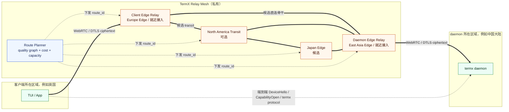

# TermX SmartRoute 与全球网络加速规范

状态：RP001B 活动基线

日期：2026-07-11

## 1. 决策结论

全球网络加速值得建设，因为它同时具备用户价值和清晰的付费边界：跨洲、跨运营商或弱网络下，即使 direct P2P 已经打洞成功，实际 RTT、丢包、抖动和断线率仍可能明显劣于托管路径。

但它不进入第一版基础 Relay，按以下顺序建设：

1. 先建立网络质量测量和 single-relay 智能选区。
2. 再建立客户端与 daemon 各自就近接入的双 Edge Relay。
3. 只有真实数据证明存在稳定收益时，才允许骨干内部增加一个受控 transit 节点。
4. 不建设用户可配置的固定地区链，不建设任意 N 跳 Relay 网络。

用户描述的“香港 -> 美国 -> 英国”可以成为 Route Planner 的候选结果，但不能成为硬编码规则。它只有在实时和历史测量都优于“香港 -> 英国”及 direct path 时才应被选择。

## 2. 为什么打洞成功仍可能需要加速

WebRTC direct 只证明两端存在可用 candidate pair，不证明这条公网路径质量最佳。常见问题包括：

- 跨运营商 peering 质量差，公网 BGP 路径绕行。
- 高峰期拥塞导致丢包和抖动，交互 terminal 比平均带宽更敏感。
- 上下行路径不对称，单向质量显著恶化。
- NAT 映射或移动网络切换导致 candidate 不稳定。
- 跨洲公网虽然可达，但缺少稳定的容量和故障转移策略。

“购买质量好的服务 IP”只能解决部署入口的一部分问题。稳定加速还依赖运营商接入、区域 peering、跨区传输线路、容量、拥塞控制、持续测量和故障切换，不能只按 IP 所在城市推断质量。

## 3. 产品定位

### 3.1 Standard Relay

- direct 失败后使用一个 Relay region。
- 目标是可达性，不承诺路径优化。
- 作为 Managed Relay 的基础能力。

### 3.2 SmartRoute

- 同时评估 direct 和多个 single-relay candidate。
- direct 即使成功，只要质量明显较差，也可以选择 Relay。
- 根据 endpoint、carrier、region 和实时负载选择 Relay。
- 适合作为 Pro 的核心付费差异。

### 3.3 Global Accelerator

- client 连接最近的 Client Edge Relay。
- daemon 连接最近的 Daemon Edge Relay。
- 两个 Edge Relay 之间走受控 inter-region backbone/tunnel。
- 适合作为 Pro 附加项、Team/Enterprise 能力或专属线路能力。

SmartRoute 和 Global Accelerator 都不改变 terminal capability、安全模型或 protocol。用户购买的是更稳定的托管网络路径。

## 4. 路径模型

WebRTC 仍是 transport；加速只扩展 `ObservedPath`：

```text
direct
single_relay
relay_mesh
```

### 4.1 direct

```text
Client <================ WebRTC DTLS ================> Daemon
```

### 4.2 single_relay

```text
Client <======== end-to-end WebRTC DTLS ciphertext via one Relay ========> Daemon
```

一个 Relay 同时承担双方的可达性和公网转发，但不终止 DataChannel DTLS。

### 4.3 relay_mesh

```text
Client <=> Client Edge Relay <=> managed backbone <=> Daemon Edge Relay <=> Daemon
```

关键限制：

- endpoint contract 只看到两个 Edge Relay 和一个 `route_id`。
- 骨干 underlay 可以使用云厂商私网、优质 transit 或 Relay 间隧道。
- 第一阶段骨干只有一个逻辑 segment，不暴露任意 hop list 给客户端。
- 后续最多允许一个内部 transit 节点，并且只由私有 Route Planner 决定。
- DataChannel DTLS 始终在 Client 与 Daemon 之间端到端终止，任何 Relay 都只能看到密文。

## 5. Relay Mesh 网络图



图中的地区只是示例。真实实现使用 region、provider、carrier 和实时测量标签，不在协议中写“中国到英国必须经过香港/美国”等特例。

## 6. 质量测量

### 6.1 测量来源

- Client 对候选 Edge Relay 做轻量 active probe。
- daemon 对候选 Edge Relay 做轻量 active probe。
- Relay 节点之间持续测量 inter-region link。
- 已建立 session 上报不含 payload 的 passive quality summary。
- Relay 上报容量、队列、丢包和节点健康度。

### 6.2 核心指标

- RTT 与 P50/P95 RTT。
- packet loss。
- jitter。
- connection establishment time。
- recent disconnect rate。
- available bitrate 或小包有效吞吐。
- Relay load、region capacity 和 route availability。
- 每 GB、每分钟和跨区 egress 的内部成本。

terminal 是交互型工作负载，默认排序优先级是稳定性、丢包、抖动、RTT，最后才是峰值吞吐。history/copy 等大窗口传输可以使用不同权重，但不能创建另一套 transport。

### 6.3 数据最小化

Probe 和 route telemetry 只能包含网络质量、匿名化 endpoint network class、region、carrier/provider tag 和 session correlation ID。禁止包含 terminal ID、命令、history、CapabilityGrant 或 DataChannel 明文。

### 6.4 GA001 被动观测基线

GA001 已冻结为 measurement-only 链路：公开 `termx` 从当前 selected ICE candidate pair 与 SCTP stats 读取累计计数，默认每 5 秒采样、每 60 秒形成一个窗口；session 结束时尝试提交最后一个至少包含两个样本的窗口。窗口只包含：

- RTT P50/P95，以及相邻 RTT 样本绝对变化的平均值作为 transport jitter。
- candidate pair 密文字节增量计算的双向有效吞吐。
- ICE connectivity-check retransmission 与本地 send discard 形成的 loss estimate；该值不是 RTP packet loss，也不能伪装成 payload 丢包精确值。
- connected duration 与 `connected -> disconnected/failed` 状态转移次数；正常 local close 不计为异常断线。
- 匿名 `network_class`、region、carrier/provider taxonomy tag 和短期 managed-session correlation ID。

公开 `PathQualitySummary` 不包含成本字段。`private/termx-cloud/route-planner/quality` 先幂等接收质量窗口，再让稍后结算的已验签 Relay usage 或受控 provider rate card 通过 `ObservationRef` 异步附加 cost summary；“尚未定价”和显式 `none` 零成本是两种状态，公开 caller 不能填写或覆盖成本。Baseline 查询必须按保留期过滤陈旧窗口。该破坏性窗口 contract 使用 Cloud Companion IPC v2，旧 companion 必须在 Hello 阶段明确不兼容。

GA001 不实现候选 Relay active probe、Relay-to-Relay link probe、route score、hysteresis、RelayLease 获取、ICE restart 或任何自动切换。质量上报失败只丢弃当前 telemetry 窗口，不改变当前 transport 和 endpoint 状态；主动 probe 与实际选路从 GA002 开始按独立 harness 建设。

### 6.5 GA001A Android 对齐基线

Android managed WebRTC 复用 GA001 的同一字段、算法和默认周期，不建立移动端专用业务协议：公开 `ManagedPathQualitySummary` 与 Go `PathQualitySummary` 由同一 JSON fixture 守卫，均使用 5 秒采样、60 秒窗口、nearest-rank P50/P95、相邻 RTT 绝对差平均值、累计密文字节吞吐、ICE 重传/send-discard loss estimate、connected duration 和异常断线次数。Android 只接受 WebRTC transport 指定的 selected candidate pair；缺失该索引时，只能确定性选择同时满足 `nominated + succeeded` 的 pair。

观测器必须在 DTLS DataChannel 的 DeviceIdentity/capability 授权成功后启动，resolve、signaling、ICE 或授权失败不产生质量窗口。PeerConnection 关闭前只读取最近缓存的累计计数并投影最终连接状态，不能等待异步 `getStats` 阻塞 transport close；至少两个有效样本才允许上报。candidate pair、observed path 或累计计数回退会结束旧窗口并从当前样本建立新基线。

移动端公开 DTO 同样没有 cost、terminal、grant、payload、address 或 credential 字段。Official 私有 cloud adapter 只能校验并转发脱敏窗口，Community adapter 稳定 fail closed；可信成本仍由服务端在质量入库后通过 observation reference 异步关联。GA001A 不新增 RelayLease、route score、重连、ICE restart、自动切路或 endpoint state mutation。

### 6.6 GA002 Smart Single Relay 实现基线

GA002 只在显式 `relay_mode: smart_route` 下启用。`auto` 继续表示基础 standard Relay 策略，不能因为安装了 Companion 就自动产生付费选路。私有 Route Planner 是候选、质量、成本和 hysteresis state 的唯一 owner：

- 候选只允许 direct 与 single-relay；`relay_mesh`、多 hop 和任意 transit 在 GA002 一律拒绝。
- 评分前硬校验质量时效/样本量、可达性、健康、容量、policy、entitlement 和可信成本。未定价 Relay 不等于零成本，必须拒绝；direct 的 `none` 与 Relay 的显式零估价保持不同语义。
- 整数评分覆盖 latency、loss、jitter、instability、congestion、hop 和 monetary cost；同分确定性优先 direct。
- session state 有容量和 TTL 上限，并使用 minimum hold、switch cooldown、连续胜出窗口和最小改善幅度防止 route flap；重复提交同一质量窗口不能累计胜出次数。单个候选失败只形成局部诊断，不污染其他候选。

Cloud Companion IPC v3 新增 `PlanManagedRoute`。公开 request 只包含 endpoint、managed session、target device 和 `SMART_ROUTE` preference；公开 response 只包含 plan ID、选中路径、稳定 `selection_reason`、不超过 10 分钟的有效期、选中路径 ICE material、relay-only 标记和 region。score、权重、候选列表、成本预算、terminal、grant 和 payload 都不能进入 IPC。

Go 与 Android 公开客户端都会再次校验 plan/session/target 绑定、有效期、ICE URL/TURN 短凭据和 direct/relay policy；只把 plan 中选中的 ICE material 交给 PeerConnection，并在端到端授权前验证实际 selected candidate path 与计划一致。失败时终止当前 endpoint，不使用 resolution 中未选中的 TURN，也不由公开进程另行申请 RelayLease。TUI 和 App 只投影 `ObservedPath` 与稳定原因。

当前 GA002 的自动选择发生在初次连接或显式重连请求；Planner 的 hysteresis 跨重复计划请求生效。会话内主动 probe、受控 ICE restart、失败后保留当前路径和无中断切换仍属于后续切片，不能把当前实现描述为 live reroute 已完成。Official development adapter 仍因未注入生产 OAuth/TLS、候选源和 lease material issuer 而 fail closed。

## 7. 选路模型

Route Planner 对候选路径计算可解释评分：

```text
route_score =
    latency_penalty
  + loss_penalty
  + jitter_penalty
  + instability_penalty
  + congestion_penalty
  + hop_penalty
  + monetary_cost_penalty
```

评分前先应用硬约束：

- entitlement 是否允许该 route class。
- RelayLease 是否覆盖两个 endpoint 和目标 region。
- 节点容量、健康度和维护状态。
- 最大 Edge Relay 数和最大内部 transit 数。
- 数据驻留、组织策略和区域 deny policy。
- 预计会话成本是否超过套餐或 session budget。

不在公开协议中固定权重。Route Planner 必须在日志和诊断中返回稳定的 `selection_reason`，例如 `lower_loss`、`direct_unstable`、`lower_latency` 或 `cost_guard`，但不暴露内部商业权重。

## 8. 建连与切换

### 8.1 初始选择

1. Client 与 daemon 各自探测少量候选 Edge Relay。
2. Control Plane 生成 direct、single-relay 和允许的 relay-mesh 候选。
3. 客户端使用受限的 Happy Eyeballs 策略并行或快速串行尝试前两个候选。
4. 在短观察窗内比较 candidate pair 的真实质量。
5. 选择满足稳定性门槛且成本最低的路径。

不能无上限并发尝试所有 Relay，这会制造额外成本和放大攻击面。

### 8.2 会话中优化

- 使用被动统计持续观察当前路径。
- 只有质量连续越过阈值才切换，避免频繁 route flap。
- 设置最短保持时间、切换冷却时间和改善幅度门槛。
- Edge Relay 不变时，骨干内部 reroute 应尽量保持 endpoint 5-tuple 和 WebRTC session。
- Edge Relay 必须变化时，通过受控 ICE restart 切换，不创建新 endpoint 或新 capability。
- 切换失败保留当前仍可用路径；不得 fallback 到未授权 route class。

## 9. 私有服务组件

| 组件 | 职责 | 不负责 |
| --- | --- | --- |
| Probe Aggregator | 汇总主动/被动质量，形成时间窗口 | terminal telemetry |
| Topology Store | 保存 Relay node/link、容量、成本和健康图 | endpoint capability |
| Route Planner | 计算候选、评分、hysteresis 和 failover | 签发 terminal scope |
| Relay Lease Issuer | 把 route 约束签入短期 lease | 代理 DataChannel |
| Edge Relay | TURN 接入、route enforcement、密文转发 | 解密 DTLS |
| Backbone Tunnel | Relay-to-Relay 受控传输 | 接受公网任意代理流量 |
| Usage Reconciler | 汇总各 hop 事件并生成一次 session 账单 | 按 hop 重复收费 |

这些组件属于当前 private monorepo 的 `private/termx-cloud` 命名空间，未来 public repo 只需要 path enum、诊断结果、RelayLease wire contract 和 fake fixtures。

## 10. RelayLease 扩展

仍使用同一种 `RelayLease`，不新增可以与 terminal capability 混淆的第六类凭据。Mesh 扩展字段：

```text
path_kind             # single_relay | relay_mesh
route_id
route_version
client_edge_relay_id
daemon_edge_relay_id
max_internal_transit
valid_from
expires_at
max_bytes
max_bitrate_kbps
route_class
```

安全规则：

- Client 只获得 Client Edge TURN credential。
- daemon 只获得 Daemon Edge TURN credential。
- Edge Relay 使用服务身份和 route assignment 建立内部 tunnel。
- 每个 Relay 只接受 lease 指定的邻接方向和 session。
- route 变化必须提升 `route_version`，旧 assignment 短时间重叠后失效。
- lease 仍不包含 terminal scope、grant 或 terminal metadata。

## 11. 计量与收费

Relay Mesh 会同时消耗两个 Edge Relay 和跨区传输，成本显著高于 single-relay。建议商业模型：

- Standard Relay：按套餐包含流量、时长和并发。
- SmartRoute：包含在 Pro，仍按一次 Relay session 计量。
- Global Accelerator：独立加速配额、加速时长或加速流量包。
- Team/Enterprise：组织配额、专属 route class、固定区域或专属线路。

各 Relay 可以上报 hop-level UsageEvent，但用户账单必须按 `route_id + managed_session_id` 聚合一次。不能因为一次数据经过两个或三个内部节点，就把同一字节机械地重复计费多次。价格可以反映 route class 成本，但账单语义必须可解释。

新增 usage metadata：

```text
path_kind
route_id
route_class
client_edge_region
daemon_edge_region
internal_transit_count
session_bytes
accelerated_seconds
```

## 12. 安全与滥用防护

- Client 与 daemon 的 DTLS 端到端加密不变。
- Relay-to-Relay tunnel 使用独立服务身份和双向认证，不能成为开放代理。
- route assignment 与短期 RelayLease 绑定，禁止节点自行添加 hop。
- 每个 route 有字节、速率、并发、expiry 和最大 transit 限制。
- Route Planner、Relay 和 Usage Reconciler 不读取 terminal capability。
- 防止流量放大、伪造 source、跨 lease 转发和过期 route replay。
- Relay Mesh 故障只影响对应 accelerated path，不影响 local、SSH 和其他 endpoint。

## 13. 复杂度评估

以下是相对工程复杂度，不是工期承诺：

| 阶段 | 相对复杂度 | 新增核心问题 | 建议 |
| --- | --- | --- | --- |
| 基础 regional Relay | 1x | TURN、lease、计量、区域部署 | 必须先完成 |
| single-relay 智能选区 | 1.5-2x | probe、候选评分、hysteresis | 应该做，商业价值高 |
| 双 Edge Relay + 单骨干 segment | 4-5x | 双端 allocation、relay tunnel、route lease、聚合计费 | 有数据后做 pilot |
| 增加一个内部 transit | 7-8x | topology graph、动态 reroute、更多故障组合 | 仅重点 corridor |
| 任意 N 跳 mesh | 10x+ | 路由收敛、环路、容量、账单、排障、安全 | 不做 |

真正困难的不是把包多转发几次，而是持续证明新路径更好，并处理容量、切换、故障、成本、计费和排障。

## 14. 分阶段发布门禁

### Phase A：Measurement First

- 在 direct 与基础 Relay 上采集质量 summary。
- 建立 region/carrier/corridor 基线。
- 不自动切换，不产生新的付费承诺。

### Phase B：Smart Single Relay

- 多 region single-relay 探测和评分。
- direct 与 Relay 质量竞争。
- 有 hysteresis 的自动选择和可解释诊断。

GA002 已完成初次连接/重连计划、跨请求 hysteresis 和公开诊断基线。主动候选 probe 与会话内 ICE restart 仍需在进入 Phase C 前单独完成，不得用重连伪装无中断切换。

### Phase C：Dual Edge Pilot

- 只选择少量有明确需求的跨洲 corridor。
- 两端就近接入，骨干使用一个逻辑 segment。
- 证明 P95 RTT/丢包/断线率改善且单位经济模型成立后再扩区。

### Phase D：Bounded Transit

- 只在 direct inter-region backbone 持续劣化时加入一个 transit。
- Route Planner 最大 `internal_transit_count=1`。
- 每条 corridor 都需要容量、故障和成本回归。

## 15. 中国及特殊网络环境

协议和客户端不写国家特例。中国大陆、跨运营商、海岛、企业专网或其他受限网络都使用统一的 region/carrier/policy 模型。

部署层需要单独处理：

- 节点与线路供应商质量。
- 运营商 peering 和跨区容量。
- IP reputation、DDoS 和流量清洗。
- 数据驻留、网络服务和当地合规要求。
- 真实用户网络的持续测量。

这些是私有基础设施和运营职责。正式购买线路或在特定司法辖区上线前，应单独完成成本、合同和合规评审；不能仅凭“购买优质 IP”假设问题已经解决。

## 16. 最终建议

- 有必要做：它是比“基础 Relay 可达性”更强的付费差异，也是 Team/Enterprise 的合理能力。
- 现在不要直接做 Relay Mesh：先完成 RP002-RP005 的安全 contract、基础 Relay 和计量。
- 基础 Relay 稳定后优先做 SmartRoute single-relay 智能选区。
- 只有测量证明重点 corridor 存在显著、可持续收益时，再做双 Edge Relay pilot。
- 香港 -> 美国 -> 英国这类三段路径只能由测量驱动并限制为最多一个内部 transit，不能成为产品规则。
