# Hub 边缘授权与 Control Plane 降载计划

状态：CLOUD009-CLOUD010 已完成，CLOUD011 进行中；2026-07-12

## 1. 目标

Control Plane 是账号、设备 ownership、订阅、计费和全局策略的持久真值，但不能成为每次 managed 连接的同步依赖。客户端启动、登录、token 刷新和 HubDirectory 刷新可以访问 Control Plane；daemon/client 注册到 Hub 后，presence、direct signaling、短期 EdgeManagedSession 和后续 Relay 准入由 Hub 的本地投影处理。

目标不是让客户端永远不知道 Control Plane，而是把高频连接流量与数据库读从 Control Plane 移除。Control Plane 不可用时，只要 Hub 已验证的本地快照仍在 `max_staleness` 内，已有 presence 和新的已授权 direct 连接都应继续工作。

## 2. 权威状态与凭据

- Control Plane 持久拥有 Account、DeviceOwnership、Pairing、Subscription、Revocation、HubDirectory 和策略 revision。
- 启动阶段签发的 edge token 使用非对称签名，至少绑定 `iss`、`aud`、`account_id`、`client_device_id`、`jti`、`iat`、`nbf`、`exp`、`auth_epoch` 和 key id。Hub 只持有验证公钥。
- edge token 只证明账号/client 会话，不能单独授权任意 target。Hub 的最终准入是 token claims 与本地 DeviceOwnership/Pairing/Revocation/Subscription 投影的交集，deny/revoke 优先。
- daemon presence 仍使用 fresh one-time challenge 和 DeviceIdentity proof。Hub 以同步得到的 daemon public key、DeviceID、AccountID 验证，daemon 自报 metadata 不是授权真值。
- HubDirectory 是 Control Plane 签名的有版本、签发时间、过期时间和 key id 的目录；客户端可缓存，但不得接受回滚版本。

## 3. Hub 投影与同步

Hub 的请求热路径只读内存投影，不直接查询 Control Plane 或数据库。投影包含 device ownership/public key、pairing、account auth epoch、订阅能力、带宽参数、kick/revoke 和区域 Relay budget。

Control Plane 向 Hub 提供按 revision 严格有序的 snapshot/delta 流。Hub 原子应用完整 revision；发现 gap、rollback、签名失败或未知 schema 时拒绝 delta，并在后台请求完整 snapshot。cache miss 必须 fail closed，禁止隐藏的同步 Control Plane fallback；后台可使用 batch、singleflight 和指数退避刷新。

生产 Hub 使用“内存热路径 + 原子持久化的已验证快照/WAL”。presence、signaling、replay 和 EdgeManagedSession 仍是易失短期状态。Hub 重启先恢复已验证快照，再由 client/daemon 重连；不能把易失 signaling 持久化成第二份 session truth。

## 4. 连接消息链路

```text
client startup -> Control Plane: login/refresh + signed edge token + signed HubDirectory
daemon startup -> Control Plane/Hub: refresh identity metadata when needed, then fresh proof presence
Control Plane -> Hub: ordered policy/device snapshot and deltas (background)

client -> Hub: edge token + target DeviceID + offer
Hub: offline token verify + local projection decision + active target presence lookup
Hub: create short-lived EdgeManagedSession and route offer
daemon -> Hub: answer on the authenticated presence stream
Hub -> client: answer
client <-> daemon: ICE/DTLS/DataChannel + daemon-owned CapabilityGrant validation
Hub -> Control Plane: asynchronous audit/usage summaries
```

`EdgeManagedSession` 由 Hub 拥有，绑定 authenticated client connection、client DeviceID、target DeviceID、active target presence、route intent 和短 TTL。Control Plane 不再逐连接创建 ManagedSession，也不为 daemon answer 签发票据。answer 只有在接收 offer 的已认证 presence stream 上才能完成对应 signaling session。

## 5. 全流程场景泳道图

以下泳道图是 CLOUD009-CLOUD011 的消息链路基准。`Client` 同时代表 desktop Companion 和 Official Android 私有 adapter；公开 daemon、WebRTC、CapabilityGrant 和 terminal protocol 的 ownership 不因客户端形态改变。

### 5.1 首次登录、启动与 Hub 目录缓存

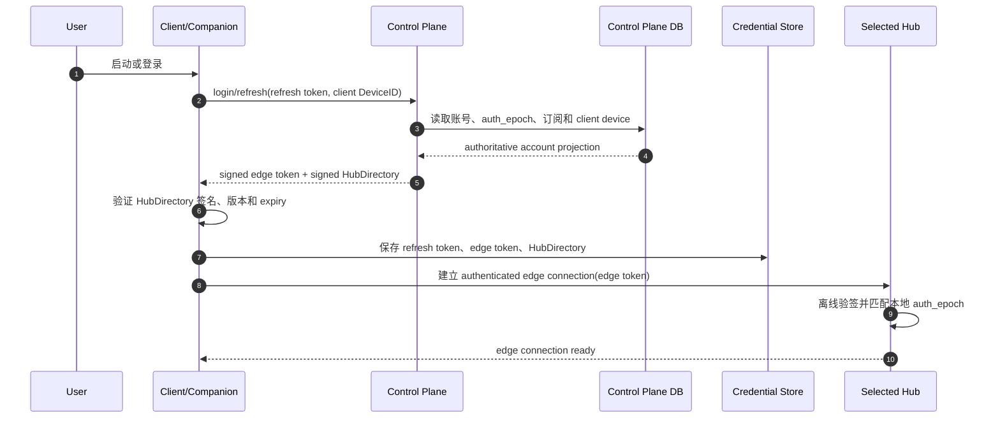

登录/刷新允许访问 Control Plane 和数据库；后续每次连接不得重复该读取。HubDirectory 签名失败、版本回滚或过期时客户端 fail closed，并通过 Control Plane 刷新，不能接受未签名的 Hub 地址 fallback。

### 5.2 daemon 注册、fresh presence 与续约

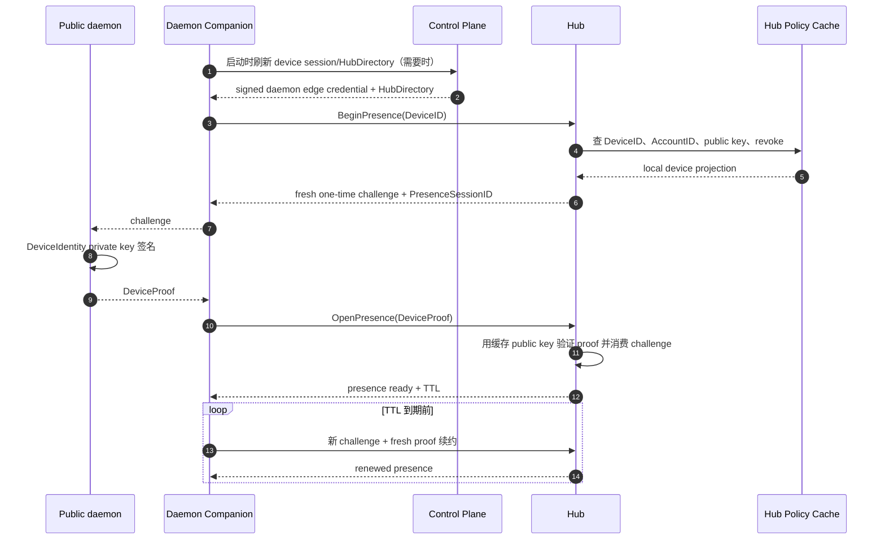

DeviceIdentity private key 永不进入 Companion、Hub 或 Control Plane。未知 DeviceID、缓存缺失、revoke、proof 重放、错误公钥和 challenge 过期均拒绝 presence，且请求线程不回源数据库。

### 5.3 后台授权快照与增量同步

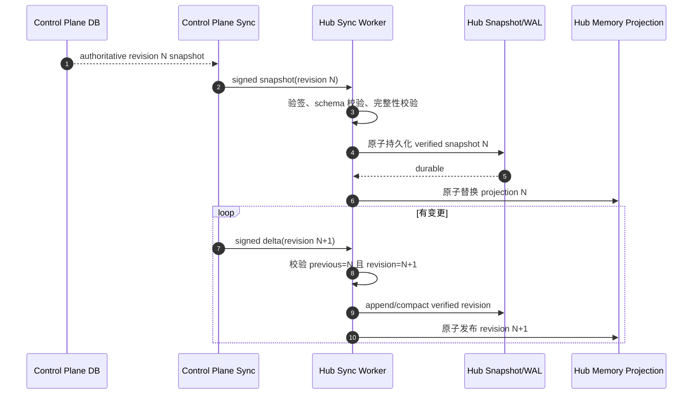

同步 worker 可以 batch、singleflight 和退避重试，但 managed 请求线程只读 `MEM`。持久快照只保存授权 projection；presence、signaling 和 EdgeManagedSession 不写入该 WAL。

### 5.4 managed direct 正常连接

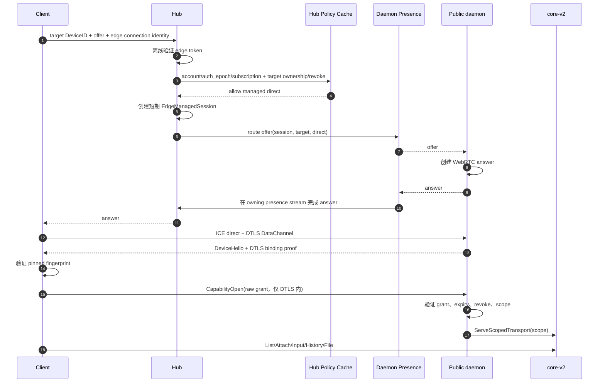

Control Plane 不出现在连接热路径。Hub 只判断云服务准入，不能看到 CapabilityGrant、terminal/file metadata 或 DataChannel payload；最终 terminal 权限仍由 owning daemon 判断。

### 5.5 Control Plane 中断但缓存仍有效

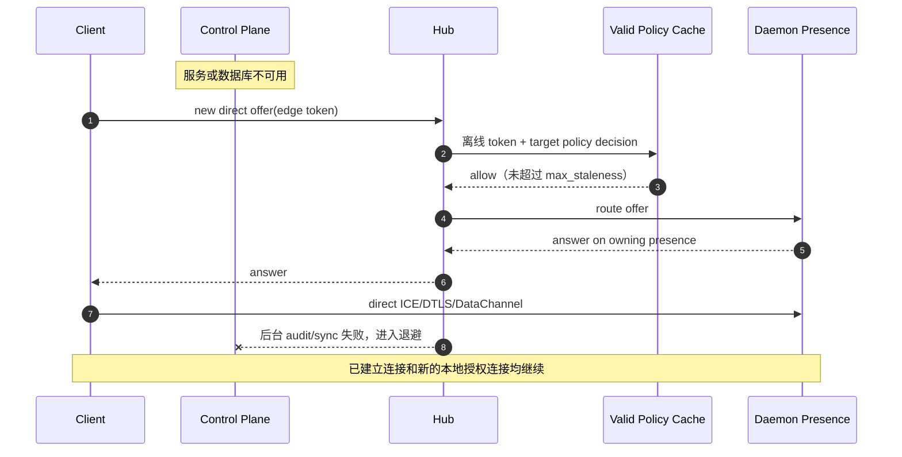

Hub 不因后台同步失败立刻清空最后一个已验证快照。客户端 edge token 仍须在有效期内；token 已过期时必须等待 Control Plane 恢复刷新，Hub 不代签或延长。

### 5.6 cache miss、快照过期与 Control Plane 恢复

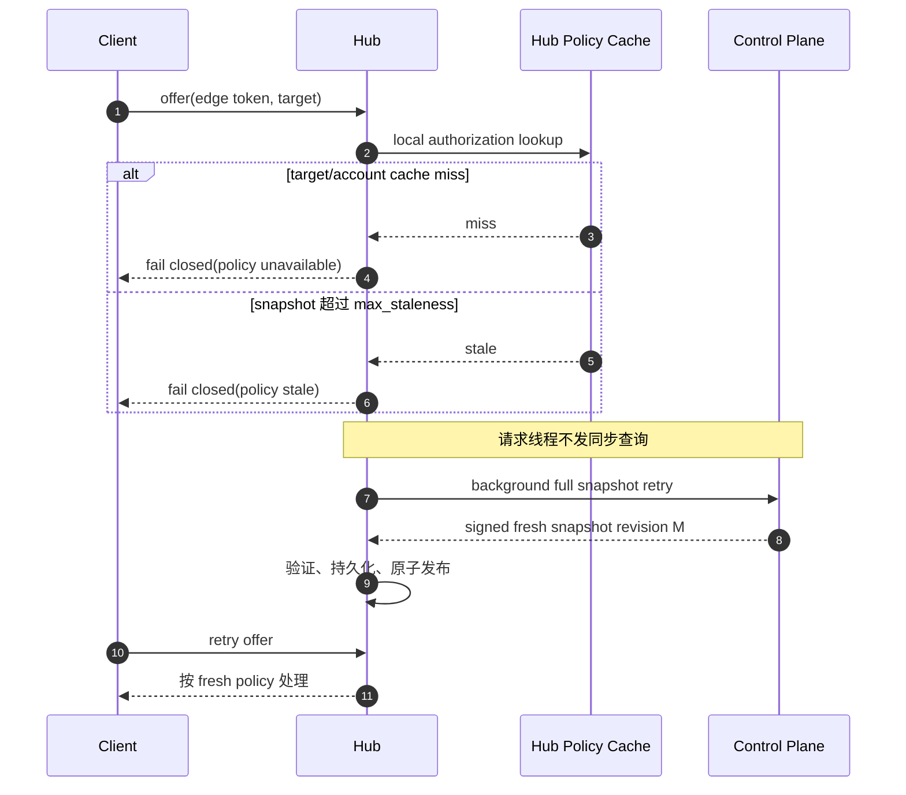

客户端可以使用有界退避重试，但 Hub 不得通过临时 allow、旧 ticket、数据库 fallback 或延长 `max_staleness` 掩盖缓存问题。

### 5.7 revision 断档、回滚或签名失败

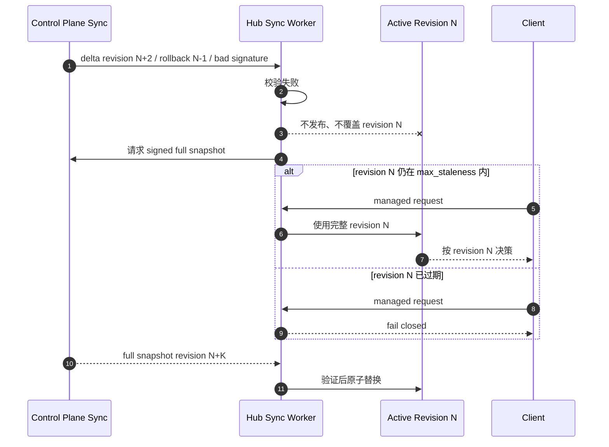

增量断档不能局部猜测补齐。安全撤销可能尚未包含在旧快照中，因此 `max_staleness` 同时是可用性窗口和最大撤销传播边界，必须由产品安全策略显式配置。

### 5.8 订阅变更、设备撤销与踢下线

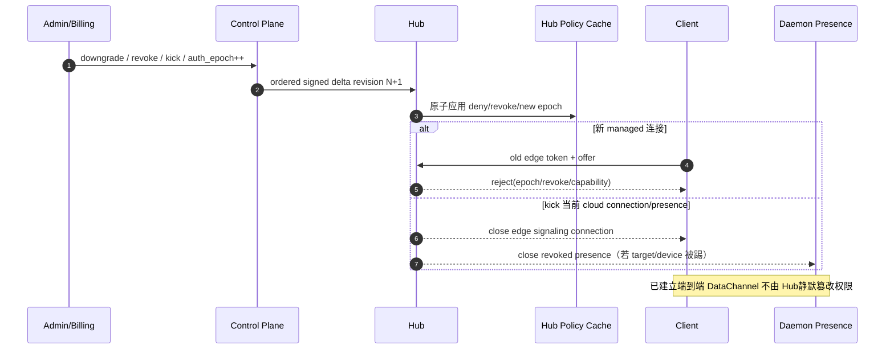

账号安全踢线是否强制关闭已建立 DataChannel 必须另立显式 contract；默认 Hub 只能关闭自己拥有的 edge/presence/signaling transport，daemon capability revoke 才能改变端到端 terminal 权限。升级延迟只会暂时少给能力；降级和撤销必须在同步 SLO/`max_staleness` 内生效。

### 5.9 Hub 重启与恢复

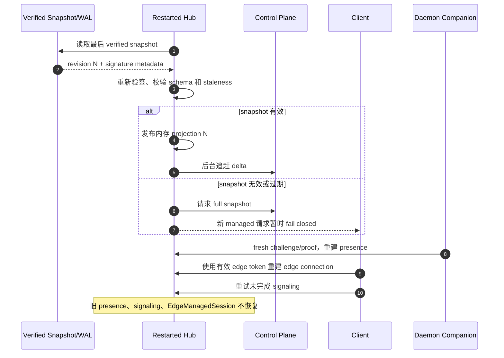

重启不会恢复半完成 answer 或伪造在线状态。已建立到该 Hub 的 signaling transport 会断开；WebRTC direct 数据面若不依赖 Hub 长连接可继续，但后续 candidate/reconnect 失败语义由客户端显式处理。

### 5.10 edge token 到期与刷新失败

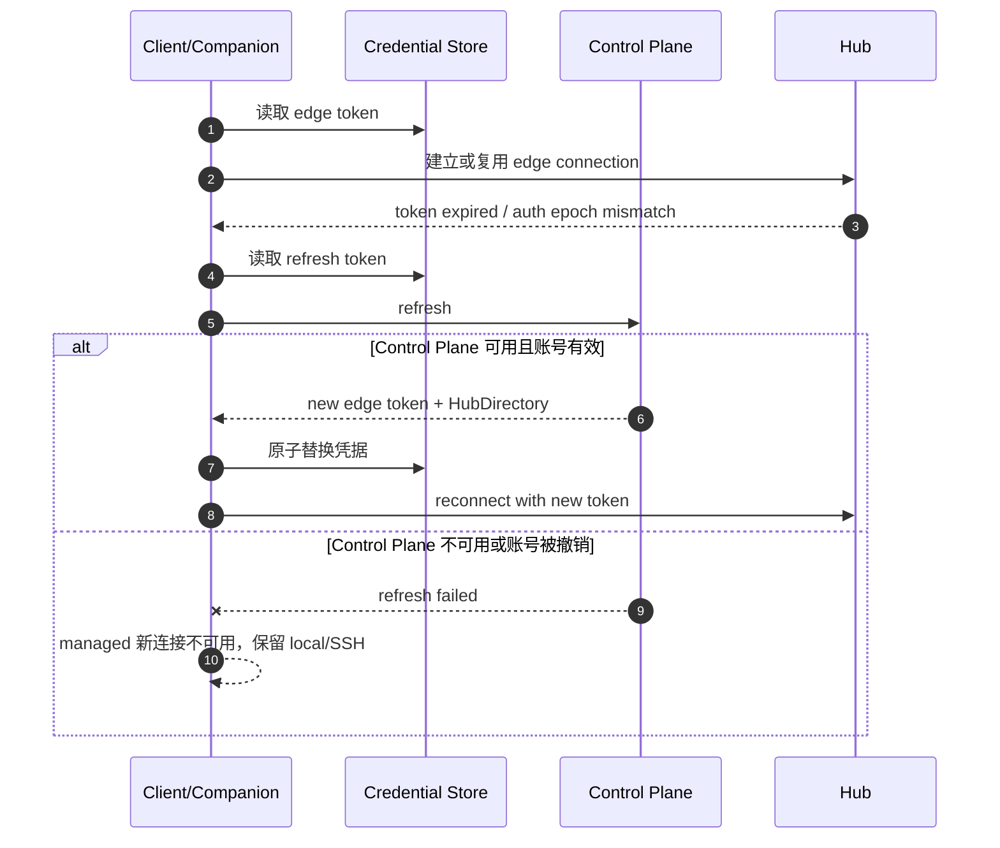

Hub 不接收 refresh token，也不能用投影为客户端续签。local、SSH 和已有非 managed endpoint 不受账号刷新失败影响。

### 5.11 single Relay 委派授权（CLOUD010）

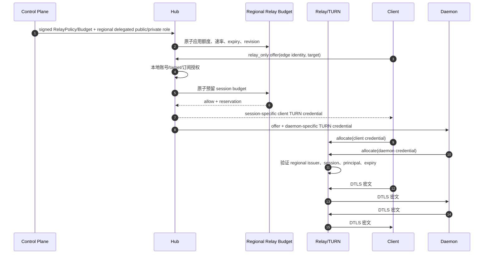

Control Plane root signing key 不复制到 Hub。预算不足、过期、revision 不完整或 Relay credential principal 不匹配均 fail closed；不得伪造 P2P 失败来触发 Relay，`relay_only`/route intent 必须是显式 contract。

### 5.12 Relay 用量上报、中断与补报（CLOUD010）

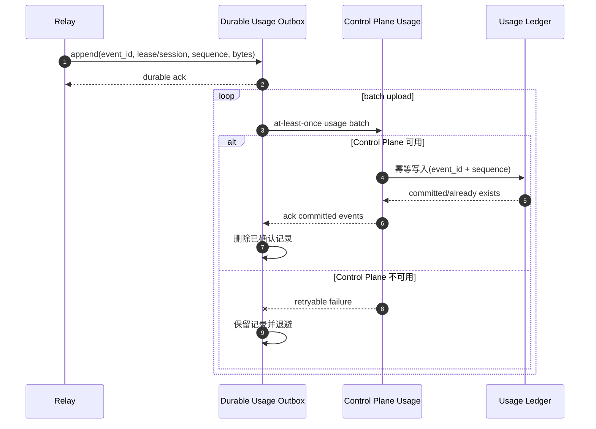

计量上报失败不能丢数据，也不能阻塞已在有效预算内的数据转发。outbox 容量耗尽时新 Relay lease fail closed；是否终止已有 Relay session 必须由显式预算安全策略决定。

### 5.13 Hub 不可用、目录切换与多 Hub 边界

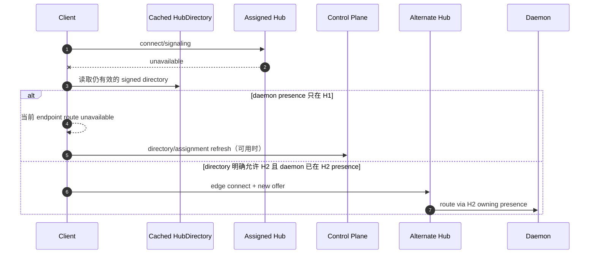

客户端不能自行把 target 切到任意 Hub；HubDirectory、target presence ownership 和 token audience 必须一致。全球多区域复制、同时多 presence 和无中断换 Hub 不属于当前单区域切片。

### 5.14 配对创建、授权变更与取消配对

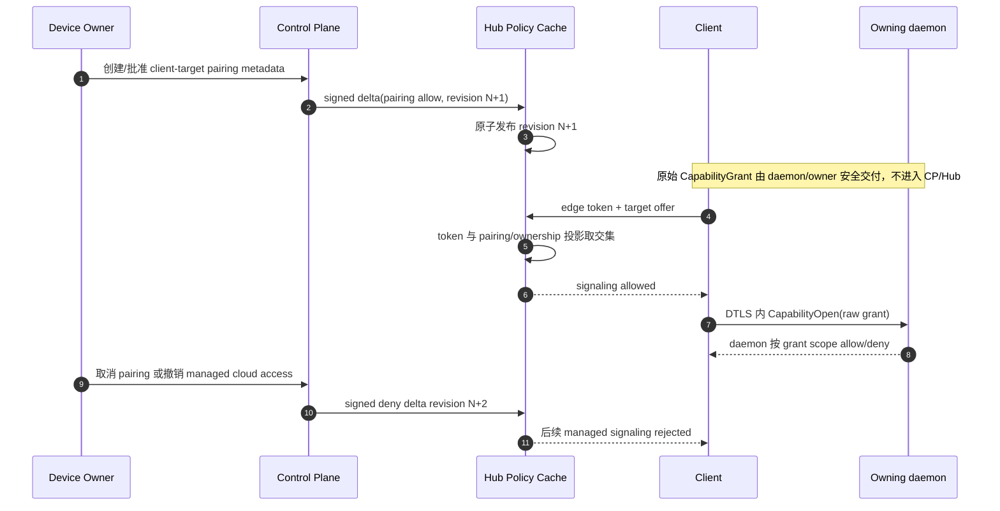

Control Plane/Hub 的 pairing projection 只决定是否允许使用托管 signaling，不签发或扩大 terminal capability。取消云 pairing 后，daemon 内原始 grant 是否同时撤销必须通过 daemon-owned revoke contract 明确执行，二者不能互相冒充。

### 5.15 direct ICE 失败、显式 Relay 与禁止伪造失败

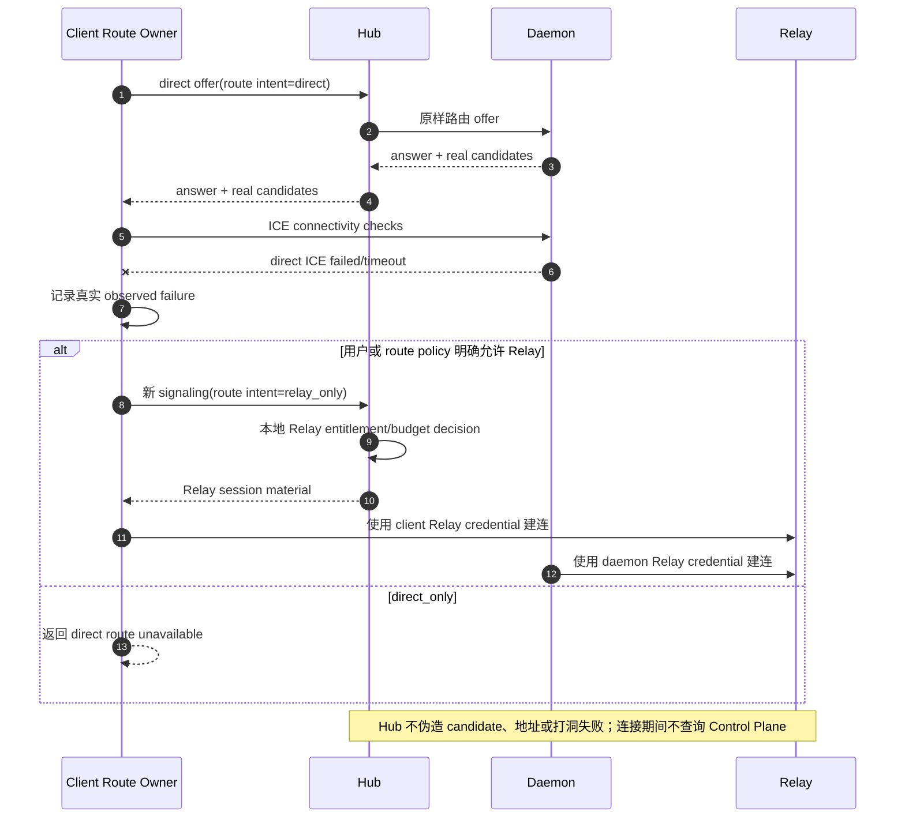

是否走 Relay 由客户端请求中的显式 route intent 与 Hub 本地 entitlement/budget 共同决定。Hub 伪造地址使 direct 人为失败会破坏可观测性、安全审计和 SmartRoute 数据，因此禁止作为 Relay 切换机制。

## 6. 故障语义

| 条件 | 新连接 | 已建立 DataChannel |
| --- | --- | --- |
| Control Plane 不可用，Hub 快照仍有效 | 允许本地授权的连接 | 不受影响 |
| 快照超过 `max_staleness` | managed 新连接 fail closed | 不主动中断；安全踢线策略另行显式定义 |
| cache miss、token 过期、auth epoch 不匹配 | fail closed，不同步回源 | 不扩大现有 capability |
| revision gap/rollback/签名失败 | 拒绝 delta，全量重同步前 fail closed 受影响主体 | 不改变 DataChannel 真值 |
| Hub 重启 | 恢复已验证快照后等待重连 | transport 断开并按客户端恢复策略重连 |

升级延迟是保守降级；订阅降级、security revoke 和 kick 必须在定义的同步 SLO 内生效。refresh token 只留在 Control Plane/Companion 安全存储，Hub 不得无限续签账号会话。

## 7. Relay 与用量边界

CLOUD009 只迁移 direct。CLOUD010 已为单区域提供受限 regional issuer 与签名 RelayBudget/PolicySnapshot；Control Plane root signing key 不进入 Hub。Hub 在预算内签发 session-specific lease/credential，Relay 验证区域 issuer。用量以 signed lease + 带 `event_id`/单调 sequence 的 signed event 写入 durable outbox，Control Plane 恢复后重新验 lease 并幂等结算。

## 8. 迁移切片

1. CLOUD009：建立版本化 Hub 授权投影、edge token 离线验证、Hub-owned EdgeManagedSession 和 presence-bound answer；证明 Control Plane listener 关闭后仍可新建 direct。
2. CLOUD010：迁移 single Relay lease/预算和 durable usage outbox，并验证中断与补报。
3. CLOUD011：desktop/Official Android 启动与刷新拿 edge token/HubDirectory，完成真实公网和 ADB 中断验收。

多区域一致性、Relay Mesh、Kubernetes、生产数据库选型和复杂计费不属于本计划当前切片。
