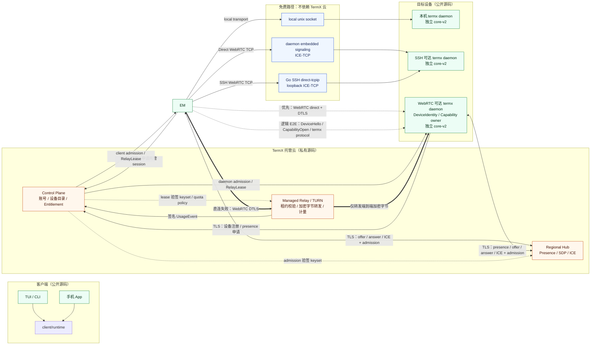
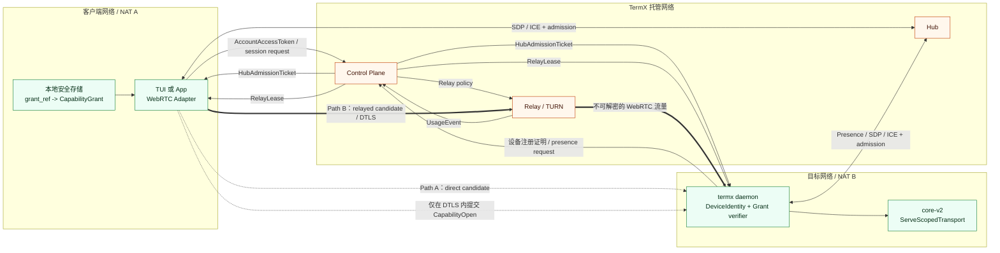
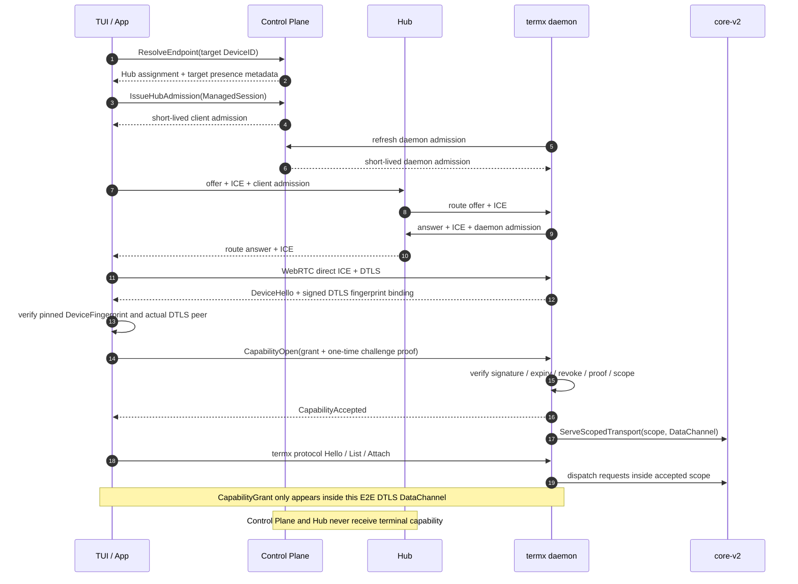
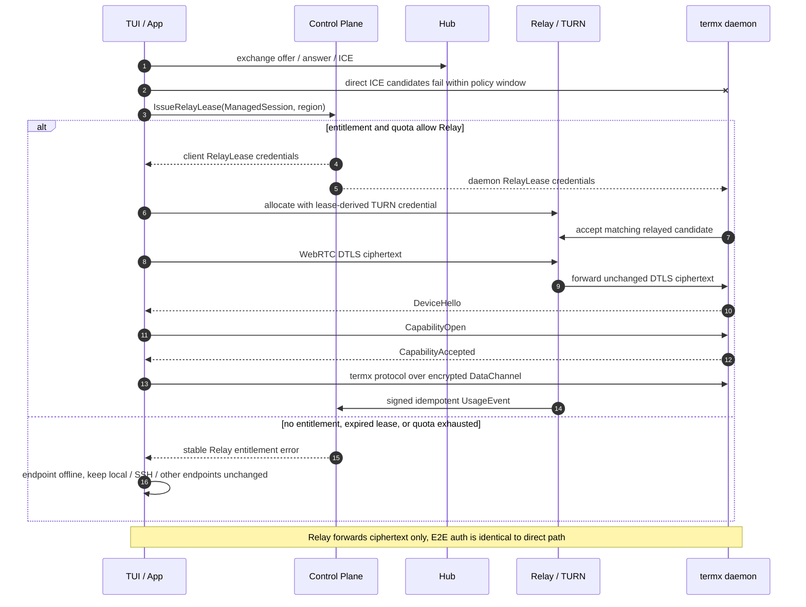
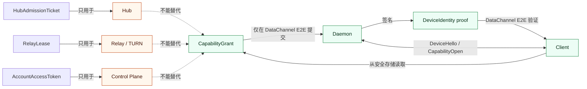

# TermX Remote Platform 网络图解

状态：目标架构图；当前真实实现与差异见 `cloud-end-to-end-swimlanes.md`

日期：2026-07-11

## 1. 阅读方式

这些图描述目标架构，不描述当前 ME012 原型实现。核心结论：

- local 和 SSH 完全绕过 TermX 托管云。
- Direct 使用 daemon embedded signaling，SSH 使用 tunnel 内 signaling，只有 managed WebRTC 使用 Hub signaling；任何 signaling 服务都不承载 terminal protocol。
- 基础 WebRTC 策略优先 direct；失败且存在有效 `RelayLease` 时才走 Relay。启用 SmartRoute 后，direct 可达但质量较差时也可以主动选择 Relay。
- direct、single Relay 和 Relay Mesh 最终都建立同一种 DTLS DataChannel，运行同一种端到端 capability handshake 和 termx protocol。
- Control Plane、Hub 和 Relay 都不能看到原始 `CapabilityGrant`。

## 2. 全部连接方式

图中最后一条逻辑 E2E 连接不是额外网络通道。它运行在 direct path 或 Relay path 已建立的同一个 DTLS DataChannel 上。

## 3. Managed WebRTC 网络拓扑

### 服务可见性

| 组件 | 可以看到 | 绝不能看到或决定 |
| --- | --- | --- |
| Control Plane | 账号、设备目录、entitlement、ManagedSession、Relay 用量 | 原始 grant、terminal list/content、terminal scope |
| Hub | admission、DeviceID、presence、SDP/ICE、signaling session | 原始 grant、terminal inventory、termx protocol frame |
| Relay | RelayLease、连接 metadata、加密字节数和时长 | DataChannel 明文、grant、terminal scope |
| Client | endpoint pin、原始 grant、daemon 返回的 protocol 数据 | daemon 私钥 |
| Daemon | DeviceIdentity 私钥、grant 签发/撤销、terminal truth | 用户计费数据库 |

## 4. Direct P2P 连接时序

## 5. Relay fallback 连接时序

## 6. 凭据边界图

## 7. 全球网络加速

SmartRoute、双 Edge Relay 和受控 inter-region backbone 的网络图见 `global-acceleration-spec.md` 的“Relay Mesh 网络图”。该路径仍承载同一个端到端 DTLS DataChannel；加速节点增加不会扩大 terminal capability，也不会创建新的 endpoint。

## 8. 一句话总结

Hub 帮两端找到彼此，Relay 在直连失败时搬运密文，Control Plane 决定谁能使用这些托管服务；只有 daemon 能决定客户端最终可以访问哪些 terminal 能力。
