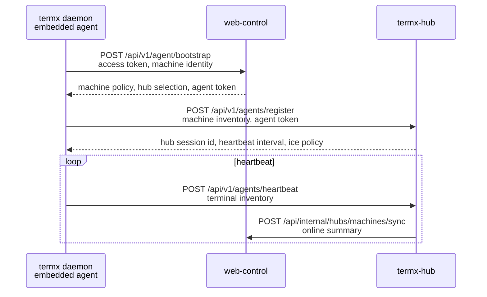

# 总体架构

## 范围

本规划覆盖：

- 手机 app
- 公网 web 控制台
- anonymous rendezvous / signaling 服务
- hub/TURN 边缘节点
- 内置在 `termx` daemon 中的 remote agent runtime
- 本地浏览器访问的内置静态 web
- Web/native 双端网络 transport 抽象

不覆盖：

- TUI workspace
- tab/layout/pane 管理
- 在远程体系里复刻 `tuiv2`

## 项目边界

```text
termx/
  termx-core/              # shell-neutral runtime + remote agent runtime
  termx-cli/               # termx daemon / CLI entry
  tuiv2/                   # 本地 TUI 产品壳，不作为远程对象模型输入
  web-control/             # 未来公网控制台，优先迁改 ../tgent/tgent-web
  termx-rendezvous/         # 未来匿名 P2P signaling 服务，不做 relay
  termx-hub/               # 未来 hub/TURN 服务，优先迁改 ../tgent/tgent-go hub，订阅 relay 使用
  remote-ui/               # 本地 embedded web 与 mobile app 共享的 React 远程 UI、hooks、transport interfaces
  mobile-app/              # 未来手机 app，新建产品壳，参考 ../tgent/tgent-app
  docs/remote-rebuild/     # 本规划
```

说明：`remote-ui/` 优先创建，先服务 `termx` 二进制内嵌本地 web；`mobile-app/` 后续复用这里的 terminal、terminal list、file manager 组件并替换 app shell / native adapter。`web-control/`、`termx-hub/`、`mobile-app/` 后续按批次重新创建。

## 角色

### Web Control

职责：

- 用户注册、登录、OAuth、refresh token
- 订阅、套餐、订单、管理员覆盖配置
- access token / setup token 管理
- machine 注册记录、在线状态、终端 inventory
- hub 节点注册、心跳、负载、区域、容量
- 为 app/browser 签发 connect ticket
- 为 agent 校验 token 并下发 policy
- 审计、流量记录、发布版本信息

可复用来源：

- `../tgent/tgent-web/src/lib/schema.ts`
- `../tgent/tgent-web/src/app/api/auth/*`
- `../tgent/tgent-web/src/app/api/admin/*`
- `../tgent/tgent-web/src/app/api/tokens/*`
- `../tgent/tgent-web/src/app/api/hubs/discover/*`
- `../tgent/tgent-web/src/app/api/internal/*`

需要改造：

- `agents` 语义改为 `machines`
- 删除或隔离 session/window/pane/tmux 语义
- connect 返回 `machine_id + terminal_id + hub_url + ticket`
- subscription policy 输出 relay/file/terminal 限额

### Anonymous Rendezvous

职责：

- 支持不登录、不订阅的匿名 P2P signaling。
- 创建短期 channel。
- 转发 WebRTC offer/answer/ICE candidates。
- 不存 terminal 数据。
- 不转发 file 数据。
- 不发 TURN credentials。
- 不管理用户、订阅、机器列表。

需要满足：

- channel TTL 默认 10 分钟。
- payload 限制，默认 64KB。
- per-IP / per-channel rate limit。
- 只用于公共 STUN P2P 尝试。
- 如果 P2P 打洞失败，产品引导用户登录并订阅 TermX Relay。

### Hub / TURN

职责：

- 维护 agent 长连接或轮询会话
- 转发 WebRTC offer/answer
- 提供 STUN/TURN/ICE 配置
- 为 TURN 生成短期凭证
- per-machine/per-user 流量统计
- 根据 web control 下发的 policy 做限速和拒绝
- 向 web control 上报 hub 心跳、容量、在线 machine 数

可复用来源：

- `../tgent/tgent-go/internal/hub/*`
- `../tgent/tgent-go/internal/hubserver/*`
- `../tgent/tgent-go/internal/hubgrpc/*`

需要改造：

- API 从 `server/agent/pane` 改为 `machine/terminal`
- signaling ticket 必须由 web control 签发
- hub 不持久化用户业务数据，只缓存在线连接和短期状态
- TURN realm、凭证、流量映射改成 TermX 命名
- hub/TURN 是订阅 relay 路径，不承载匿名免费数据面

### TermX Daemon Agent

职责：

- 作为 `termx` daemon 的子 runtime 启动
- 读取 remote config、持久 machine identity
- 向 web control 注册或校验 access token
- 向 hub 注册、心跳、上报 terminal inventory
- 向 anonymous rendezvous 注册短期 signaling channel
- 接收 WebRTC offer，创建 PeerConnection
- 将 DataChannel 桥接到 TermX 的 terminal protocol
- 提供 file manager API
- 提供本地 web 静态文件服务和本地 signaling
- 提供本地 WebRTC-over-TCP / ICE TCP mux，用于 UDP 不可用时的 local browser 调试路径

必须满足：

- 不发布独立 agent 二进制
- 不依赖 `tuiv2`
- terminal inventory 来自 `termx-core` server
- 远程传输复用 `termx-core/protocol` 的二进制 terminal wire contract

### Mobile App

职责：

- 支持未登录扫码配对和匿名 P2P 连接
- 登录 web control 后展示云端 machine 列表
- 展示指定 machine 的 terminal 列表
- 连接单个 terminal
- 文件管理
- 管理连接状态、重连、网络切换、前后台恢复

重做原则：

- UI / state / routing 重做
- terminal rendering、file manager 行为、WebRTC/native bridge 参考 tgent
- 业务模型只认 machine/terminal，不认 workspace/tab/pane
- 所有网络能力通过 interface 注入
- terminal list、terminal session、file manager 优先复用 `remote-ui/` 里已经在本地 embedded web 验证的组件

### Shared Remote UI

职责：

- 承载本地 embedded web 与 mobile app 共享的远程 UI 和业务 hooks。
- 从 `../tgent` 迁改 terminal rendering、terminal client、file manager、WebRTC browser adapter 的成熟行为。
- 将 `SessionList.tsx` / pane 语义改造成 `TerminalList.tsx` / terminal 语义。
- 保持所有网络能力在 `RemoteTransport` / `PeerTransport` interface 后面，组件不直接 import `fetch`、`RTCPeerConnection` 或 native plugin。
- 本地 embedded web 首先使用 browser local adapter；mobile app 后续使用 native adapter。

首批组件：

- `Terminal.tsx`
- `TerminalList.tsx`
- `FileManager.tsx`
- `useTerminalSession`
- `useFileManager`
- browser local transport adapter
- mock transport for tests

## 网络通信图

### 免登录匿名 P2P

```mermaid
sequenceDiagram
  participant D as termx daemon<br/>embedded agent
  participant R as anonymous rendezvous
  participant A as mobile app

  D->>R: create/listen short channel
  D-->>User: show QR with channel_secret + public STUN
  A->>A: scan QR, create app keypair
  A->>R: claim channel
  A->>R: send WebRTC offer<br/>public STUN only
  R->>D: forward offer
  D->>D: verify app cert/signature
  D-->>R: answer
  R-->>A: answer
  A<->>D: P2P DataChannel terminal:{terminal_id}
  A<->>D: P2P DataChannel api/file
```

说明：

- 免费匿名路径只用公共 STUN。
- rendezvous 只转 signaling。
- P2P 成功后 terminal 和文件管理都可用。
- P2P 失败时不自动使用 TermX relay，需要用户登录并订阅。

### 注册与在线状态



### 手机连接远程 terminal

```mermaid
sequenceDiagram
  participant A as mobile app
  participant W as web-control
  participant H as termx-hub
  participant D as termx daemon<br/>embedded agent

  A->>W: GET /api/v1/machines
  W-->>A: machines + terminals
  A->>W: POST /api/v1/machines/{machine_id}/terminals/{terminal_id}/connect
  W-->>A: connect ticket, hub_url, ice policy
  A->>H: GET /api/v1/rtc/config
  H-->>A: STUN/TURN iceServers
  A->>H: POST /api/v1/sessions<br/>ticket + WebRTC offer
  H->>D: forward offer
  D-->>H: WebRTC answer
  H-->>A: WebRTC answer
  A<->>D: WebRTC DataChannel terminal:{terminal_id}
  A<->>D: WebRTC DataChannel api
  A<->>D: WebRTC DataChannel file:{transfer_id}
```

说明：

- 这是登录后的云端路径。
- 免费账号仍可走公共 STUN P2P。
- 订阅用户可以从 hub 获取 TermX TURN relay credentials。

### 本地浏览器访问内置 web

```mermaid
sequenceDiagram
  participant B as local browser
  participant D as termx daemon

  B->>D: GET http://127.0.0.1:{port}/
  D-->>B: embedded static web
  B->>D: GET /api/local/status
  B->>D: GET /api/local/terminals
  B->>D: POST /api/local/pair
  B->>D: POST /api/local/rtc/offer
  D-->>B: WebRTC answer with host/TCP candidates
  B<->>D: DataChannel terminal:{terminal_id}
  B<->>D: DataChannel api
  B<->>D: DataChannel file:{transfer_id}
```

说明：

- 本地 HTTP 与 ICE TCP 可以复用同一 TCP port，也可以先用相邻/独立 port；对外 contract 必须让浏览器 adapter 能发现 ICE TCP endpoint。
- 可参考 `../tgent/tgent-go/internal/server/server.go` 的 cmux/端口复用和 `../tgent/tgent-go/internal/agent/webrtc.go` 的 Pion TCP mux。
- 这个路径不使用 TermX TURN credentials，也不需要公网 rendezvous。

## Transport Interface

业务层只依赖接口：

```ts
export interface RemoteTransport {
  connect(target: ConnectTarget, options: ConnectOptions): Promise<ConnectResult>
  disconnect(): Promise<void>
  status(): TransportStatus
  openTerminal(terminalId: string): Promise<TerminalChannel>
  openApi(): Promise<ApiChannel>
  openFileTransfer(transferId: string): Promise<FileTransferChannel>
  getConnectionInfo(): Promise<ConnectionInfo>
}
```

Web runtime 实现：

- browser `fetch`
- browser `RTCPeerConnection`
- browser `RTCDataChannel`

Native runtime 实现：

- Capacitor plugin 只做边界
- Android/iOS native HTTP client
- Android/iOS native WebRTC
- native file picker/download/save

UI 和业务 state 不直接 import browser WebRTC 或 native WebRTC。

## 数据模型

核心实体：

- `User`
- `Subscription`
- `Plan`
- `AccessToken`
- `Machine`
- `Terminal`
- `Hub`
- `RendezvousChannel`
- `AppCertificate`
- `ConnectTicket`
- `RemoteSession`
- `TrafficUsage`
- `AuditEvent`

禁止作为远程公开模型的实体：

- `Workspace`
- `Tab`
- `Window`
- `Pane`
- `TmuxSession`

内部兼容层可以读旧名，但外部 API 和新代码一律使用 machine/terminal。
