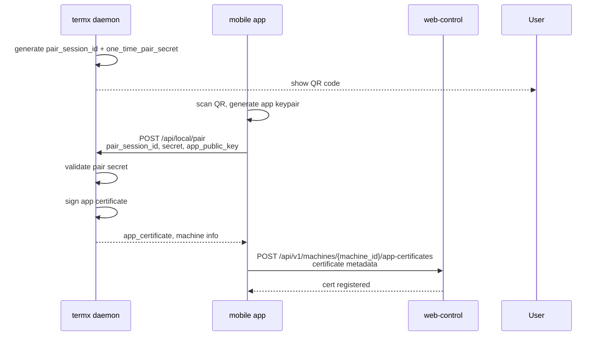
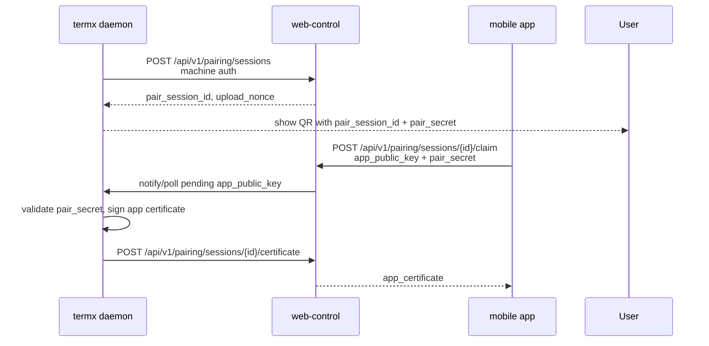

# 鉴权与 App 证书配对方案

状态：规划稿，后续 remote 实现必须优先遵循。

## 目标

在手机 app 与 `termx daemon` 内置 agent 之间建立端到端身份信任。Anonymous rendezvous、web control 和 hub/TURN 负责 signaling、账号、授权、订阅和网络中转，但不能伪造一台已配对手机，也不能代替 app 对 agent 发起高权限命令。

核心设计：

```text
machine keypair: termx daemon 生成并持有
app keypair: 手机 app 本地生成并持有
app certificate: termx daemon 用 machine private key 签发
connect ticket: web-control 针对一次连接签发
anonymous channel secret: 仅用于免登录 P2P signaling
```

不采用主路径：

```text
app 下载并解密 agent private key
```

`../tgent` 的加密私钥上传 + 二维码配对码解密方案可以参考，但不要原样作为 TermX 主路径。

## 为什么不原样复刻 tgent

`../tgent` 当前思路大致是：

1. agent 生成 Ed25519 keypair。
2. agent 用 pair code + agent id 派生 AES key。
3. agent 把 AES-GCM 加密后的 private key seed 上传到 web。
4. app 扫二维码得到 pair code。
5. app 从 web 下载 encrypted private key。
6. app 解密出 agent private key seed。
7. app 用 agent private key 对命令或 WebRTC offer 签名。

这个方案的优点：

- 易恢复。
- 手机无需本地和 agent 完成复杂握手。
- web 只保存加密私钥，不直接保存明文。

主要问题：

- app 持有 agent private key 副本，agent 身份被复制。
- 一台手机泄露后，等于 machine 身份泄露。
- encrypted private key 变成高价值服务端数据。
- pair code 强度、有效期、展示渠道和备份都会影响 machine private key 安全。
- 多手机、多设备撤销不清晰。撤销某台手机时，本质上很难证明 agent private key 没被复制。

TermX 主路径改为：app 只持有自己的 app private key；agent 只签发 app certificate。

## 信任角色

### User

由 web control 管理。

职责：

- 登录 web/app。
- 管理订阅。
- 管理机器。
- 管理 app 证书撤销。

### Machine

一台运行 `termx daemon` 的机器。

持有：

- `machine_id`
- `machine_private_key`
- `machine_public_key`
- `machine_credential` 或 agent refresh token

约束：

- `machine_private_key` 只保存在本机。
- 不上传 machine private key。
- 不把 machine private key 复制给 app。

### App Device

一台手机或未来浏览器客户端。

持有：

- `app_device_id`
- `app_private_key`
- `app_public_key`
- `app_certificate`

约束：

- app private key 只保存在 app secure storage / platform keystore。
- 每台手机独立 keypair。
- app certificate 可单独撤销。

### Web Control

持有：

- 用户账号。
- subscription/policy。
- machine public key。
- app certificate metadata。
- revoked cert list。
- connect ticket signing key。

不持有：

- machine private key。
- app private key。

### Hub/TURN

持有：

- hub identity。
- TURN secret。
- web-control 下发或可验证的 connect ticket。
- 短期 signaling/session 状态。

不持有：

- machine private key。
- app private key。

### Anonymous Rendezvous

持有：

- 短期 `channel_id`。
- 短期 `channel_secret` 的 hash 或等价校验材料。
- 临时 offer/answer/candidate 消息。

不持有：

- 用户账号。
- machine private key。
- app private key。
- TURN credentials。
- terminal/file 数据。

约束：

- 只做 signaling mailbox。
- 默认只下发公共 STUN。
- 不能授权 relay。
- 不能绕过 app certificate 验证。

## 密钥与证书

### Machine Key

生成位置：`termx daemon`。

算法：Ed25519。

存储：

```text
$TERMX_DATA_DIR/remote/machine_key
```

权限：

```text
0600
```

用途：

- 向 web control 证明 machine 身份。
- 签发 app certificate。
- 验证本机签发过的 app certificate。

### App Key

生成位置：手机 app。

算法：Ed25519。

存储：

- Android Keystore 或 encrypted secure storage。
- iOS Keychain。
- Web runtime 仅用于本地/调试时，存 IndexedDB + WebCrypto non-exportable key；生产 app 优先 native。

用途：

- 对 connect ticket + WebRTC offer + API command 签名。
- 防止 hub/web 伪造 app。

### App Certificate

格式优先用 canonical JSON + Ed25519 签名，后续可以替换为 COSE_Sign1 或 PASETO footer，不需要 X.509。

Payload:

```json
{
  "version": 1,
  "cert_id": "cert_...",
  "machine_id": "mach_...",
  "machine_public_key_fingerprint": "sha256:...",
  "app_device_id": "appdev_...",
  "app_public_key": "base64...",
  "app_name": "Alice iPhone",
  "capabilities": ["terminal", "file_manager"],
  "issued_at": "2026-05-01T00:00:00Z",
  "expires_at": "2027-05-01T00:00:00Z"
}
```

Signature:

```text
signature = Ed25519(machine_private_key, canonical(payload))
```

Envelope:

```json
{
  "payload": { ... },
  "signature": "base64..."
}
```

## 配对流程

### 本地优先配对

适用于手机和机器在同一局域网，或用户可以打开本地 browser。



二维码内容：

```json
{
  "type": "termx_pair_v1",
  "machine_id": "mach_...",
  "machine_name": "MacBook Pro",
  "machine_public_key_fingerprint": "sha256:...",
  "local_pair_url": "http://192.168.1.23:18888/api/local/pair",
  "pair_session_id": "pair_...",
  "pair_secret": "random_192bit_base64url",
  "expires_at": "2026-05-01T00:05:00Z"
}
```

安全要求：

- pair secret 至少 128 bit，建议 192 bit。
- 有效期默认 5 分钟。
- 单次使用。
- 成功后立即失效。
- 本地 pair endpoint 默认只在用户显式执行 `termx pair` 后短期开启。
- local pair URL 可以是 `127.0.0.1`、局域网 IP 或 mDNS 地址。手机扫码时通常需要局域网 IP。

### 远程中继配对

适用于机器不在同一局域网，但用户能在机器终端看到二维码或复制配对码。



这里 web control 只是 mailbox：

- web control 可以看到 app public key。
- web control 不知道 app private key。
- web control 不知道 machine private key。
- pair secret 可以由 app 直接发送给 web control，也可以先做 PAKE/OOB 协商后避免服务器看到 pair secret。第一版可以接受服务器看到 pair secret，因为最终证书仍必须由 machine private key 签发。

后续增强：

- 用 SPAKE2/OPAQUE 这类 PAKE 代替直接传 pair secret。
- 或使用 Noise XX + QR secret 绑定 transcript。

### 匿名 P2P 配对与连接

匿名 P2P 允许用户不登录、不订阅先试用远程能力。前提是公共 STUN 打洞成功。

流程：

```mermaid
sequenceDiagram
  participant D as termx daemon
  participant R as anonymous rendezvous
  participant A as mobile app

  D->>R: create channel
  R-->>D: channel_id, channel_secret, public STUN
  D-->>User: show QR
  A->>A: scan QR, generate app keypair
  A->>R: claim channel
  A->>R: send app_public_key / offer
  R->>D: forward
  D->>D: validate channel_secret, sign app certificate if needed
  D->>D: verify app signature
  D-->>R: answer + app_certificate if pairing
  R-->>A: answer + app_certificate
  A<->>D: direct P2P DataChannels
```

约束：

- 不需要用户 token。
- 不需要 connect ticket。
- 不发 TermX TURN credentials。
- 只使用 QR 中的 public STUN list。
- P2P 成功后 terminal 和 file manager 都可用。
- P2P 失败后提示订阅 Relay，而不是静默降级到免费 relay。

## 连接鉴权

登录/订阅路径连接一个 terminal 时需要三层授权：

1. 用户授权：web-control 签发 connect ticket。
2. app 身份：app private key 签名。
3. machine 信任：agent 验证 app certificate 是自己签过的。

流程：

```mermaid
sequenceDiagram
  participant A as mobile app
  participant W as web-control
  participant H as termx-hub
  participant D as termx daemon

  A->>W: POST /api/v1/machines/{machine_id}/terminals/{terminal_id}/connect
  W-->>A: connect_ticket
  A->>A: create WebRTC offer
  A->>A: sign ticket_id + offer_hash + nonce + timestamp
  A->>H: POST /api/v1/sessions<br/>ticket, app_certificate, offer, signature
  H->>H: validate ticket or ask web-control
  H->>D: forward offer package
  D->>D: verify ticket, certificate, app signature
  D-->>H: answer
  H-->>A: answer
  A<->>D: DataChannel terminal:{terminal_id}
```

Offer signature message:

```text
termx-webrtc-offer-v1:
ticket_id:
machine_id:
terminal_id:
sha256(sdp):
nonce:
timestamp
```

Agent verification:

1. connect ticket is signed by web-control and not expired.
2. ticket machine_id equals local machine_id.
3. ticket terminal_id exists and is allowed.
4. app certificate machine_id equals local machine_id.
5. app certificate signature verifies with local machine public key.
6. certificate is not expired.
7. certificate cert_id is not revoked.
8. offer signature verifies with app certificate public key.
9. nonce/timestamp are fresh.
10. certificate capabilities allow requested action.

匿名 P2P 路径没有 web-control connect ticket，因此 agent verification 改为：

1. rendezvous channel secret 有效。
2. app certificate 是本机 machine key 签发，或本次配对流程刚签发。
3. app signature 能用 app certificate public key 验过。
4. terminal_id 存在。
5. nonce/timestamp fresh。
6. ICE config 不包含 TermX TURN relay credentials。

## API 影响

### Web Control

新增：

```text
POST /api/v1/pairing/sessions
GET  /api/v1/pairing/sessions/{id}
POST /api/v1/pairing/sessions/{id}/claim
POST /api/v1/pairing/sessions/{id}/certificate

GET    /api/v1/machines/{machine_id}/app-certificates
POST   /api/v1/machines/{machine_id}/app-certificates
DELETE /api/v1/machines/{machine_id}/app-certificates/{cert_id}
```

connect ticket 响应中带：

```json
{
  "ticket_id": "tkt_...",
  "connect_ticket": "...",
  "required_certificate": true,
  "accepted_machine_public_key_fingerprint": "sha256:..."
}
```

### Hub

`POST /api/v1/sessions` 请求扩展：

```json
{
  "connect_ticket": "...",
  "app_certificate": {
    "payload": {},
    "signature": "base64..."
  },
  "offer": {
    "sdp": "...",
    "ice_candidates": []
  },
  "signature": {
    "algorithm": "ed25519",
    "nonce": "...",
    "timestamp": 1770000000,
    "value": "base64..."
  }
}
```

Hub 第一版可以只校验 ticket，把 certificate/signature 原样转发给 agent。后续为了更早拒绝攻击流量，可以让 hub 校验 app signature，但 hub 仍然不能签发 app certificate。

### Anonymous Rendezvous

新增：

```text
POST /api/v1/anonymous/channels
GET  /api/v1/anonymous/channels/{channel_id}/events
POST /api/v1/anonymous/channels/{channel_id}/offer
POST /api/v1/anonymous/channels/{channel_id}/answer
```

rendezvous 不校验 app certificate 的业务权限。它只校验 channel secret、TTL、payload size 和 rate limit。真正的证书与签名校验在 agent。

### TermX Daemon

新增本地短期开启接口：

```text
POST /api/local/pair
```

Request:

```json
{
  "pair_session_id": "pair_...",
  "pair_secret": "...",
  "app_device_id": "appdev_...",
  "app_name": "Alice iPhone",
  "app_public_key": "base64...",
  "requested_capabilities": ["terminal", "file_manager"]
}
```

Response:

```json
{
  "machine_id": "mach_...",
  "machine_name": "MacBook Pro",
  "machine_public_key": "base64...",
  "app_certificate": {
    "payload": {},
    "signature": "base64..."
  }
}
```

## 撤销与轮换

### App Certificate Revocation

用户在 web control 删除某台手机证书：

- web control 标记 `cert_id` revoked。
- connect ticket 不再为该 cert 签发。
- agent heartbeat 拉取 revoked cert list。
- hub signaling 可先查 ticket/cert 状态。

agent 本地也保留 revoked cache，防止短期内 web/hub 不可用时旧证书继续使用。

匿名模式下没有云端 revoke 即时同步。用户可以在 daemon 本地 revoke：

```text
termx remote cert revoke <cert_id>
```

后续 app 登录并 claim machine 后，再把 revoke 状态同步到 web-control。

### Machine Key Rotation

机器换 key 时：

- 旧 app certificates 全部失效。
- web control 记录新 machine public key。
- 用户需要重新配对 app。

默认不要自动 rotate machine key。只有用户显式执行：

```text
termx remote rotate-machine-key
```

### App Key Rotation

app 可以重新配对生成新 app key：

- 新 cert 生效。
- 旧 cert 自动 revoke 或保留一段时间。

## 恢复策略

默认策略：新手机重新扫码配对。

不默认提供 agent private key 云恢复。

可选增强：

- app private key 恢复包。
- 恢复包由用户 passphrase 或平台密钥保护。
- 恢复的是 app 身份，不是 machine 身份。

如果未来必须做云端恢复：

- 只恢复 app private key。
- 不上传 machine private key。
- 恢复包必须有 KDF 参数、版本、设备绑定和审计记录。

## 与 tgent 可复用内容

可以复用或参考：

- Ed25519 签名命令的思路。
- nonce + timestamp 防重放。
- QR code 配对 UX。
- AES-GCM 加密恢复包的实现经验。
- Android native bridge 中 Ed25519/AES-GCM 工具代码的结构。

需要改变：

- 不让 app 解密 agent private key。
- 不把 agent encrypted private key 作为主路径上传 web。
- 不把 `agent/server/pane` 命名带入 TermX API。
- app 证书按 app device 单独签发和撤销。

## 实施顺序

1. 在 `termx-core` 定义 machine key、app certificate、canonical signing helpers。
2. 在 daemon 实现 `termx pair` 和本地 pair endpoint。
3. 实现 anonymous rendezvous channel 和公共 STUN P2P signaling。
4. 在 mobile app transport 层生成 app keypair 并保存。
5. 实现本地/匿名扫码配对。
6. 在 web control 增加 app certificate metadata 和 revoke API。
7. 在 connect ticket 中绑定 `cert_id` 或 `app_public_key`。
8. 在 hub signaling 中透传 certificate/signature。
9. 在 agent WebRTC offer handler 中强制验 ticket/channel + certificate + app signature。
10. 再考虑远程中继配对和 PAKE 增强。
